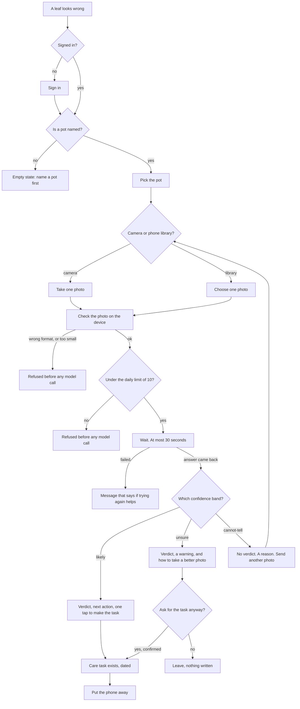

# Journey map — photograph a sick plant, get an assessment and a next action

**Written by** 300 Design, run 1 (`001-photo-assessment`). **Date:** 2026-08-25.
**Read next by** 400 Architecture, 500 Engineering, 600 QA.

This document walks one person through the whole feature, from the moment before the app is opened
to the moment they put the phone away. It exists to find the step that feels worst, because that is
the step the design has to carry. A flow drawn only as boxes hides that step. A flow drawn with the
feeling next to each box does not.

Everything here comes from `00-prd.md` and `01-user-stories.md`. Where a step has no story behind
it, it is marked and handed on. Nothing is invented.

---

## 1. The person and the moment

One person keeps at least eight pots of houseplants in an apartment
(`docs/100-consulting/00-context-brief.md`, section 1). He is **standing in front of a pot, in the
evening, indoors, in poor light, holding the phone in one hand**. A leaf looks wrong and he does not
know what is wrong or what to do (`00-prd.md`, section 1).

That posture is a requirement, not decoration. It sets three things for every screen in this
feature:

- One thumb reaches the controls. Nothing important sits at the top of a tall screen.
- The light is bad, so the screen has to be readable at arm's length in a dim room.
- He is standing still while he waits. Every second of waiting is felt, not ignored.

## 2. The flow

## 3. Step by step, with the feeling

The feeling is scored 1 to 5. **1 is worst.** The score is a judgement by this role, written down so
a later reader can disagree with a specific number rather than with a mood.

| # | Step | What the person does | What they think | Feeling | Story |
| --- | --- | --- | --- | --- | --- |
| 1 | Notice | Looks at a yellow leaf | "Something is wrong and I do not know what" | 2 | before the app |
| 2 | Open | Opens the app, one hand | "I hope it does not ask me to sign in again" | 3 | US-07 |
| 3 | Pick the pot | Taps the pot by the name he typed | "That is my `legénypálma`" | 4 | US-01, US-11 |
| 4 | Frame the photo | Holds the phone close to the leaf | "Is this close enough? Is it too dark?" | 3 | US-01 |
| 5 | Send | Taps send once | "Now what" | 3 | US-01 |
| 6 | **Wait** | Stands still, phone in hand | "Is it working? Should I tap again?" | **2** | US-01 AC-7, AC-8 |
| 7a | Read `likely` | Reads the verdict and the next action | "Good. I can do that tonight" | 5 | US-02, US-04 |
| 7b | Read `unsure` | Reads a verdict marked as maybe wrong | "So do I do it or not" | 3 | US-04 |
| 7c | **Read `cannot-tell`** | Reads that there is no answer | "I waited, it cost one of my ten, and I got nothing" | **1** | US-05 |
| 8 | Make the task | Taps once, sees a date | "It is out of my head now" | 5 | US-03 |
| 9 | Blocked at the limit | Reads that ten is used up | "I only wanted to check one more plant" | 2 | US-08 |
| 10 | Blocked, feature off | Reads that the feature is off | "Nothing I do fixes this" | 2 | US-09 AC-4, US-13 |

## 4. The worst step, and the screen that carries it

**The worst step is 7c: the answer comes back `cannot-tell`.**

It is worst because three bad things arrive together, and none of them is the person's fault in a
way they can see:

1. They stood still for up to 30 seconds and got no answer.
2. The attempt still counted against the ten they get each day (US-05 AC-5). The money was already
   spent, so the count is honest, but it does not feel honest.
3. There is nothing to do next unless the screen says what to do next.

**The screen that carries it is `SC-5 Result — cannot-tell` in `02-SPEC.md`.** Four things on that
screen exist only because of this step:

- **The photo is shown, not described.** If the reason is "too dark", the person sees a dark photo.
  Being told a photo was too dark and being shown it are not the same. This comes from
  `factory/feature.md`, and it is the fastest way to turn a refusal into a next move.
- **The reason comes from a fixed list of four** (US-05 AC-2), so it is always a specific thing that
  went wrong, never "something went wrong".
- **One tap sends another photo for the same pot** (US-05 AC-4). The person does not walk back
  through pot selection.
- **The screen says the attempt counted, and how many are left.** Finding this out later is worse
  than reading it now.

**The PRD covers this step.** US-05 defines the whole state, including the reason list, the storing
of the refusal as a finished assessment, and the one-tap retake. So this journey does not need a
decision the PRD refused to make. `cannot-tell` being a correct result rather than an error is the
product decision that makes the design possible.

## 5. The second worst step, and why it is not the first

**Step 6, the wait, scores 2.** Up to 30 seconds is a long time to stand in front of a plant holding
a phone (G-5, set by the owner). Three design answers are in `SC-2 Working`:

- The send button cannot be tapped twice (US-01 AC-7). A second tap would be a second paid call.
- The screen names what is happening now — making the photo smaller, sending it, asking the model —
  so the wait has parts instead of being one blank pause.
- There is **no cancel**. The call is paid for the moment it is sent, so cancelling would save
  nothing and would only hide a result the owner already paid for. The screen says so in one line.

It scores above `cannot-tell` because it ends in an answer. A wait that pays off is a different
feeling from a wait that does not.

## 6. Steps this run does not own

Written down so a later reader does not think they were forgotten.

| Step | Who owns it |
| --- | --- |
| Naming a pot for the first time (step C1 in the diagram) | No story in this run defines it. `01-user-stories.md` US-01 AC-3 needs it to exist. Recorded as a seam and as human gate 21 |
| The sign-in screen itself (step B1) | 400 Architecture decides the protocol and the flow. This run designs only the signed-out state of its own screens |
| Reminding the person when the task is due | Backbone feature 6, a later run. This run writes the task and stops |
| Opening an old assessment weeks later | No story in this run defines the way in. US-10 AC-4 needs it to exist. Recorded as a seam |

## 7. What this document does not decide

Which model is used · how sign-in works · where the daily limit is counted · how the photo is stored
· the build order · whether the feature ships.
