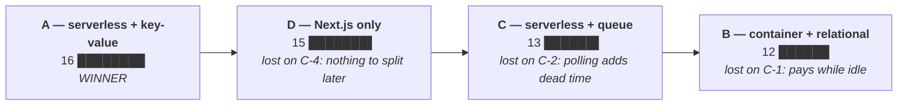

# Architecture options — how this system is shaped

**Written by** 400 Architecture, run 1 (`001-photo-assessment`). **Date:** 2026-08-25.
**Read next by** 500 Engineering, 800 Infra, 900 Security, 600 QA.

This file does one job: it puts four whole-system shapes side by side, scores them on the four
things that actually pull in different directions on this project, and names the winner. Everything
else in `docs/400-architecture/` and every ADR follows from the winner. Nothing was drawn before
this page was finished.

The inputs are `factory/feature.md`, `docs/100-consulting/00-context-brief.md`,
`docs/200-product/001-photo-assessment/00-prd.md`, `01-user-stories.md`,
`docs/300-design/001-photo-assessment/01-CONTEXT.md` and `02-SPEC.md`. Nothing outside those six
files is treated as a requirement. Outside facts carry a link and the date they were checked.

---

## 1. The access patterns, before any technology

A store is chosen from the questions it has to answer, not the other way round. Here is every
question this feature asks of stored data. It is a short list, and its shortness is the finding.

| # | The question | How often | Story |
| --- | --- | --- | --- |
| Q-1 | Which pots does this user own? | Every time the assess screen opens | US-01, US-15 |
| Q-2 | One pot by its id, owned by this user | Every assessment | US-01 |
| Q-3 | How many model attempts has this user made today? | Before every model call. There is no retry, so that is once per assessment (2026-08-26) | US-08 |
| Q-4 | Is the AI feature switched on? | Before every model call | US-13 |
| Q-5 | Write one finished assessment for one pot | Once per assessment | US-02, US-05 |
| Q-6 | Read the assessments of one pot, newest first | Not in run 1. Backbone 4 reads it | US-10 AC-4 |
| Q-7 | Write one dated care task for one pot | Once, when the user taps | US-03 |
| Q-8 | Which tasks are due on a date? | Not in run 1. Backbone 6 reads it | US-03 note |
| Q-9 | Is this session still valid, and what is its account type? | Every request | US-07, US-14 |
| Q-10 | Assessments started, model calls and spend, per day, over a date range | Rarely, by one admin | US-12 |
| Q-11 | Which accounts have not signed in for 11 or 12 months? | Once a month | `factory/feature.md` |

**Eleven questions, and ten of them name one user or one day.** Q-11 is the only one that has to
look across all accounts, and it runs once a month over a table with a handful of rows in it. There
is no join, no report over a large set, no search, and no query that is not either "give me this one
item" or "give me the items under this one owner, in order".

That is the shape the options are scored against. A relational store is not wrong for this list —
it is simply not needed by it, and the later backbone features (Q-6 and Q-8) are the same shape
again: one pot's history in time order, one day's tasks in time order.

## 2. What is already decided, and is therefore not an option

These come from `factory/feature.md`, "Human decisions already made". No option below re-opens any
of them.

- Next.js for the web, Nest.js for the API, Zod contracts shared between them.
- Two repositories. `ai-factory` holds the line; `zamphora` holds the product. How `zamphora` is
  arranged **is** open, and it is ADR-0001.
- The Anthropic API, paid from the owner's own Anthropic credits. **Amazon Bedrock is not used.**
- Every user signs in. Two account types, `USER` and `ADMIN`, from day one.
- 180 days for a photo, deleted by a storage lifecycle rule and not by application code.
- 30 seconds from the tap to something on screen. **One model call per assessment, no retry**
  (owner, 2026-08-26, replacing the earlier two-attempt rule). 10 calls a day.
  A kill-switch that takes effect inside 60 seconds. A 30-day session.
- No second-opinion service, ever. No option below leaves a place for one.

## 3. The four constraints the options are scored on

These four were chosen because the options **disagree** on all four. Scoring on "scalability" would
have given every option the same mark, which is the same as not scoring at all.

**C-1 — What it costs while nobody is using it.**
The AWS free plan gives up to $200 of credit and then **closes the account**; it does not bill
([AWS Free Tier](https://aws.amazon.com/free/), checked 2026-08-25). The account was opened
2026-07-01, so the window ends 2026-12-31. A shape that costs money every hour whether or not
anybody opens the app spends the credit on nothing. This is the constraint that separates the
options most.

**C-2 — Whether it fits inside 30 seconds, tap to screen.**
Set by the owner on 2026-08-25 and carried in US-01 AC-8. The model call is the big number inside
it, and it is not under our control. Anything that adds a fixed delay — a cold start, a second
round trip, a queue hop — eats headroom that the upload needs on a weak signal.

**C-3 — Whether one part-time developer can operate it.**
`00-context-brief.md` §5.3: one developer, part-time, with Nest.js and AWS both listed as things to
learn rather than things known. The brief asks for "the documented path over the clever one,
because there is no earned instinct to catch a clever choice going wrong". Count the parts that can
break at 22:00 on a Tuesday.

**C-4 — How hard it is to leave.**
Two kinds. Leaving a vendor (the model provider must stay swappable — `factory/feature.md` requires
it, and `CLAUDE.md` names the port `LlmProvider`). And leaving the shape itself: the six
split-readiness rules in `factory/feature.md` exist so a later split is a change of configuration
rather than a rewrite.

Scores are 1 to 5. 5 means the option is good on that constraint. The reason for each score is
written under the table, because a number with no sentence behind it is a decoration.

## 4. The four options

### Option A — Serverless, key-value, the model call inside the request

The Next.js server and the Nest.js API each run as a function that starts when a request arrives
and stops afterwards. Data lives in DynamoDB, one table, keyed by owner. Photos live in a private
S3 bucket with a lifecycle rule. Sign-in is a Cognito user pool. The assessment endpoint makes the
Anthropic call itself and holds the request open until it answers.

### Option B — One long-running container, a relational store, the model call inside the request

The web and the API each run as a container that is always on, behind a load balancer. Data lives
in a managed Postgres database. Photos and sign-in are the same as Option A. The assessment
endpoint works the same way.

### Option C — Serverless, key-value, the model call in a background worker

Same as Option A up to the point where the photo arrives. The API writes a job, puts it on a queue
and answers immediately. A second function picks the job up, makes the model call and writes the
result. The browser asks "is it done yet?" every second or two until the answer appears.

### Option D — No separate API. Next.js does everything

One application. The screens and the server work live in the same Next.js project, in route
handlers. Data and photos as in Option A. Nest.js is not used at all.

**Option D contradicts a decision the owner already made** (`factory/feature.md`: "Stack: Next.js
for the web, Nest.js for the API"). It is scored anyway, because the DON'T column of this role's
contract forbids taking a technology named in an input as decided and skipping the comparison. If
it had won, the right outcome would have been a human gate, not a quiet switch.

## 5. The scoring

| Constraint | A — serverless + key-value | B — container + relational | C — serverless + queue | D — Next.js only |
| --- | --- | --- | --- | --- |
| C-1 Cost while idle | **5** | **1** | **5** | **5** |
| C-2 Fits 30 seconds | **4** | **5** | **3** | **4** |
| C-3 One part-time developer | **4** | **2** | **2** | **5** |
| C-4 How hard to leave | **3** | **4** | **3** | **1** |
| **Total** | **16** | **12** | **13** | **15** |

**The same result as a picture.** The bars are the totals; the note under each says what killed it.

**A and D are one point apart, and the role was not allowed to break that tie.** It was recorded as
gate 26. **The owner rejected Option D on 2026-08-26: there will be a separate API.** So Option A
stands, and this is now settled rather than assumed.

### Why each score is what it is

**C-1, cost while idle.**
A, C and D score 5 because nothing runs between requests. The always-free monthly amounts cover the
whole of run 1 at one user: AWS Lambda includes "one million requests and 400,000 GB-seconds per
month" ([AWS Lambda pricing](https://aws.amazon.com/lambda/pricing/), checked 2026-08-25), and
Cognito's free tier is 10,000 monthly active users on the Lite and Essentials tiers, and *"does not
automatically expire at the end of your 12-month AWS Free Tier term"*
([Cognito pricing](https://aws.amazon.com/cognito/pricing/), checked 2026-08-25).

B scores 1 because the two things it needs most are charged by the hour and never idle: a load
balancer and a managed database. Both keep spending credit through every night when the app is
untouched. **The exact monthly figures were not checked first-party and are not written here**, so
this score is an argument about shape, not about a number. That is enough to separate 1 from 5,
because 5 is "nothing runs" and B is "two things always run".

**C-2, fits 30 seconds.**
B scores 5: a container that is already up adds nothing before the work starts.

A and D score 4. A function that has not run for a while has to start first. Published measurements
put an optimised Node.js cold start at roughly 200 to 800 ms, and 200 to 400 ms at the middle of
the range for production workloads
([Sedai](https://sedai.io/blog/what-is-cold-starts-in-lambda-understanding),
[oneuptime](https://oneuptime.com/blog/post/2026-01-27-lambda-cold-start-optimization/view), both
checked 2026-08-25). **These are secondary sources, not a measurement of this application**, and
`03-flow.md` budgeted the top of that range until 2026-08-31 and now budgets **2,000 ms**, because those figures describe a plain Node handler and this is a bundled Nest+Express application (NFR-06). Against a 30-second budget, 2,000 ms is under 7%.

There is a second and harder ceiling on A and D, and it is the reason neither scores 5. **An API
Gateway HTTP API cuts a request off at 30 seconds and that cannot be raised** — the same number the
user was promised. So the whole server side must finish inside a budget somebody else is already
counting. The design obeys it by failing at 20 seconds and writing its own message.
**The three stacked deadlines and the arithmetic are in `03-flow.md` §4.** That is a constraint to
obey, not a fault in the option.

C scores 3, which is the surprising one. Moving the model call to a worker removes the gateway
ceiling entirely — that is worth something. But the user in US-01 is standing in front of a plant
waiting, and polling adds a round trip and up to one poll interval of dead time on top of the same
model call. It buys freedom the run cannot use yet, because the thing that makes a background job
worth having is a notification, and notifications are backbone 6, run 3.

**C-3, one part-time developer.**
D scores 5: one application, one deploy, one place to look.

A scores 4: a function, a table, a bucket, a user pool. Four managed pieces, none of which is
patched, backed up or restarted by hand.

B scores 2: the container needs a network with subnets, a load balancer, a database with backups
and a patch window, and a way for the container to reach the internet. Every one of those is a
thing to learn before the first assessment works, and `00-context-brief.md` says the developer is
learning AWS as they go.

C scores 2: it is Option A plus a queue, plus a second function, plus a job record with its own
states, plus an endpoint the browser polls, plus an answer to "what happens when the person closes
the app mid-job" that no story in this run gives.

**C-4, how hard to leave.**
B scores 4: Postgres is portable and a container runs anywhere.

A and C score 3. The data access has to be written against DynamoDB's key model, and moving to a
relational store later would mean rewriting the repository layer. That cost is real and it is
accepted, because the eleven questions in section 1 are all "one owner, in order" and would map
onto a relational store without changing a single screen or contract. The model provider is behind
`LlmProvider` in every option, so the vendor question is answered the same way by all four.

D scores 1, and this is what sinks it. With no API there is no border between the screens and the
work. Split-readiness rules 1, 2, 3, 4 and 6 in `factory/feature.md` are about a border that would
not exist. Splitting later would be a rewrite, not a change of configuration, which is exactly the
outcome those six rules were written to prevent.

## 6. The choice

**Option A wins at 16, and the owner confirmed it on 2026-08-26 by rejecting Option D.**

**The one trade that separated the top two.** D gains a point on C-3 — one application really is
simpler for one person to run than two — and loses two on C-4, because it has no border between the
screens and the work for a later split to follow. D is the only option that cannot obey five of the
six split-readiness rules in `factory/feature.md`.

**Why B never got close.** On an account that closes rather than bills, a shape that spends credit
while nobody is using it is spending it on nothing. It loses four points on C-1 alone and never
recovers them.

**What losing looks like.** If Option A is wrong, it shows up as either of these, and both are
countable: the cold start plus the model call regularly passes 20 seconds, so users meet the
failure screen on a good network; or the eleven questions in section 1 grow a twelfth that needs a
join, and the repository layer starts growing code that a database would have done.

**When to re-open Option C.** Option C stops waiting for the model: the API answers at once and the
phone collects the result later. That removes the 30-second ceiling for good. It costs a second
function, a queue, a polling loop in the web app and a new waiting state on a screen spec that is
already agreed at five states. **Two triggers, either one:** a second model call is added to the
flow, or the model call alone regularly passes 15 seconds. Until then Option C buys headroom that
`03-flow.md` says is not needed — the typical run is 8.2 seconds against 30.

## 7. What Option A is made of

The detail is in `02-containers.mmd` and in the ADRs. In one table:

| Part | What it is | ADR |
| --- | --- | --- |
| Repository | One repo, pnpm workspaces + Turborepo, `apps/` + `packages/` + `infra/` | ADR-0001, ADR-0012 |
| Compute | Nest.js as one function behind an HTTP API. Next.js served from the same origin | ADR-0002, ADR-0010 |
| Data | DynamoDB, one table, the owner in the partition key | ADR-0002, ADR-0004 |
| Photos | Private S3 bucket, lifecycle expiry at 180 days, short-lived signed reads | ADR-0007 |
| Sign-in | OpenID Connect to a Cognito user pool. No token ever reaches the browser | ADR-0003 |
| Account types | Refuse by default. Every route names its role or it does not run | ADR-0004 |
| The model call | One call, behind `LlmProvider`, with structured output | ADR-0005 |
| Which model | Chosen by measurement. Haiku 4.5 until the measurement exists | ADR-0006 |
| The daily limit | One atomic conditional increment, before the call and before the retry | ADR-0008 |
| The kill-switch | A row in the table, cached 30 seconds | ADR-0009 |
| Components | shadcn/ui, which uses Base UI underneath. Accepted 2026-08-26 | ADR-0011 |

## 8. Where the AI sits on the ladder

The ladder is plain code → one model call → a fixed chain of calls → an agent. The rule is to pick
the lowest rung that works, and to say why the rung below it does not.

**Plain code is used, and it is used first.** Three things happen before any model call and none of
them needs a model: the file must be one of JPEG, PNG, GIF or WebP; the shorter side must be at
least 200 px; a pot must be picked. Two more happen after the answer arrives and are also plain
code: the follow-up must be a whole number from 1 to 30, and the date is the assessment day plus
that number. `00-context-brief.md` §5.2 is the reason the last one is code — the model chooses the
interval, but nothing about turning an interval into a date needs a model.

**Plain code cannot produce the verdict.** The input is a photograph. There is no rule set that
turns pixels into "too much water" without a vision model.

**One call is the right rung, and here is why the next one up is not.** A chain would mean a second
call, which doubles the cost of every assessment against a balance of a few hundred calls, and it
would have nothing new to work from: the same photo and the same plant name would go in both times.
An agent needs tools to call. There are none. The second-opinion service is rejected outright by
the owner. Identifying the species from the photo is out of scope on purpose, because the user
names the pot. A follow-up conversation is out of scope. **An agent with no tools is one call with
extra machinery around it.**

**One thing on this rung was decided by the owner and is not re-opened here.** The follow-up
interval could have been plain code — a fixed table from verdict to interval. `factory/feature.md`
records that option being rejected, and the reason: it always gives the same date for the same
verdict. It is cheaper and fully testable, and it lost anyway. That is the owner's call, recorded,
not revisited.

## 9. Numbers in this file that are guesses

Written out so no reader mistakes one for a commitment.

| Number | Where it came from | What replaces it |
| --- | --- | --- |
| Cold start 200–800 ms | Secondary sources, checked 2026-08-25. Not a measurement of this app | The `InitDuration` metric after the first deploy |
| "A load balancer and a database cost money every hour" | Shape, not a figure. No first-party price was checked | Nothing. Option B lost and the figure is not needed |
| Model call latency | **No source at all.** `03-flow.md` budgets 8,000 ms as a guess | The first real call. 500 Engineering records it |
| Bundle size of any component library | The projects' own published figures, per `factory/feature.md` | One real screen, built and measured. ADR-0011 |

## 10. What this document does not decide

Whether Option A is accepted · whether any cost is acceptable · which hosting product runs the
Next.js server · whether the component library in ADR-0011 may be added · the build order · the
release date · whether the feature ships.
