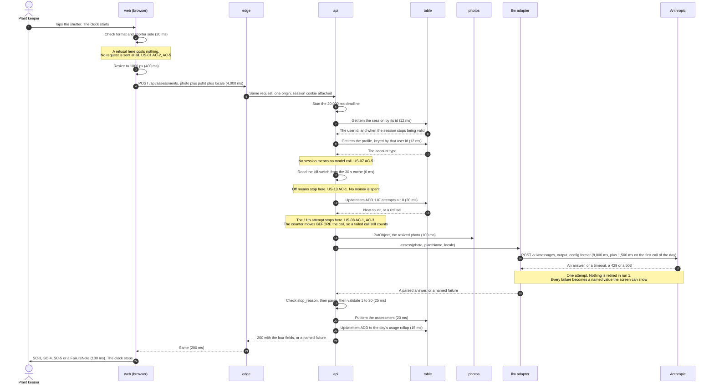

# The assessment flow, with the clock running

**Written by** 400 Architecture, run 1 (`001-photo-assessment`). **Date:** 2026-08-25.
**Read next by** 500 Engineering, 900 Security, 800 Infra, 600 QA.

The owner set one number on 2026-08-25: **30 seconds, from the tap that takes the photo to
something on screen.** This file spends that budget, step by step, and shows that the parts add up
to less than the whole. It also names the one place where the platform will cut the request off
before the app can say anything useful, and what stops that.

Every millisecond below is labelled **sourced**, **estimated** or **guessed**. A guessed number that
reads like a commitment is worse than no number, so section 6 lists all of them in one place.

---

## 1. Where the clock starts and stops

`factory/feature.md`: *"Measured from the tap that takes the photo to something on screen, so it
covers the resize, the upload and the model call."*

**Start:** the moment the operating system hands the photo file back to the app. Not the moment the
person opens the camera. The time a person spends framing a leaf is theirs, not the system's.

**Stop:** the first paint of SC-3, SC-4, SC-5 or a `FailureNote`. Not the moment the answer arrives
at the browser. US-01 AC-8 says *"a result or a message appears"*, so a failure screen stops the
clock exactly as a verdict does.

**This reading is written down because it changes the number.** If the clock started at the camera
button instead, several seconds of a person aiming a phone would come out of the model's budget.
If it stopped at the network response instead of the paint, the render would be free. Neither is
what the sentence says.

## 2. The step list

Two columns of milliseconds. **Typical** is what most attempts should look like. **Budget** is what
the design must survive: a cold function, the first call of the day, and a weak signal.

| # | Step | Where | Typical | Budget | Where the number comes from |
| --- | --- | --- | --- | --- | --- |
| 1 | Check the format and the shorter side | Browser | 10 | 20 | Estimated. Reading a file header |
| 2 | Resize to at most 1000 px on the longer side | Browser | 250 | 400 | **Guessed.** Decode, draw to a canvas, encode JPEG on a mid-range phone |
| 3 | Send the photo and the request | Network | 1,600 | 4,000 | **Guessed.** About 200 KB. 1 Mbps up gives 1.6 s, 400 kbps gives 4 s |
| 4 | Start the function | api | 0 | **2,000** | Estimated, 2026-08-31. A bundled Nest+Express Lambda, not a plain handler — NFR-06. Zero when it is already warm |
| 4a | Claim the request id | api → table | 12 | 15 | Estimated. One conditional `PutItem`. §4a of `03-api-spec.md` |
| 5 | Read the session, then the profile it points at | api → table | 24 | 30 | Estimated. **Two reads, not one.** See the note under this table |
| 5b | Decode and re-encode the photo, stripping EXIF | api | 120 | 200 | **Guessed.** `sharp` on about 200 KB, ARM64 at 1024 MB |
| 6 | Read the kill-switch | api → table | 0 | 15 | Estimated. Zero on a cache hit, which is the normal case. ADR-0009 |
| 6b | Read the circuit breaker | api → table | 12 | 15 | Estimated. One `GetItem`. Gate 50 |
| 7 | Count the attempt, and refuse if it is the 11th | api → table | 15 | 20 | Estimated. One conditional `UpdateItem`. ADR-0008 |
| 8 | Write the photo to the bucket | api → photos | 80 | 100 | Estimated. One `PutObject`, about 200 KB, same region |
| 9 | Compile the answer schema | Anthropic | 0 | 1,500 | **Guessed size, sourced behaviour.** Only on the first call of the day per schema |
| 10 | **The model call** | Anthropic | 6,000 | 8,000 | **Guessed. No source at all.** The weakest number here |
| 11 | Check `stop_reason`, then parse and validate the answer | api | 5 | 25 | Estimated |
| 12 | Write the assessment row | api → table | 15 | 20 | Estimated. One `PutItem` |
| 13 | Add to the day's usage rollup | api → table | 12 | 15 | Estimated. One atomic `UpdateItem`. US-12 |
| 14 | Answer travels back | Network | 120 | 200 | Estimated. A small JSON answer |
| 15 | Paint the result screen | Browser | 60 | 100 | Estimated |
| | **Total** | | **8,335** | **16,825** | |

**The typical run is about 8.3 seconds. The bad run is about 16.8 seconds.** Both are inside 30,000.

**Four rows were added and one was raised on 2026-08-31.** Step 4a claims the request id so one tap
is one charge; step 5b re-encodes the photo to strip EXIF; step 6b reads the circuit breaker. Step 4
went from 800 ms to 2,000 ms because the old figure described a plain Node handler (NFR-06). The bad
run grew by about 1.6 seconds and still has more than 13 seconds of headroom.

**Why step 5 is two reads and not one.** An earlier version of this file said the session and the
profile were read together in one `BatchGetItem`. That cannot work. `BatchGetItem` needs every key
before it starts, and the profile's key is the user id — which is stored *inside* the session item
that has not been read yet. So it is one read, then a second read using what the first returned.

The alternative was to put the user id in the cookie so both keys are known up front. That was
rejected: it undoes the decision in `05-patterns.md` §2 that the cookie means nothing on its own.
Twelve milliseconds is a cheap price for a cookie that carries no information.

## 3. There is no retry in run 1

**Decided by the owner on 2026-08-26.** One model attempt per assessment. If it fails, the person
sees a failure screen and can send the photo again themselves.

This replaces the earlier two-attempt rule. The reason is that two attempts broke two numbers at
once:

- **Money.** One attempt costs about $0.0035. Two cost about $0.0070, and the cost ceiling for one
  assessment is $0.0040. The rule and the ceiling could not both be true.
- **Time.** A first attempt that runs out of time has to fail early enough to leave room for a
  second one. That means neither attempt gets the full budget, so a model call that is slow but
  working gets killed to protect a retry that may not help.

**What dropping it buys, beyond fixing those two.** The daily limit of 10 now means 10 real
assessments instead of 5 assessments and 5 retries. And the model call gets the whole budget rather
than half of it, which matters because 8,000 ms is the weakest guess in this file.

**What it costs.** A network blip that a retry would have hidden now shows a failure screen. The
person taps again. That is one extra tap against a failure that a retry could not fix either — a
retry only helps when the second call succeeds where the first did not.

**So the worst case is simply the budget column: 16,825 ms, against 30,000. That is 13,175 ms of
headroom.**

**The headroom is not spare — most of it belongs to step 3 and step 10.** The upload has the widest
spread and the least control. The model call is a guess with no source. Both can double before this
breaks.

**A retry becomes right again in run 3**, when the assessment runs in the background and nobody is
standing in front of the plant waiting. Then a doubling wait — 1 second, then 2, then 4 — becomes
possible too. It does not fit here: 1+2+4+8 is 15 seconds of waiting alone, before a single call.

## 4. The platform will cut the request off first, and that has to be stopped

An API Gateway HTTP API has a maximum integration timeout of 30 seconds, and it cannot be raised.
Only regional and private REST APIs can go above 29 seconds, and that costs account throttle quota
([AWS re:Post](https://repost.aws/knowledge-center/api-gateway-timeout-limit) and
[AWS What's New, June 2024](https://aws.amazon.com/about-aws/whats-new/2024/06/amazon-api-gateway-integration-timeout-limit-29-seconds/),
both checked 2026-08-25). When it fires, the gateway answers **504 with a body the application did
not write**.

That breaks US-09 AC-1. Every failure message must end with one of two sentences, and a bare 504
ends with neither.

**So the application must fail before the platform does.** **Four** numbers, in this order, and each
one is set somewhere on purpose:

| Limit | Value | Who enforces it | What the user sees |
| --- | --- | --- | --- |
| Server-side work budget | **20,000 ms** | `apps/api`, one deadline for the whole request | `FailureNote` in state `retry-may-work`. The app wrote it |
| Function timeout | **22,000 ms** | The Lambda configuration | Nothing. This is the net under the net |
| **CloudFront origin response** | **25,000 ms** | `readTimeout` on the `/api/*` origin | A 504 the app did not write. **Must never be reached** |
| Gateway integration timeout | **30,000 ms** | API Gateway. Cannot be raised on an HTTP API | A 504 the app did not write. **Must never be reached** |

**The third row was added on 2026-08-31, and it used to be missing.** ADR-0010 puts CloudFront in
front of **every** request, and a CloudFront custom origin has its own response timeout: **30
seconds by default, 60 seconds at most** without a quota increase. `01-iac-plan.md` §4.6 never set
it. So CloudFront — not API Gateway — was the outermost clock, and it was the one path left to a 504
this product did not write. F-4 in `07-adversarial.md` named this and it stayed open. It is now
`readTimeout: 25 seconds`, which sits between the app's deadline and the gateway's cut-off, so the
app is still the first thing to answer.

**One ceiling this sets, worth knowing before it surprises somebody.** CloudFront can never be
raised above 60 seconds. So "escape the 30-second limit later" — by moving to a Lambda Function URL,
for example — is bounded by CloudFront, not only by API Gateway.

### Where 20,000 comes from

A deadline is a **permission**, not a prediction. So it has to be checked against what happens when
the app uses all of it, not against what it usually uses.

**The cold start sits outside the deadline and this is the part that is easy to get wrong.** The
code that starts the clock cannot run until the function has started. So the 2,000 ms is spent before
the app knows a request exists, and it has to be budgeted separately rather than subtracted from the
app's own number.

Working backwards from the 30-second promise:

```
30,000   the promise to the person
−4,420   client work before the request (check 20, resize 400, upload 4,000)
−2,000   cold start, before the app can start its clock
−  300   answer travels back 200, paint 100
────────
23,280   the most the app could be allowed
20,000   what it is actually allowed
────────
 3,280   slack, kept on purpose
```

**The cold start was 800 ms here until 2026-08-31 and is now 2,000 ms.** NFR-06 explains why: the
200–800 ms range described a plain Node handler, and this is a bundled Nest.js application with six
libraries loaded before the handler runs. **The promise still holds** — the slack falls from 4,480
to 3,280 ms and no other number in this file changes.

**Checked against both outer clocks:** 2,000 cold start + 20,000 app work = 22,000, under
CloudFront's 25,000 and well under the gateway's 30,000. Neither is ever the first thing to fire,
which is the whole point.

The expected server work from the table in section 2 is about 12,100 ms including the cold start. So
the model call can take **more than twice its budgeted 8,000 ms** and the request still answers. That
headroom is deliberate, because section 6 marks 8,000 ms as the weakest number in this file.

**The rule for 500 Engineering:** one deadline is set when the request arrives, and every step
checks it. When the deadline passes, the handler returns its own failure answer. It never lets the
platform answer for it.

## 5. The sequence



## 6. Every number in this file that is a guess

| Number | Step | Why it is a guess | What replaces it, and when |
| --- | --- | --- | --- |
| 400 ms to resize | 2 | No phone was measured | A timing mark around the resize, on the owner's own phone, in the first web task |
| 4,000 ms to upload | 3 | Depends entirely on the signal | The real spread, from the timing mark, after ten real assessments |
| 1,500 ms to compile the schema | 9 | The behaviour is sourced. The size is not | The difference between the first call of a day and the second |
| **8,000 ms for the model call** | 10 | **No source at all. This is the weakest number in the file** | **The very first real call.** 500 Engineering records it and this table is corrected |
| **2,000 ms cold start** | 4 | Estimated for a bundled Nest+Express Lambda. Was 800 ms, which described a plain Node handler | The Logs Insights query in `03-observability.md` §4 after the first deploy — there is no `InitDuration` metric |
| 200 ms to re-encode the photo | 5b | `sharp` on ARM64 at 1024 MB, not measured here | A timing mark around the re-encode, on the first deploy |

The behaviour behind step 9 is sourced, even though the size is not: *"The first time you use a
specific schema, there is additional latency while the grammar compiles"*, and compiled grammars
*"are cached for 24 hours from last use"*
([Anthropic structured outputs](https://platform.claude.com/docs/en/build-with-claude/structured-outputs),
checked 2026-08-25). One user who assesses a plant every few days therefore pays that cost on
almost every visit, which is why it sits in the budget column and not in a footnote.

**If the model call turns out to take 15 seconds instead of 8, this still works.** The worst case
becomes 16,825 + 7,000 = 23,825 ms, inside 30 seconds, and the server's share stays under the
20,000 ms deadline. **That headroom is what dropping the retry bought.** Under the old two-attempt
rule the same measurement would have given 39,230 ms and broken the promise.

It is still the single measurement most worth taking first, because the number below which it breaks
is now knowable: the model call has room up to about **16,400 ms** before the server deadline fires.
Everything else inside the deadline adds up to about 2,100 ms: 195 for the table and bucket calls,
200 for the re-encode, 1,500 for the schema compile, 60 for parsing and the two writes. Then
`WRITE_BUDGET_MS` reserves 1,500 ms so the write after a paid answer always finishes
(`03-api-spec.md` §4d). 20,000 − 2,100 − 1,500 = 16,400.

## 7. What is deliberately not in this flow

| Not here | Why |
| --- | --- |
| A cancel button | The call is paid the moment it is sent. `01-CONTEXT.md` §4 |
| A queue and a poll | Option C in `00-options.md`. It removes the gateway ceiling and buys freedom this run cannot use, because a background job needs a notification and that is run 3 |
| A second model call | The ladder in `00-options.md` §8. A chain would double the cost with nothing new to work from |
| A second opinion service | Rejected outright by the owner. No place is left for one |
| Queuing the photo while offline | Idea W-6, Out. `02-SPEC.md` negative criterion 12 |
| A cache in front of the photo | ADR-0007. A cached copy is a copy that US-10 AC-3 would have to delete |
