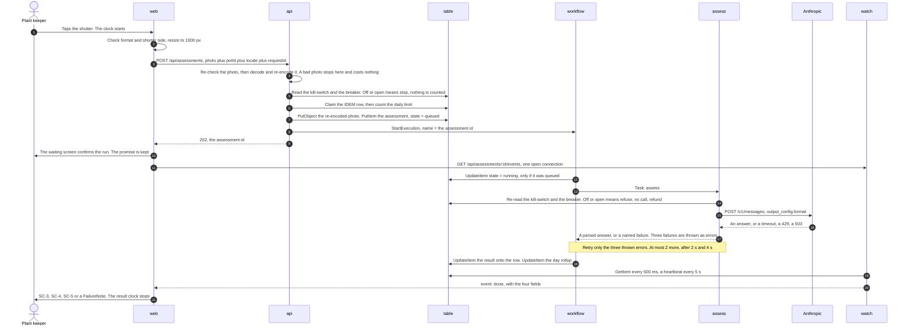

# The assessment flow, with the clock running

**Written by** 400 Architecture, run 1 (`001-photo-assessment`). **Date:** 2026-08-25.
**Rewritten 2026-09-17** for ADR-0014 to ADR-0016, when the assessment moved into the background.
**Read next by** 500 Engineering, 900 Security, 800 Infra, 600 QA.

The owner set one number on 2026-08-25: **30 seconds, from the tap that takes the photo to
something on screen.** Since 2026-09-17 the thing on screen is the waiting screen with the run
confirmed. The result then follows over one open connection, and the screen gives up after 60
seconds. This file spends both budgets step by step and shows that the parts add up to less than
the whole.

Every millisecond below is labelled **sourced**, **estimated** or **guessed**. A guessed number that
reads like a commitment is worse than no number, so section 6 lists all of them in one place.

---

## 1. Where the clock starts and stops

`factory/feature.md`: *"Measured from the tap that takes the photo to something on screen, so it
covers the resize, the upload and the model call."*

**Start:** the moment the operating system hands the photo file back to the app. Not the moment the
person opens the camera.

**Stop for the promise:** the waiting screen shows that the assessment is running. That is the
moment the `202` arrives. US-01 AC-8 was reworded on 2026-09-17 to say exactly this.

**Stop for the result:** the first paint of SC-3, SC-4, SC-5 or a `FailureNote`. A failure screen
stops this clock exactly as a verdict does.

## 2. The step list

Two columns of milliseconds. **Typical** is what most attempts should look like: a warm function on
a decent signal. **Budget** is what the design must survive: a cold function, the first call of the
day, and a weak signal.

| # | Step | Where | Typical | Budget | Where the number comes from |
| --- | --- | --- | --- | --- | --- |
| 1 | Check the format and the shorter side | Browser | 10 | 20 | Estimated. Reading a file header |
| 2 | Resize to at most 1000 px on the longer side | Browser | 250 | 400 | **Guessed.** A mid-range phone |
| 3 | Send the photo and the request | Network | 1,600 | 4,000 | **Guessed.** About 200 KB, 1 Mbps up against 400 kbps |
| 4 | Start the `api` function | Lambda | 0 | 2,000 | Estimated for a bundled Nest.js function, NFR-06 |
| 5 | Read the session, then the profile | api → table | 24 | 30 | Estimated. Two reads in order |
| 6 | Decode and re-encode the photo, stripping EXIF | api | 120 | 200 | **Guessed.** `sharp` on about 200 KB |
| 7 | Read the kill-switch and the breaker, claim the request id, then count the attempt | api → table | 30 | 50 | Estimated. Two small writes and a cached read. The order is `03-api-spec.md` §4, steps 6 to 7 |
| 8 | Write the photo to the bucket | api → photos | 80 | 100 | Estimated. One `PutObject` |
| 9 | Write the assessment row as `queued`, then `StartExecution` | api → table, workflow | 40 | 80 | Estimated. Two calls |
| 10 | The `202` travels back and the waiting screen confirms | Network, browser | 150 | 300 | Estimated |
| | **The promise: tap to confirmed** | | **2,300** | **7,200** | **against 30,000** |
| 11 | The phone opens its connection to `watch` | Browser → watch | 100 | 2,000 | Estimated. Includes a possible cold start of `watch` |
| 12 | `ClaimRun`: the row moves from `queued` to `running` | workflow → table | 30 | 50 | Estimated. One conditional `UpdateItem` |
| 13 | Start the `assess` function | Lambda | 0 | 1,500 | Estimated. A smaller bundle than `api` |
| 14 | Re-read the kill-switch and the breaker | assess → table | 0 | 30 | Estimated. Zero on a cache hit |
| 15 | Compile the answer schema, first call of the day | Anthropic | 0 | 1,500 | **Guessed size, sourced behaviour.** Cached 24 hours |
| 16 | **The model call** | Anthropic | 6,000 | 8,000 | **Guessed. No source at all.** The weakest number here |
| 17 | Check `stop_reason`, parse and validate | assess | 5 | 25 | Estimated |
| 18 | `Persist` the result, then `Rollup` | workflow → table | 30 | 60 | Estimated. Two `UpdateItem` calls |
| 19 | `watch` sees the row and sends the event | watch → browser | 300 | 700 | Estimated. It reads every 500 ms |
| 20 | Paint the result screen | Browser | 60 | 100 | Estimated |
| | **Tap to result** | | **8,800** | **21,200** | **against 60,000** |

**The typical run confirms in about 2 seconds and shows the result in about 9. The bad run confirms
in about 7 and shows the result in about 21.** Both are inside their budgets.

**Where the retry sits.** If the model times out at 18,000 ms, the workflow waits 2 seconds and
calls again; a second timeout waits 4 seconds and calls a third time. Three timeouts add up to about
60 seconds, which is why the waiting screen gives up at exactly that number. A retry that succeeds on
the second call lands at about 30 seconds on the bad run.

## 3. The retry, and why it is safe now

**Decided by the owner on 2026-09-17 (ADR-0014).** The workflow retries the `Assess` task at most
twice, only on `provider-timeout`, `provider-throttled` and `provider-unavailable`. The `assess`
handler throws exactly those three as errors so the workflow can see them; everything else is
returned as a value and never retried.

This was "no retry" from 2026-08-26, and the reason it was is worth keeping. While the phone waited,
a retry broke two numbers at once: two calls cost about $0.0070 against a $0.0040 ceiling, and a
first call had to fail early enough to leave room for a second. Moving the assessment into the
background removed both. The cost ceiling is now $0.012 per photo (NFR-10), and no call has to be
cut short to leave room for another.

**The cap is two lines and both must stay:** `MaxAttempts: 2` in the workflow and `maxRetries: 0`
in the adapter. Every retry is a billed Step Functions transition and a paid call, so the cap is a
cost control, not a convenience.

## 4. The clocks, and why no platform clock is on the paid path

In run 1 the model call sat inside the request, under four stacked clocks: the app's 20 seconds,
the function's 22, CloudFront's 25 and API Gateway's 30. The first version of this file showed why
the app had to fail first: a platform cut-off answers with a 504 that nothing in this product wrote.

That problem is gone, because the paid path no longer has a request. The clocks are now these, and
every one of them is ours:

| Clock | Value | Who owns it | What the user sees if it fires |
| --- | --- | --- | --- |
| The model abort | **18,000 ms** per attempt | The adapter, an `AbortSignal` | Nothing directly. The workflow may retry |
| The `Assess` task | **25,000 ms** per attempt, with a `Catch` | The state machine | `RecordFailure` writes `provider-timeout` on the row |
| The `assess` function | **30,000 ms** | The Lambda setting | Nothing. The net under the task timeout |
| The whole state machine | **none** | — | A machine-level timeout would skip every `Catch` and leave the row `running`. So there is none |
| The `api` function's request | **20,000 ms**, one interceptor | The API | `deadline-passed`, written by the app. It answers in about a second, so this is a net |
| The waiting screen | **60,000 ms** | The browser | `deadline-passed` on screen, whatever the workflow is doing |

The `api` function's own routes still sit under CloudFront's 25 seconds and API Gateway's 30. They
answer in about a second, so those clocks are never reached. The stream route is different: it is a
`GET` behind a Lambda Function URL, and CloudFront's origin timeout counts the gap between packets,
so a heartbeat every 5 seconds keeps it open for the whole wait (ADR-0015).

**The rule for 500 Engineering:** inside each function, one clock checked often. Between functions,
a timeout per task with a `Catch` on each. Never a timeout on the machine.

## 5. The sequence

## 6. Every number in this file that is a guess

| Number | Step | Why it is a guess | What replaces it, and when |
| --- | --- | --- | --- |
| 400 ms to resize | 2 | No phone was measured | A timing mark on the owner's own phone, in the first web task |
| 4,000 ms to upload | 3 | Depends entirely on the signal | The real spread after ten real assessments |
| 2,000 ms cold start of `api`, 1,500 ms of `assess`, 2,000 ms of `watch` | 4, 11, 13 | Estimated for bundled Nest.js functions | The Logs Insights query in `03-observability.md` §4 |
| 1,500 ms to compile the schema | 15 | The behaviour is sourced, the size is not | The first call of a day against the second |
| **8,000 ms for the model call** | 16 | **No source at all. The weakest number in the file** | **The very first real call** |
| 300 ms for the stream to deliver | 19 | It reads every 500 ms, so the average gap is 250 ms plus the send | The first e2e run |

**If the model call turns out to take 15 seconds instead of 8, this still works.** The bad run
becomes about 28 seconds to the result, inside 60, and the promise at step 10 does not move at all,
because the model call is no longer in front of it. That is the whole point of the change.

## 7. What is deliberately not in this flow

| Not here | Why |
| --- | --- |
| A cancel button | The call is paid the moment `assess` runs. `01-CONTEXT.md` §4 |
| A poll from the phone | The result is pushed over one connection (ADR-0015). The plain `GET` is only the reconnect fallback |
| A queue that a function reads | An idle queue read by Lambda still costs requests. The workflow pushes |
| A second model call | The ladder in `00-options.md` §8 |
| A second opinion service | Rejected outright by the owner |
| A cache in front of the photo | ADR-0007 |
