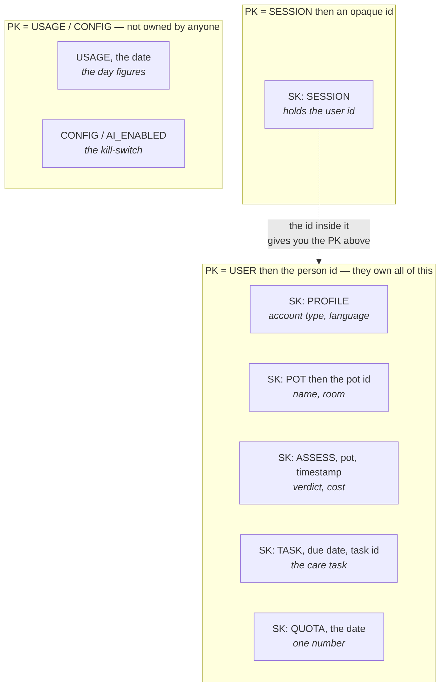
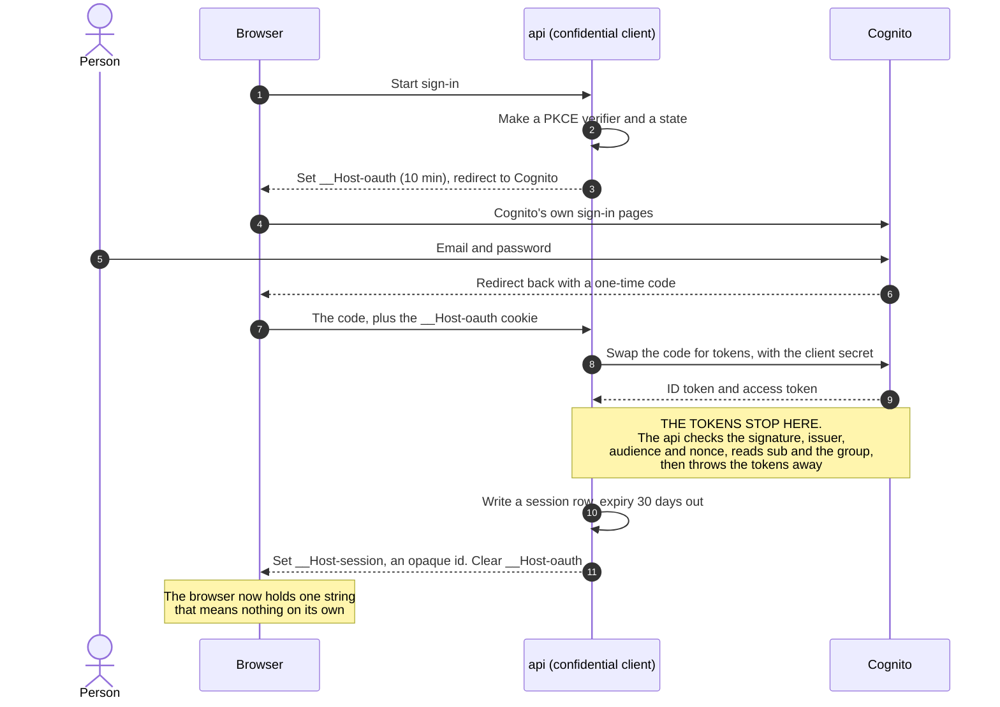

# Patterns — the shapes this system repeats

**Written by** 400 Architecture, run 1 (`001-photo-assessment`). **Date:** 2026-08-25.
**Updated 2026-09-17, twice.** First for ADR-0014 to ADR-0016: the assessment row gained a `state`,
pattern 7 became per-task clocks, pattern 8 gained the workflow's retry, and pattern 13 is new. Then
an audit found **pattern 5 had been missed**: the counter now counts assessments started rather than
model calls, and the refund was not written down at all.
**Read next by** 500 Engineering, 800 Infra, 900 Security, 600 QA.

A pattern here is a shape that appears more than once, or a shape that is easy to build a second
way by accident.

**Read this file for HOW something works. Read its ADR for WHY it was chosen and what lost.** They
are not two versions of the same text, and neither repeats the other.

| # | Pattern | Its ADR |
| --- | --- | --- |
| 1 | The data key design | ADR-0002, ADR-0004 |
| 2 | Sign-in, and the opaque session | ADR-0003 |
| 3 | Refuse by default | ADR-0004 |
| 4 | One port, one adapter, for the model | ADR-0005, ADR-0006 |
| 5 | The counter that cannot be raced | ADR-0008 |
| 6 | A switch read from a cache with a ceiling | ADR-0009 |
| 7 | The clocks: one per task, none on the platform | ADR-0014, and `03-flow.md` §4 |
| 8 | Failure is a value with a name | ADR-0005, ADR-0014 |
| 9 | Deletion belongs to the storage rule | ADR-0007 |
| 10 | Language: codes on the wire | — |
| 11 | Nothing crosses the wire except a contract | ADR-0001, ADR-0012 |
| 12 | There is no admin route at all in run 1 | ADR-0009, ADR-0004 |
| 13 | The workflow owns the run | ADR-0014, ADR-0015, ADR-0016 |

Every pattern below belongs to the whole product, not to this one feature. Later runs read this
file and extend it. They do not rewrite it.

---

## 1. The data key design

One DynamoDB table. **The owner id is the partition key of everything a person owns.** That single
choice is what makes US-07 AC-2 and AC-4 true by construction instead of by a check somebody has to
remember to write.

### The items

| Item | PK | SK | What it holds |
| --- | --- | --- | --- |
| Profile | `USER#<sub>` | `PROFILE` | Account type, language, when they last signed in, when the account was made |
| Session | `SESSION#<opaque id>` | `SESSION` | The user id, and when the session stops being valid |
| Pot | `USER#<sub>` | `POT#<potId>` | The name the person typed, the room |
| Assessment | `USER#<sub>` | `ASSESS#<potId>#<iso timestamp>` | **`state` — `queued`, `running`, `done` or `failed` — and a `failureCode` when failed** (added 2026-09-17, ADR-0014). Then band, verdict, next action, follow-up days, language, photo key, model id, cost |
| Care task | `USER#<sub>` | `TASK#<due date>#<taskId>` | The pot, the assessment it came from, the action text |
| Today's attempts | `USER#<sub>` | `QUOTA#<yyyy-mm-dd>` | One number |
| **A claimed request** | `USER#<sub>` | `IDEM#<requestId>` | The assessment id once it exists, and a time-to-live 10 minutes out |
| A day's usage | `USAGE` | `<yyyy-mm-dd>` | Assessments started, model calls made, cost in millionths of a dollar |
| The kill-switch | `CONFIG` | `AI_ENABLED` | On or off. **One field only** — see the note under this table |
| **The circuit breaker** | `CONFIG` | `BREAKER` | How many model calls failed in a row, when it opened, when it may next let one call through, and a time-to-live |

**Two rows were added on 2026-08-31.**

**`IDEM#<requestId>` is what makes one tap one charge.** `POST /api/assessments` is the only path
that spends money and it had no protection against running twice, while the design's own budget
allows a 4,000 ms upload — which is exactly when a person taps again. The browser makes one UUID per
photo; the API claims it with a conditional `PutItem` before anything else happens
(`../500-engineering/03-api-spec.md` §4a). This closes F-13 in `001-photo-assessment/07-adversarial.md`.

**`CONFIG / BREAKER` is the automatic cost guard** (gate 50, `../800-infra/02-cost-guardrails.md`
§5.6). **It must never share a row with `AI_ENABLED`.** The kill-switch is a person's decision and
the breaker is a machine's. If they shared a row, the machine could undo the human — and ADR-0009
puts the human above the machine on purpose.

### Every item carries a version, and this is how a shape changes

**Added 2026-08-31.** DynamoDB has no schema and no migration tool, and an assessment row has **no
clock** — ADR-0007 keeps the text as long as the pot exists. So an item written today can still be
read in three years, and there was no rule at all for changing a shape.

**Every item carries `v`, a whole number. It is `1` today.**

The rules that go with it are three sentences, and they are cheaper now than the scan-and-rewrite
they replace:

1. **A reader ignores a field it does not know.** So adding a field is always safe.
2. **Never rename a field and never change what one means.** Write a new field, stop writing the old
   one, and leave the old one where it is.
3. **Raise `v` only when a reader must behave differently**, and keep the code that reads the older
   version until nothing on disk still uses it.

**The kill-switch row holds one field, and this changed on 2026-08-26.** It used to hold who flipped
it and when. The owner removed the admin route (gate 30), so nothing in the application ever writes
that row — the developer edits it in the AWS website, and AWS keeps its own record of who did that.
ADR-0009 says plainly: **do not add `changedBy` or `changedAt`.**

**The same thing as a picture.** One table, and the partition key is what separates one person's
data from everyone else's. Everything a person owns sits under one key, so one `Query` gets it.



**Read the dotted arrow as the reason Q-9 is two reads.** The session is in its own partition, and
the only way to the person's partition is the id stored inside it. You cannot ask for both at once,
because you do not know the second key until the first read comes back.

**The sort key prefixes are readable on purpose** — `POT#`, `ASSESS#`, `TASK#`, `QUOTA#`. A person
new to DynamoDB reads them correctly in six months. `GSI1PK` and `entityType` do not survive six
weeks.

### Every question in `00-options.md` §1, answered

| # | The question | The operation |
| --- | --- | --- |
| Q-1 | This user's pots | `Query` PK = `USER#<sub>`, SK begins with `POT#` |
| Q-2 | One pot | `GetItem` |
| Q-3 | Attempts today | The conditional increment itself — see pattern 5 |
| Q-4 | Is the AI on | `GetItem` PK = `CONFIG`, from cache — see pattern 6 |
| Q-5 | Write an assessment | `PutItem` |
| Q-6 | One pot's history, newest first | `Query` PK = `USER#<sub>`, SK begins with `ASSESS#<potId>#`, backwards |
| Q-7 | Write a care task | `PutItem` |
| Q-8 | This user's tasks due on a date | `Query` PK = `USER#<sub>`, SK begins with `TASK#<date>` |
| Q-9 | Session and account type | **Two reads in order.** `GetItem` the session, then `GetItem` the profile using the user id the session holds |
| Q-10 | Usage over a date range | `Query` PK = `USAGE`, SK between two dates |
| Q-11 | Accounts idle for 11 or 12 months | A `Scan` with a filter, once a month |

**Q-9 cannot be one call, and it is worth saying why.** `BatchGetItem` needs every key before it
starts. The profile's key is `USER#<sub>`, and `<sub>` is stored **inside** the session item, which
has not been read yet. So the first read has to finish before the second can begin.

The alternative is to put the user id in the cookie so both keys are known up front. That is
rejected, because it undoes pattern 2 below: the cookie means nothing on its own. Twelve extra
milliseconds is a cheap price for that, and Q-9 runs on every request, so this is the most
frequently exercised path in the product and it must be right.

**There is no secondary index in run 1, and that is on purpose.** Ten of the eleven questions are a
`GetItem` or a `Query` under one partition. Q-11 is a `Scan`, which is the right answer when it runs
once a month over a table with a handful of accounts in it and the wrong answer at any larger size.

**The first index arrives in run 3, and the trigger is written down now.** Backbone 6 needs "every
task due today, across all accounts", which crosses partitions. When that run starts, add a global
secondary index keyed on the due date. **Do not add it in run 1**, because an index costs storage
and write capacity for a query nothing makes yet.

**Do not** design across items with overloaded generic key names (`GSI1PK`, `entityType`, and the
rest). The keys above say what they hold. `00-context-brief.md` §5.3 asks for the documented path
over the clever one, and a solo developer who is new to DynamoDB will read `POT#` correctly in six
months and will not read `GSI1PK` correctly in six weeks.

## 2. Sign-in: a Backend-For-Frontend with an opaque session

**The protocol is OpenID Connect, on top of OAuth 2.0, using the authorization code flow with
PKCE.** The identity provider is a Cognito user pool. The full decision, with the rejected options,
is ADR-0003.

**No token ever reaches the browser.** The browser holds one cookie carrying an id that means
nothing on its own. **ADR-0003 has the reason, the IETF source and the rejected shapes.** This
section is how it works.

**The round trip, drawn.** The important part is where the tokens stop.



**Why this shape and not PKCE in the browser.** A browser cannot keep a secret, so a browser-based
client is a *public* client and any script-injection bug becomes token theft. Here the API is a
*confidential* client: it holds the client secret, and it is the only thing that ever sees a token.

**Sign-out is a row delete.** Not a token to revoke, not a clock to wait out. That is the practical
payoff of owning the session instead of borrowing Cognito's.

### The two cookies

| Cookie | Lives for | `SameSite` | Why |
| --- | --- | --- | --- |
| `__Host-oauth` | 10 minutes | `Lax` | Holds the PKCE verifier and the `state` while the person is away on Cognito's pages. It **must** be `Lax`: the return from Cognito is a cross-site top-level navigation, and `Strict` would not send it, so the flow would break every time |
| `__Host-session` | 30 days | `Strict` | The opaque session id. `Strict` is what the draft asks for, and nothing in the product needs this cookie on a cross-site navigation |

Both carry `Secure`, `HttpOnly`, `Path=/` and no `Domain`, which is what the `__Host-` prefix
requires. The draft asks for all four (§6.1.3.2).

**The one cost of `Strict`, named so nobody is surprised by it.** The 11-month warning email will
link back into the app. On that first click the cookie is not sent, so the person sees a signed-out
page and is signed in again after one more navigation. That is accepted. If it is ever not
acceptable, the fix is a second read-only `Lax` cookie — a decision, not a quiet change.

### Why the session is ours and not Cognito's

The Cognito tokens are used **once**, at sign-in, and then dropped. The API reads `sub` and the
group from the verified ID token, writes a session item, and never refreshes anything. Three things
follow, and all three are worth having:

- Signing out is a real delete of a row, not a hope that a token expires.
- The 30-day session from gate G-7 is a number we own, in one place.
- The API does not have to hold a refresh token for weeks, so there is no long-lived provider
  credential sitting in the table.

**Do not** read the account type out of the session item. It is read from the profile item on every
request, in the second of the two reads. US-14 AC-4 says a changed account type decides the very next
request, and a type copied into a 30-day session would not.

**Do not** trust the session item's own expiry to deletion. DynamoDB TTL *"typically"* deletes
within *"a few days after their expiration"* and expired items still come back from reads until
then ([DynamoDB TTL](https://docs.aws.amazon.com/amazondynamodb/latest/developerguide/howitworks-ttl.html),
checked 2026-08-25). The TTL is housekeeping. The check that a session is still valid is a
comparison in code, on every request.

## 3. Refuse by default

Two different things are protected, by two different mechanisms, and mixing them up is the mistake
this pattern exists to prevent.

**Who may call this route at all** is a role check. A global Nest.js guard reads a decorator on the
route. **A route with no decorator does not run.** That is what makes US-14 AC-3 true: a new
admin-only action written next year with the check forgotten refuses everybody, including the admin,
which is loud and safe. The common tutorial does the opposite — an opt-out `@Public()` marker — and
that fails open.

Three decorators exist and there is never a fourth: `@Anonymous()`, `@Roles('USER')`,
`@Roles('ADMIN')`.

**Whose data this is** is not a check at all. It is the partition key. A request from user A builds
its key from A's session, so there is no code path in which A's key names B's row. `02-SPEC.md`
already requires the refusal not to reveal whether the thing exists — a missing row and someone
else's row are the same answer, because both are simply "not under this partition".

**Do not** write a route handler that takes an owner id from the request body, the query string or
the path. The owner comes from the session and from nowhere else.

## 4. One port, one adapter, for the model

`CLAUDE.md` names the port: `LlmProvider`. It lives in `packages/llm`, and it is the only place in
the repository allowed to import a model vendor's SDK. ADR-0005 carries the decision.

```
assess(input: AssessmentRequest): Promise<AssessmentOutcome>
```

`AssessmentOutcome` is either a parsed answer or one of a closed list of named failures. **It is
never a thrown vendor error.** The reason is US-09 AC-1: every failure message ends with one of two
sentences, so the failure has to arrive as a value the code can switch on, not as an exception whose
shape depends on which SDK is installed.

### The three rules the adapter follows, in this order

1. **Make a bad answer nearly impossible.** The call carries `output_config.format` with the answer
   schema, `additionalProperties: false`, and every field in `required`
   ([Anthropic structured outputs](https://platform.claude.com/docs/en/build-with-claude/structured-outputs),
   checked 2026-08-25). Handling a broken answer is the net, not the plan.
2. **Read `stop_reason` before reading the content.** The documented values include `end_turn`,
   `max_tokens`, `refusal`, `stop_sequence`, `tool_use`, `pause_turn` and
   `model_context_window_exceeded`
   ([Anthropic, handling stop reasons](https://platform.claude.com/docs/en/build-with-claude/handling-stop-reasons),
   checked 2026-08-25). Three of them are not a verdict and are not the same as each other, and the
   log records which one happened even though the user sees one screen for all three.
3. **Never match on the raw text of the answer.** Parse it. A model version can escape characters
   differently, and string matching breaks silently on an upgrade.

### The answer schema, and the one thing it cannot express

Six fields, all present, all allowed to be null, and every cross-field rule checked in Zod
afterwards:

| Field | Type | Null when |
| --- | --- | --- |
| `band` | one of `likely`, `unsure`, `cannot-tell` | never |
| `verdict` | one of the ten codes in `00-prd.md` §5.2 | the band is `cannot-tell` |
| `nextAction` | text | the band is `cannot-tell` |
| `followUpDays` | whole number | the band is `cannot-tell`, or the verdict is `nothing-wrong` |
| `cannotTellReason` | one of the four in US-05 AC-2 | the band is not `cannot-tell` |
| `retakeAdvice` | a list of the four in US-04 AC-2 | never — an empty list instead |

**The range 1 to 30 cannot be put in the schema.** Anthropic's structured outputs do not support
numerical or string-length constraints (same page, checked 2026-08-25). So the range check is ours,
in Zod, after parsing. US-03 AC-6 already says what happens when it fails: the verdict and the next
action are still shown and no task is offered. That is not a workaround; it is the acceptance
criterion that was written for exactly this.

**Do not** make the schema express the cross-field rules with `oneOf` or `anyOf`. Nullable fields
plus a Zod refinement is smaller, testable in a unit test with no model call, and does not depend on
which parts of JSON Schema the vendor supports this month.

## 5. The counter that cannot be raced

The daily limit is one atomic operation:

```
UpdateItem
  Key: PK = USER#<sub>, SK = QUOTA#<yyyy-mm-dd>
  UpdateExpression: ADD attempts :one
  ConditionExpression: attribute_not_exists(attempts) OR attempts < :limit
```

If the condition fails, no model call is made and no money is spent. If it succeeds, the attempt is
already counted before the call is made. ADR-0008 carries the decision and the rejected options.

Four properties fall out of this and each one is an acceptance criterion:

- **Ten requests at the same instant produce exactly ten successes**, because the increment is one
  operation on one item. A read-then-write would let all ten read 9.
- **A failed call still counts** (`factory/feature.md`), because the counter moves before the call.
  A person whose call fails has spent one of their ten, because the money was spent either way.
- **A refused run gives the attempt back**, and only when no call was made at all (ADR-0016).
  Three paths reach it: `StartExecution` failed in the API; `assess` found the kill-switch off;
  `assess` found the breaker open. The refund is one atomic `ADD attempts -1`, so it cannot race the
  increment.
- **The date is in the key**, so yesterday's counter is never read and never needs clearing. The TTL
  on the item exists only to stop the table growing, and nothing depends on it firing on time.

**One consequence, written down because it is easy to meet by surprise.** Since 2026-09-17 the
counter counts **assessments started**, not model calls. The increment runs once in the `api`
function, before the workflow starts, and the workflow's own retry never touches it. So ten a day is
ten assessments, and each of those may cost up to three model calls (ADR-0014). **The daily ceiling
in money is therefore 10 × $0.012, about $0.12 a day**, not 10 × $0.0040. `06-nfrs.md` §3 and
`../800-infra/02-cost-guardrails.md` §5 both use that figure.

**This is a change from the run-1 rule and the old reading is worth knowing.** Until 2026-09-17 there
was no retry, so one assessment was exactly one call and the two readings of the limit — "ten
assessments" and "ten calls" — said the same thing. They no longer do. **Where a document says the
limit counts calls, it is out of date.** US-08 AC-5 was reworded on 2026-09-17 to say that the
workflow's retries do not count again.

**The day is a UTC calendar day.** The message that says when the limit resets shows that moment in
the reader's own time. **Do not** compute the day from a timezone sent by the browser: two
timezones would give one account two resets.

## 6. A switch that is read from a cache with a ceiling

The kill-switch is one row, read into memory in the function and re-read when the copy is more than
**30 seconds** old. Gate G-8 sets the promise at 60 seconds, so 30 leaves the whole promise as
headroom. ADR-0009 carries the decision.

**Do not** read the row on every request. `factory/feature.md` rejected that as the more
complicated answer: with no cached value, somebody has to decide what happens when that read itself
fails, on or off, and there is no good answer to write down.

**Do not** put the value in an environment variable. Changing one is a deploy, and US-13 AC-2 says
a switch that needs a release is not a kill-switch.

**A call already in flight finishes** (US-13 AC-4). That falls out for free: the check happens once,
before the call, and nothing re-checks it afterwards.

## 7. The clocks: one per task, none on the platform

**Changed on 2026-09-17 (ADR-0014).** Until then the whole server side ran against one 20,000 ms
deadline, because the model call sat inside the request and API Gateway would cut the request at
30 seconds. The model call now runs in the background, so the paid path has no platform clock at
all, and the clocks are these:

| Where | Clock | What happens when it fires |
| --- | --- | --- |
| The `api` function, its own request | `REQUEST_DEADLINE_MS = 20_000`, one interceptor | The app answers `deadline-passed` itself. In practice it answers `202` in about a second, so this is a net |
| Every task in the workflow | `TimeoutSeconds` on the task, with a `Catch` | `RecordFailure` writes the failure by its name |
| The `Assess` task | 25 seconds **per attempt**; the `assess` function 30 seconds; the model abort 18 seconds | The model always fails first, by name |
| The waiting screen | 60 seconds | `deadline-passed` on screen, whatever the workflow is still doing |

**Do not** put a timeout on the whole state machine. A machine-level timeout ends a run without
running any `Catch`, so the row would stay `running` for ever. Per-task timeouts always reach
`RecordFailure`. And the old rule still holds inside one function: one clock, checked often, never a
generous timeout per step that nobody adds up.

## 8. Failure is a value with a name

Every failure in this feature is one of a closed list, and each name carries two things the screen
needs: whether trying again helps, and whether it may be retried automatically. The two are not the
same. "The person may tap again" and "the code retries by itself" are different permissions.

**The middle column changed twice.** On 2026-08-26 the owner removed every automatic retry, because
the phone was waiting and a second call ate the same clock. On 2026-09-17 the assessment moved into
the background (ADR-0014), and a capped retry came back for exactly three names. It happens inside
the workflow, never on the screen, and never for the other names.

| Name | Retried by the workflow? | The sentence the screen ends with |
| --- | --- | --- |
| `provider-timeout` | **yes, at most 2 more. The `assess` handler throws it so the workflow can see it** | trying again may work |
| `provider-throttled` (429) | **yes, at most 2 more, the same way** | trying again may work |
| `provider-unavailable` (503) | **yes, at most 2 more, the same way** | trying again may work |
| `answer-unreadable` | no | trying again may work |
| `workflow-not-started` | no. The attempt is refunded | trying again may work |
| `provider-refused` (`stop_reason: refusal`) | **no** | trying again will not work now |
| `answer-truncated` (`stop_reason: max_tokens`) | **no** | trying again will not work now |
| `provider-bad-request` | **no** | trying again will not work now |
| `no-credit` | **no** | trying again will not work now |
| `daily-limit-reached` | **no** | trying again will not work now |
| `feature-off` | **no** | trying again will not work now |
| `photo-rejected` | **no** | trying again will not work now |
| `deadline-passed` | **no** | trying again may work |

`02-SPEC.md` §6 is the same table seen from the screen. If a row is added to one, it is added to the
other, or a failure exists that has not been designed.

**Do not** retry `provider-refused` or `answer-truncated`. A safety classifier that declined will
decline again, and an answer cut off for want of room will be cut off again in the same place.
**Do not** retry `no-credit`. `factory/feature.md` is explicit: running out of credit is a normal
failure state, and retrying does not help. **Do not** write a retry anywhere in code: the adapter
returns every failure as a value, the `assess` handler throws only the three retried names, and the
workflow's `Retry` with `MaxAttempts: 2` is the only place a second call can come from.

**One name is missing a screen and it is recorded, not papered over.** `02-SPEC.md` §3.14 withdrew
the `unreadable-answer` state from SC-5 and says out loud that the failure path still needs it. That
is 300 Design's open gap; the name `answer-unreadable` above is the value it will need.

## 9. Deletion belongs to the storage rule, not to code

A photo is deleted by an S3 lifecycle rule at 180 days. Application code never deletes on a
schedule. `factory/feature.md` gives the reason: *"the rule holds even when the app is broken"*.

Two rules follow, and both are in ADR-0007:

- **No second copy of a photo exists anywhere.** No thumbnail in a second bucket, no cached copy in
  a content delivery network. US-10 AC-3 requires "every resized or cached copy" to be gone on
  demand, and the cheapest way to satisfy that is to never make one.
- **A photo is read through a signed URL that lasts five minutes.** Not through a public bucket and
  not through a cache. A five-minute URL cannot outlive a delete by long enough to matter.

## 10. Language: codes on the wire, sentences in the screen

Everything that crosses the wire is a code. The ten verdicts, the three bands, the four
`cannot-tell` reasons and the four pieces of retake advice are all codes, so the screen renders them
in whichever language the person is reading. `02-SPEC.md` §9 and US-11 AC-5 need exactly that.

**One field is different, and it is the only one: `nextAction`.** The model writes it as prose. So
the request carries the reader's language, the prompt tells the model to answer in it, and the
assessment row records which language it was written in.

**That left a hole nobody had covered, and the owner closed it on 2026-08-26 (gate 28).** An
assessment written in Hungarian and read later in English shows a Hungarian next action inside an
English screen. **The answer: show the text exactly as written, and put a short line next to it
saying which language it is in.** The assessment row already stores the language, so the screen has
what it needs and no extra read is done.

Two alternatives lost. Translating on read means a second paid model call every time somebody opens
an old assessment, on an account that closes when the credit runs out. Saying nothing at all is
cheapest and leaves the reader wondering why one line looks different. **US-11 AC-6 is the new
criterion**, and it does not contradict AC-1: AC-1 is about walking the flow now, AC-6 is about
re-reading something written earlier.

**Do not** build a sentence by joining fragments. `02-SPEC.md` §9 forbids it, and Hungarian does not
put the parts in the English order.

## 11. Nothing crosses the wire except a contract

Every request body, every response body and the model answer schema live in `packages/contracts`,
as Zod schemas with the types inferred from them. `CLAUDE.md` already forbids a wire type declared
anywhere else.

Two rules from `factory/feature.md`'s split-readiness list matter most here, because they are what
decide whether a later split is cheap:

- `packages/contracts` is imported **by package name only**, never by a relative path.
- **No relative import crosses an app border.** If `apps/web` and `apps/api` both need a thing, the
  thing moves into a package.

**Do not** put the model's answer schema only in `packages/llm`. The web app parses the same four
fields to draw SC-3, SC-4 and SC-5, so the schema is a wire type and belongs in `contracts`.
`packages/llm` imports it.

## 12. There is no admin route at all in run 1, and that is a shape too

**Decided by the owner on 2026-08-26 (gate 30), which reversed the first version of this section.**
Run 1 builds no admin route and no admin screen. The developer reads the usage figures straight from
the DynamoDB table with AWS credentials, and flips the kill-switch by editing its row in the AWS
website (ADR-0009).

**The role decorator still ships, carried by no route.** Every route declares `@Anonymous()`,
`@Roles('USER')` or `@Roles('ADMIN')`, and one with none of them does not run (ADR-0004, NFR-32).
`ADMIN` is declared and unused on purpose: US-14 AC-3 is about the admin route somebody adds next
year, and the default has to already be *refuse* on the day they add it.

**Do not** build a second way in for the admin when that route finally arrives — no separate key and
no shared secret. Editing the row in the AWS console is no longer on that list, because it is now the
run-1 answer; what makes it acceptable is that only the person holding the AWS account can do it, and
in run 1 that is the same person.

**One credential deliberately stays out of the running system.** US-12 AC-2 asks for the app's
model-call count to match the provider's own record exactly. Anthropic publishes that record through
an admin endpoint, `/v1/organizations/usage_report/messages`, which needs an **admin** API key that
is a different and more powerful credential than the one the app uses
([Anthropic usage and cost API](https://platform.claude.com/docs/en/manage-claude/usage-cost-api),
checked 2026-08-25). That key does not go on the server. The comparison is a script the owner runs
locally, against the table directly. 900 Security confirms or overrules that placement.

## 13. The workflow owns the run

**Added 2026-09-17 (ADR-0014 to ADR-0016).** The assessment runs in the background. This pattern
says who does what, in order, so nobody builds a second way.

```
api          checks the switch and the breaker, counts the attempt, claims the IDEM row,
             re-encodes the photo, writes the row as queued,
             StartExecution with name = the assessment id, answers 202 in about a second
ClaimRun     UpdateItem queued -> running, with a condition. A duplicate start stops here
Assess       the one model call, in the assess function. Re-reads the switch and the breaker first.
             Retried at most twice, on the three thrown errors only
Persist      UpdateItem the result onto the row. Retried on DynamoDB errors, never money
Rollup       UpdateItem the day rollup. Retried the same way
Refund       ADD attempts -1, reached only when no call was made
RecordFailure  UpdateItem state = failed, with the failure code
mark-failed  an EventBridge rule on FAILED, TIMED_OUT or ABORTED writes failed on the row,
             for a run that died outside its own Catch
watch        streams the row's state to the phone over server-sent events, a heartbeat every
             5 seconds, closes at 55 seconds, the browser reconnects
```

Four things fall out of that shape:

- **The execution name is the assessment id.** Step Functions returns the same run for a repeated
  start with the same name, and `ClaimRun` makes a duplicate stop in one step. So one tap is one
  run, whatever the network does.
- **The `assess` function holds the model key and nothing else worth stealing.** Its role is the
  key parameter, the two `CONFIG` rows, the breaker row and the photo object. The `api` function
  holds no model key at all.
- **The circuit breaker is written by `assess`**, because the API never sees the outcome. Retries
  count toward its five failures. The half-open test is exactly one call, because `assess` runs one
  copy at a time.
- **Nothing polls.** The phone holds one open connection. The workflow pushes. No Lambda reads a
  queue, because an idle queue read by Lambda still costs requests.

**Do not** call `LlmProvider` from the `api` function. **Do not** put a Lambda between the workflow
and the table for a plain write. **Do not** poll from the phone except as the reconnect fallback.
