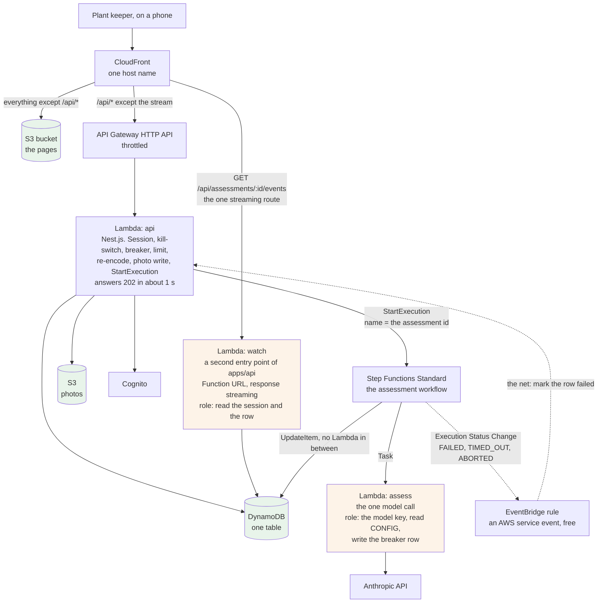
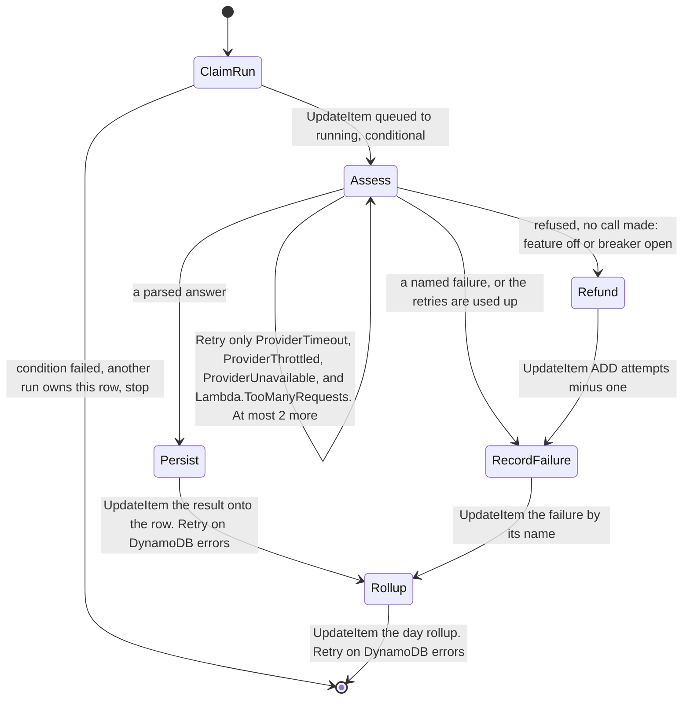
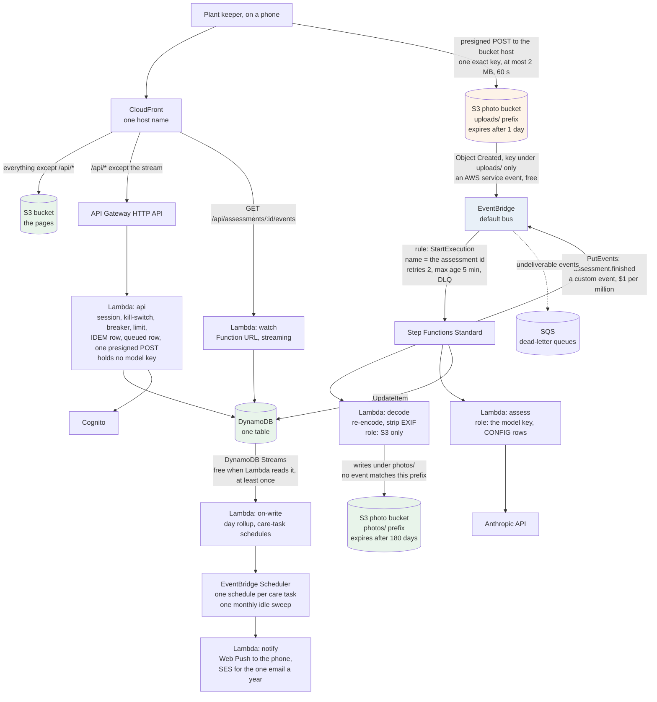
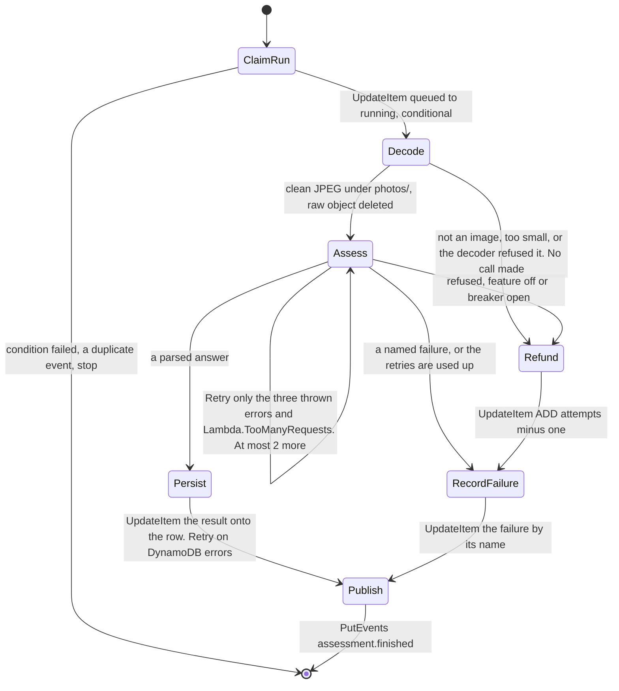
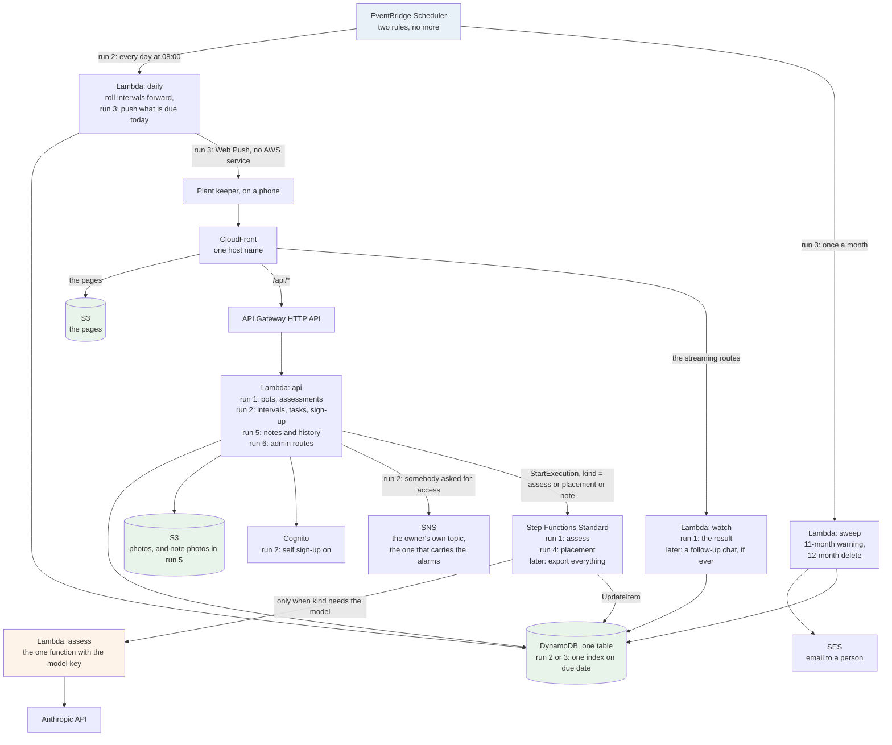

# Two new shapes for zamphora — the short version

**Written 2026-09-17. Decided the same day: the owner chose Option E** (gate 72, ADR-0014 to
ADR-0016). §3 is now the current shape and §8 is the approved target for runs 2 to 6. Option F in
§4 is the shape that was not taken. `08-async-options.md` has every fact, link and number.

---

## 1. The problem with today's shape

Today, one Lambda function does everything. The phone sends the photo and **waits** while the model
thinks. That gives three problems:

- **A hard clock.** API Gateway cuts every request at 30 seconds. So the model call must finish in
  about 16 seconds, or the person sees an error.
- **No retry.** If the model call fails, the app cannot try again. There is no time left.
- **One key for everything.** One function holds the model key, the table and the photos. If the
  photo decoder is ever broken by a bad image, the attacker holds all of it.

Both new shapes fix all three. They do it the same way: **the phone stops waiting.** The API answers
at once, the model call runs in the background, and the result is pushed to the phone when it is
ready.

## 2. What is free on this account

The account is on the free plan. Only "Always Free" services are free. About $160 of credit is
left, so cents a month are fine.

| Service | What it is | Free amount a month |
| --- | --- | --- |
| **Step Functions** | Runs steps in order, retries the ones you mark, keeps a history | 4,000 steps, forever |
| **EventBridge** | Routes events. Its **Scheduler** is a timer | Events from AWS services free. 14 million timer runs |
| **DynamoDB Streams** | A feed of every write to the table | Free when a Lambda reads it |
| **Lambda Function URL** | A plain web address for one function. Can **stream** | Inside Lambda's 1 million requests |
| **X-Ray** | Draws one request as a line through every service | 100,000 traces |
| **SQS, SNS** | A queue, a topic | 1 million each |

**Not free, and closes the account fast:** ECS, Fargate, EC2, a load balancer, a NAT gateway, a
relational database. About $150 a month idle. They stay in the paid shape (§6 of the full file).

## 3. Option E — the phone stops waiting, nothing else moves

**The idea.** The API does everything it does today up to the model call. Then it hands the call to
a Step Functions workflow and answers `202` with the assessment id. The phone opens one connection
and the result is pushed to it.

**How one assessment works, in six steps.**

1. The phone sends the photo to the API, as today.
2. The API checks the kill-switch, counts the daily limit, cleans the photo, saves it, and writes
   an assessment row with `state = queued`.
3. The API starts the workflow and answers `202` in about one second. The phone shows a waiting
   screen. **Something is on screen, so the 30-second promise is kept.**
4. The workflow calls the `assess` function. That function makes the one model call. If the call
   times out or the provider is busy, the workflow tries again, **at most two more times**.
5. The workflow writes the result onto the row.
6. The phone has one open connection to the `watch` function. It sends the result the moment the
   row changes. This is **server-sent events**, the same thing the model provider uses to stream.

**What is new.** Step Functions. Two small functions, `assess` and `watch`. One EventBridge rule
as a safety net. X-Ray.

**What it costs.**

- The result screen needs one new state, `waiting`, with a give-up after 60 seconds.
- The 30-second promise now means "the waiting screen is on screen", not "the answer is". **You
  decide if that is still the promise.**
- One photo can cost three model calls instead of one: about $0.012 instead of $0.004.
- If the app is closed while the run finishes, nothing in run 1 shows the result yet.

**What it fixes.** All three problems in §1. The model key leaves the API. A retry exists, with its
cap written in one place.

## 4. Option F — every step is its own unit, events connect them

**The idea.** The phone uploads the photo **straight to S3**, with a 60-second permission for one
exact file name. S3 announces "a file was created". That announcement starts the workflow. Every
write to the table becomes an event too, and a timer service sends reminders later.

**How one assessment works, in six steps.**

1. The phone asks the API for permission to upload. The API checks the kill-switch, counts the
   daily limit, writes the `queued` row, and signs a permission for **one exact file name**, at
   most 2 MB, valid 60 seconds.
2. The phone uploads straight to S3. No function runs during the upload.
3. S3 tells EventBridge "a file was created under `uploads/`". EventBridge starts the workflow.
4. The `decode` function cleans the photo, removes EXIF, saves it under `photos/` and deletes the
   raw upload. This function can reach S3 and nothing else.
5. The `assess` function makes the model call, with the same retry rule as Option E.
6. The workflow writes the result. The phone gets it over the same stream as in Option E.

**What later features get from this shape.**

- **Reminders.** When a care task is written, the `on-write` function creates a one-time timer for
  its due date. On the day, the timer runs `notify`, which sends a push message to the phone.
- **The 12-month clean-up.** One monthly timer runs a function that warns idle accounts by email
  and deletes the ones idle for a year. Today nothing does this.
- **A separate key for every step.** The decoder holds nothing worth stealing.

**What is new.** Everything in Option E, plus: the direct upload, EventBridge rules, the timer
service, DynamoDB Streams, SES for email, three more small functions.

**What it costs.**

- The most new things to learn and to run: about sixteen pieces instead of four today.
- The upload goes to a second web address, the bucket's own. That needs a CORS rule and one
  exception to the "one origin" rule.
- For a few seconds two copies of a photo exist. The raw one is deleted by the decoder, and a
  rule deletes any that is left after a day.
- Every place where a service retries on its own needs a cap, or money can leak. There are
  thirteen such places, and each has its setting in §8 of the full file.

## 5. The scores

The same four constraints as `00-options.md`, plus one new one.

| Constraint | **A** today | **E** | **F** |
| --- | --- | --- | --- |
| Cost while nobody uses it | 5 | 5 | 5 |
| Fits 30 seconds | 4 | 4 | 4 |
| One part-time developer can run it | 4 | 3 | 2 |
| How hard it is to leave | 3 | 3 | 3 |
| **Total, old four** | **16** | **15** | **14** |
| What later features get for free | 1 | 3 | 4 |
| **Total with the new one** | **17** | **18** | **18** |

**How to read it.** On the old rules, today's shape still wins by one or two points. The new shapes
win only if "what later features get" counts. So this is not "the better design wins". It is you
deciding that the future features and the learning now count. That is your call, and it is a fair
one.

## 6. The rules that keep it safe

Today the danger is a loop in the code. In the new shapes the danger is **a service retrying on
its own**. Every such place has one setting:

- Step Functions: retry at most 2 times, only for a timeout or a busy provider. Switch off the
  hidden retry that the CDK adds by default.
- EventBridge rules and timers: retry 2 times, then send the event to a dead-letter queue.
- The `assess` function: one copy at a time. A second run waits, for free.
- The model client: `maxRetries: 0` stays, as today.
- Option F: the start rule matches only files under `uploads/`, so a cleaned photo never starts a
  new run.

The kill-switch and the daily limit work as today. One new rule: if the switch is flipped after the
attempt was counted, no call is made and the attempt is given back.

## 7. Microservices at the API level

Options E and F already split the work by job: fast routes, the paid call, the decoder, the
stream, the timers. Each is its own function with its own key. That is the useful split.

Splitting the API itself into a pots service, a tasks service and an auth service is not proposed.
The session check would exist three times. The three services would share one table. The plant
list would pay three cold starts. The trigger to do it is already written in ADR-0001: a second
person, a second language, or CI over 15 minutes.

## 8. Which one, if the future counts

The planned features are in `factory/feature.md`: watering and soil intervals (run 2),
notifications (run 3), placement advice (run 4), a plant's history over time (run 5), admin
screens (run 6), and open sign-up with "ask for access" as a run-2 story.

| Feature | What it needs | E has it? | Needs something only F has? |
| --- | --- | --- | --- |
| Intervals and the care schedule | Task rows written ahead, a "due today" index, one daily job | Yes, with one daily timer rule | No. F's one-timer-per-task is a second way to do the same thing |
| Notifications | A daily job that sends Web Push; an email once a year | Yes, the same daily rule plus a monthly one | No |
| Placement advice | A second kind of model call | Yes, the same workflow with `kind = placement` | No |
| History over time | Reads of the assessment rows; notes with photos, no model call | Yes | Only if photos grow past 2 MB. At 200 KB, no |
| Admin screens | Routes behind the admin role | Yes | No |
| Open sign-up, "ask for access" | Cognito sign-up on, a flag the owner flips, the owner told | Yes. The API posts to the SNS topic the owner already gets alarms from | No |

**Every planned feature is served by E plus three small additions:** two timer rules, Web Push,
and SES for email. Nothing planned needs F's direct upload or its stream of writes.

**So the recommendation is: take E, and let it grow.** F is not wrong, it is early. Its pieces can
each be added later as one small decision, the day a feature asks for one. The full file, §11,
has the feature-by-feature table and the two triggers.

**This is what E looks like grown to run 6.** The run that adds each piece is on its box.

**What it uses, all together:** Lambda (six functions at most), Step Functions, EventBridge
Scheduler, DynamoDB, S3, CloudFront, Cognito, SNS, SES, Parameter Store, X-Ray. **What it does
not use, and why not:** DynamoDB Streams and a direct upload, because nothing planned needs them;
containers, a load balancer and a database server, because they close the account.

## 9. What was decided

On 2026-09-17 the owner chose **Option E** and approved the grown shape in §8 as the target for runs
2 to 6 (gate 72). Three things came with the choice: the 30-second promise is kept by the waiting
screen; an attempt is given back when no model call was made; and the retry is capped at two inside
the workflow. The decision is in `factory/feature.md` under "Human decisions already made", in
ADR-0014, ADR-0015 and ADR-0016, and in `00-options.md` §11, which scores E and F next to the run-1
options.

## 10. Where the detail is

| Question | Full file |
| --- | --- |
| Which service is free, cheap, or closes the account, with links | §2 |
| Why the retry can only fire on a thrown error | §4.3 |
| Why the result is streamed, and why not a WebSocket or a poll | §4.4 |
| Why the whole API is not behind a Function URL | §4.7 |
| Why one upload permission is for one exact file name | §5.2 |
| All thirteen retry traps and their settings | §8 |
| Every record that changes if a shape is chosen | §9 |
| Every number that is a guess | §10 |
