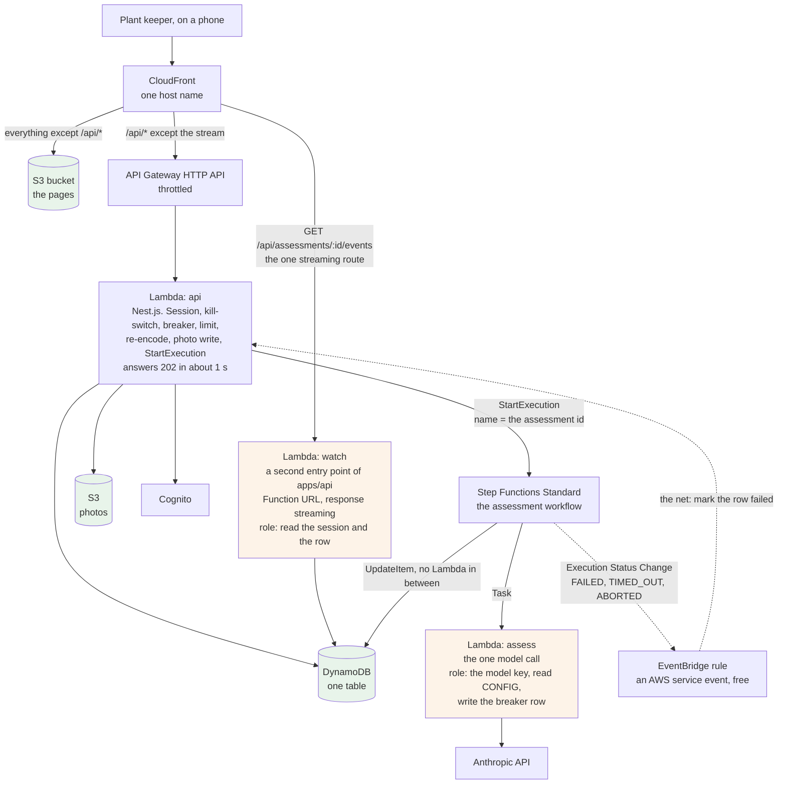
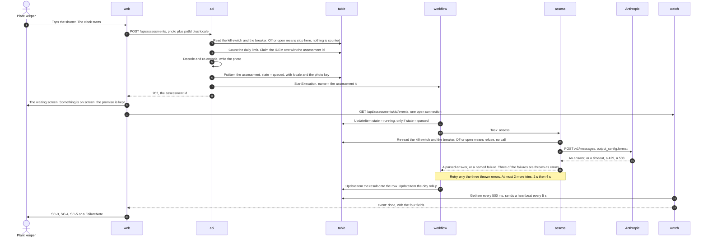
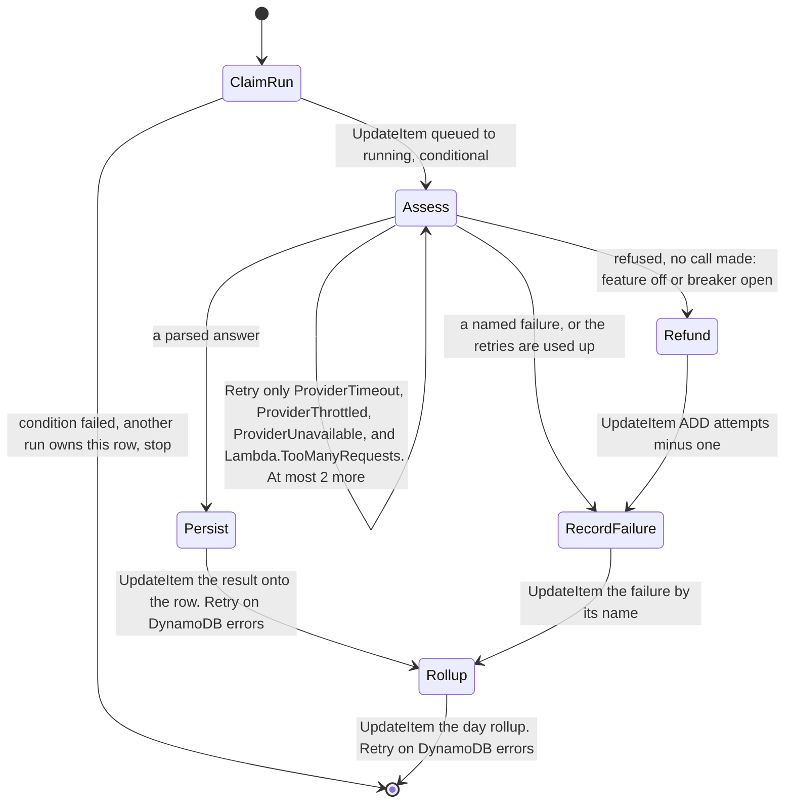
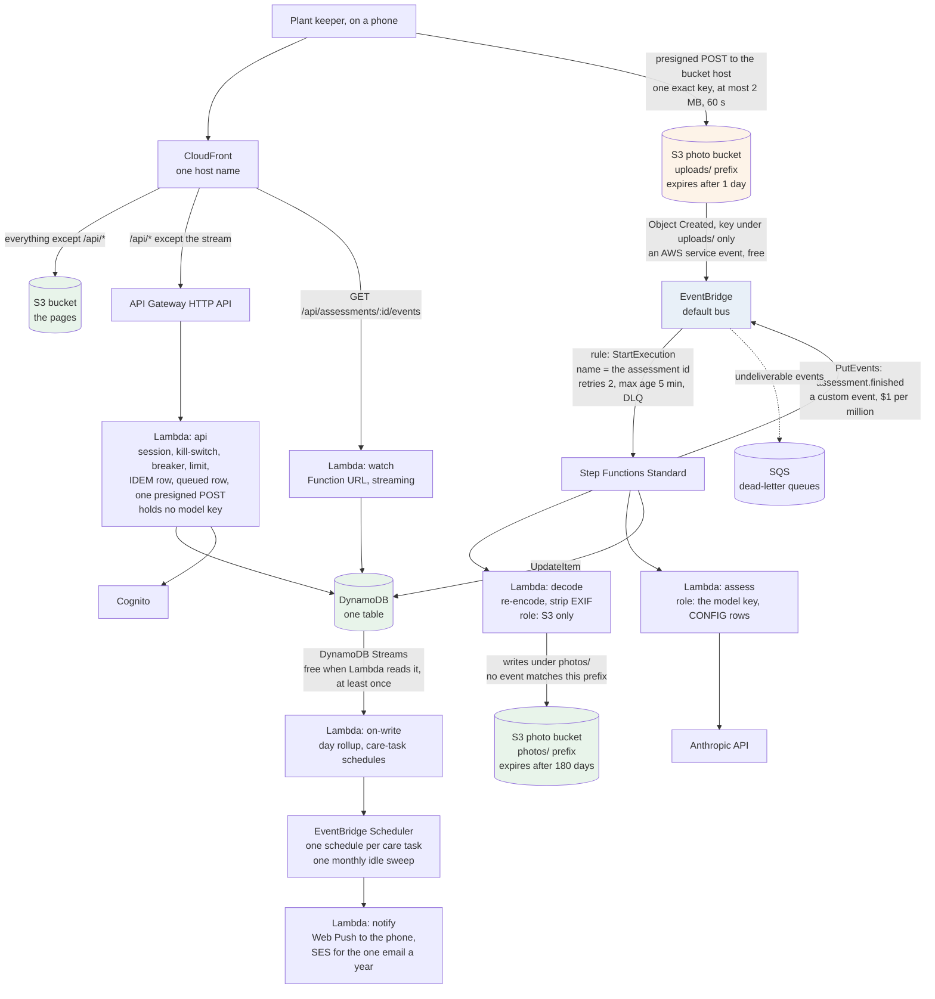
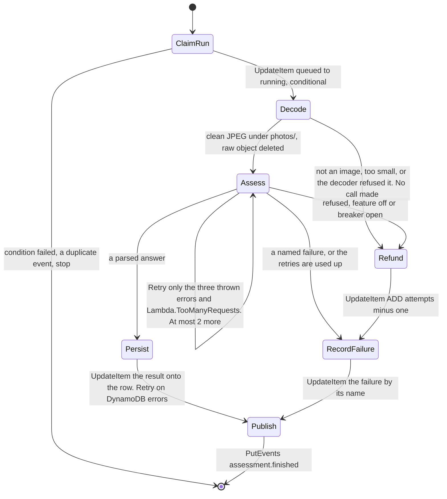
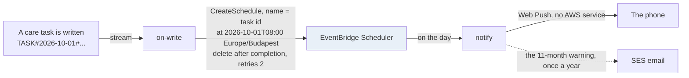
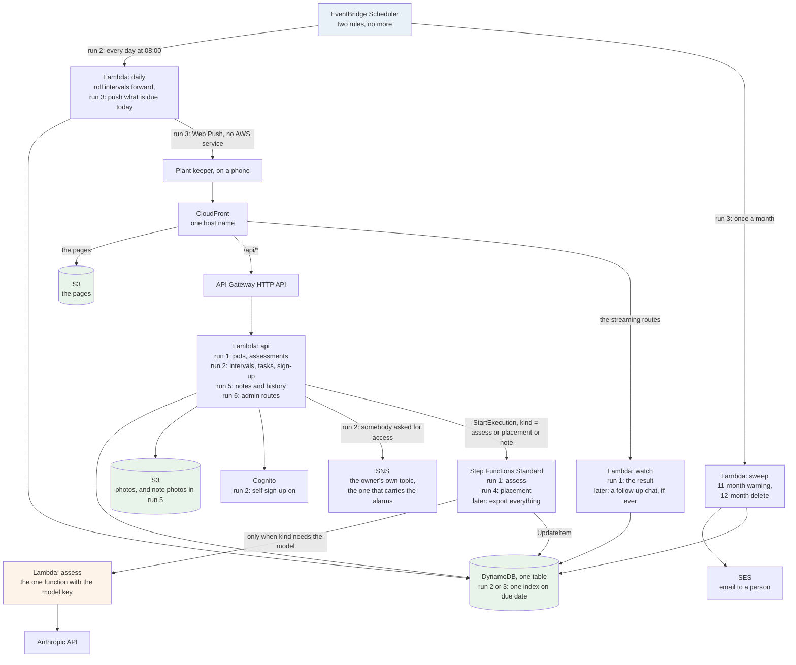

# Two asynchronous shapes for zamphora, on the free plan

**Written at the owner's request, 2026-09-17. Decided the same day: Option E** (gate 72,
ADR-0014 to ADR-0016). This file is now the **reference** behind that decision: every link, number
and rejected shape. Nobody needs to re-read it. Read `08-async-options-short.md` instead.

**Reviewed the same day by a fresh session that had none of this session's context.** It found 20
problems, three of them blockers, and every one is folded into the text below. The three blockers
were: Option F as first drawn looped forever, because the cleaned photo landed in the bucket that
starts the workflow; nothing in F tied one upload to one counted attempt; and the retry in both
shapes could never fire, because the adapter returns a failure as a value and Step Functions only
retries an error. They are named here so the next reader knows this file was wrong once and how.

**Read next by** the owner. Then, if a shape is chosen, by 400 Architecture and 800 Infra.

**The short version is `08-async-options-short.md`.** Read that one first. It has the same
diagrams, plain words, and only what is needed to choose. Come back here for a link, a number or
the reason behind a rule.

Every outside fact carries a link and the date it was checked. Every number that is a guess is
listed once more in §10, so no reader mistakes it for a commitment.

---

## Contents

1. [What Option A does not have yet](#1-what-option-a-does-not-have-yet)
2. [What is free, what is cheap, and what closes the account](#2-what-is-free-what-is-cheap-and-what-closes-the-account)
3. [The fifth constraint](#3-the-fifth-constraint)
4. [Option E — the phone stops waiting, and little else moves](#4-option-e--the-phone-stops-waiting-and-little-else-moves)
5. [Option F — every step is its own unit, and events connect them](#5-option-f--every-step-is-its-own-unit-and-events-connect-them)
6. [The paid shape, and the question of microservices](#6-the-paid-shape-and-the-question-of-microservices)
7. [Scoring](#7-scoring)
8. [The new cost traps, each with its setting](#8-the-new-cost-traps-each-with-its-setting)
9. [What changes in which record if a shape is chosen](#9-what-changes-in-which-record-if-a-shape-is-chosen)
10. [Every number in this file that is a guess](#10-every-number-in-this-file-that-is-a-guess)
11. [The two shapes against the planned features](#11-the-two-shapes-against-the-planned-features) — the recommendation, and the grown diagram
12. [What this document does not decide](#12-what-this-document-does-not-decide)

---

## 1. What Option A does not have yet

`00-options.md` chose Option A: one Nest.js application in one Lambda function behind an API
Gateway, and the phone holds the request open while the model answers. It won at 16 points, and
every ADR follows from it. It is a good answer for run 1. This table lists what it does not have,
and says honestly which rows are a limit of the shape and which are only work not done yet. The two
shapes below exist to remove the first kind.

| # | What Option A does not have | Limit or not built? | Where it is written |
| --- | --- | --- | --- |
| L-1 | A model call longer than about 16 seconds. The gateway cuts the request at 30 seconds and CloudFront at 25, so the app gives up at 20 | **Limit of the shape** | `001-photo-assessment/03-flow.md` §4 |
| L-2 | A retry of a failed model call. Every retry eats the same clock, so the rule is "no retry anywhere" | **Limit of the shape** | ADR-0005, `03-flow.md` §3 |
| L-3 | A separate permission set for the paid route. One function means one IAM role over the whole table, the whole bucket and both secrets | **Limit of the shape.** ADR-0002 names the trigger to split; the split has not happened | ADR-0002 "fifth cost", `../900-security/02-mitigations.md` RR-03, gate 70 |
| L-4 | A timer for the 12-month deletion of an idle account | **Not built.** A scheduled rule invoking the one function would do it. Nothing in `01-iac-plan.md` runs on a timer today | `../900-security/02-mitigations.md` R-02, gate 66 |
| L-5 | A way to tell the person something after the request ends | **Not built.** Web Push needs no AWS service and would work on A too. Backbone 6 has no run yet | `factory/feature.md`, backbone table |
| L-6 | A fast route that a slow assessment cannot block. Ten assessments at once fill the reserved concurrency of 10, and the plant list answers 429 | **Limit of the shape**, until the split in L-3 | ADR-0002, the split trigger |
| L-7 | A trace worth drawing. One function, one outside call, so X-Ray is off | Not a limit; a fact about one hop | `../800-infra/03-observability.md` §8 |

**L-1 and L-2 are one problem.** The "no retry" rule exists because of the clock, not because a
retry is wrong. `03-flow.md` §3 says so: *"A retry becomes right again in run 3, when the assessment
runs in the background."* Both shapes below run it in the background.

## 2. What is free, what is cheap, and what closes the account

This section comes before the options, because it decides what may appear in a diagram.

The account is on the **free account plan**. It has **Always Free** offers only. A twelve-month
trial offer is worth nothing here (`../800-infra/02-cost-guardrails.md` §2). When the credit is
gone, the plan ends and the resources go with it.

**One input changed on 2026-09-17, stated by the owner in chat:** about **$160 of credit remains**,
and the free window ends 2026-12-31. So a service that costs cents or a few dollars a month is
acceptable now. "Always Free only" is the default, not a hard rule. **Every paid line below carries
its number**, and the account's own protections in `02-cost-guardrails.md` §6 still apply.

### 2.1 Always Free, checked first-party on 2026-09-17

| Service | What it is, in one sentence | Monthly allowance | Source |
| --- | --- | --- | --- |
| **AWS Step Functions, Standard** | A workflow service. You draw steps, it runs them in order, retries the ones you say, and keeps the history of every run | **4,000 state transitions.** *"does not automatically expire at the end of your 12 month AWS Free Tier term"*. Each retry counts as one more transition | [Step Functions pricing](https://aws.amazon.com/step-functions/pricing/) |
| **Amazon SQS** | A queue. One side puts a message in, another side takes it out later | 1,000,000 requests | [Free application integration](https://aws.amazon.com/free/application-integration/) |
| **Amazon SNS** | A topic. One message in, many subscribers out: email, a queue, a function. **Email needs the recipient to confirm a subscription first**, so it reaches the owner and nobody else | 1,000,000 publishes, 100,000 HTTPS deliveries, **1,000 emails** | same page; [SNS FAQ](https://aws.amazon.com/sns/faqs/) on the opt-in |
| **Amazon EventBridge Scheduler** | A timer. It invokes a target once at a set time, or on a repeating rule | **14,000,000 invocations** | [EventBridge pricing](https://aws.amazon.com/eventbridge/pricing/) |
| **Amazon EventBridge bus** | A router for events. A rule matches an event and sends it to a target | Events from AWS services are free. **Custom events cost $1.00 per million** | same page, and [reducing EventBridge charges](https://repost.aws/knowledge-center/eventbridge-reduce-charges) |
| **DynamoDB Streams** | A feed of every write to a table, in order, delivered **at least once** | Reads by a Lambda function are **free with no limit**. 2.5 million reads by anything else | [DynamoDB pricing](https://aws.amazon.com/dynamodb/pricing/), [Streams cost guide](https://docs.aws.amazon.com/amazondynamodb/latest/developerguide/CostOptimization_StreamsUsage.html) |
| **AWS X-Ray** | Tracing. One request drawn as a line through every service it touched | 100,000 traces recorded, 1,000,000 scanned | [Free DevOps offers](https://aws.amazon.com/free/devops/) |
| **S3 Event Notifications** | S3 tells another service that an object was written | *"There are no additional charges"* | [S3 FAQ](https://aws.amazon.com/s3/faqs/) |
| **Lambda Function URL** | A plain HTTPS address for one function, with no API Gateway in front. It can **stream** a response, which API Gateway's HTTP API cannot | Lambda's own 1,000,000 requests. No extra charge. Refuses anything over 10 times the reserved concurrency with a free `429` | [Function URLs](https://docs.aws.amazon.com/lambda/latest/dg/urls-configuration.html), [streaming](https://docs.aws.amazon.com/lambda/latest/dg/configuration-response-streaming.html) |
| **Powertools for AWS Lambda (TypeScript)** | A library, not a service. A tracer, a structured logger, metrics and an idempotency helper. **The idempotency helper keeps its own table rows and is not a drop-in for `IDEM#`** | Free | [Powertools for TypeScript](https://docs.powertools.aws.dev/lambda/typescript/latest/) |

### 2.2 Cheap, not free — acceptable with the $160, each with its number

| Service | What it costs | Why it is here |
| --- | --- | --- |
| **Step Functions above 4,000 transitions** | $0.000025 per transition in `us-east-1`, so **$0.025 per 1,000**. The `eu-central-1` rate is not on the page and is checked when the stack is written | 4,000 a month is about 800 assessments at 5 transitions each. One user at the daily cap of 10 uses well under half |
| **Step Functions Express** | Priced per request and per duration, **no free amount** | **Do not use.** It also runs a step *at least once*, not exactly once, which is wrong for a paid call |
| **EventBridge custom events** | $1.00 per million | An `assessment.finished` event 30 times a month is $0.00003 |
| **Amazon SES** | **No Always Free offer** on this plan; the 3,000-message offer is a 12-month trial. $0.10 per 1,000 after | **The only way to email a user.** SNS email reaches only an address that confirmed a subscription, so the 11-month warning to an idle person needs SES. One message a year is $0.0001 |
| **API Gateway WebSocket API** | $1.00 per million messages, $0.25 per million connection-minutes; the free amount is a 12-month trial | Cents at this size. Rejected in §4.4 for the second front door, not for the price |
| **A customer-managed KMS key** | About $1 a month per key, plus requests | Already priced in `02-cost-guardrails.md` §2. 900 Security said SSE-S3 is enough for run 1 |
| **DynamoDB point-in-time recovery** | $0.20 per GB a month, a few cents here | `02-cost-guardrails.md` §8 already asks the owner to re-open gate 46 |
| **API Gateway HTTP API** | $1.00 per million calls | Already in the design. The fallback GET in §4.4 adds a few calls a month |

**Sources for this table:** [Step Functions pricing](https://aws.amazon.com/step-functions/pricing/),
[SES FAQ](https://aws.amazon.com/ses/faqs/), [EventBridge pricing](https://aws.amazon.com/eventbridge/pricing/),
[API Gateway pricing](https://aws.amazon.com/api-gateway/pricing/), all checked 2026-09-17.

### 2.3 Not on this plan at any price worth paying

| Service | Why not | Source |
| --- | --- | --- |
| **ECS on Fargate, ECS on EC2, EC2 itself** | No Always Free offer. Charged by the hour whether or not anyone uses the app. The smallest useful set is about $150 a month idle and closes the account in about six weeks | [Free container offers](https://aws.amazon.com/free/containers/), and `../learn/aws-and-the-pipeline.md` §7 |
| **Amazon ECR, private** | 500 MB a month is a 12-month trial. Public repositories get 50 GB Always Free, but a product image does not belong in a public registry | [ECR pricing](https://aws.amazon.com/ecr/pricing/) |
| **Application Load Balancer, NAT Gateway, RDS, Aurora, ElastiCache** | Charged by the hour, no Always Free offer | ADR-0002, `02-cost-guardrails.md` §6 |

**So ECS, ECR, Fargate, ELB and ASG stay in §6, the paid shape.** They are the right answer on a
paid account with steady traffic, and the wrong answer on this one. `../learn/aws-and-the-pipeline.md`
§7 draws that shape in full and the Lambda Web Adapter is the bridge to it.

## 3. The fifth constraint

`00-options.md` §3 scored four whole-system shapes on four constraints. They are kept as written, so
the new shapes can be compared with the old scores:

- **C-1** — what it costs while nobody is using it.
- **C-2** — whether it fits inside 30 seconds, tap to screen.
- **C-3** — whether one part-time developer can operate it.
- **C-4** — how hard it is to leave.

**One constraint is added, because the options disagree on it.**

**C-5 — what the shape gives later runs for free.** Three things are already owed and have no
mechanism in Option A: a timer for the 12-month sweep (gate 66), a delivery channel for backbone 6,
and a separate IAM role for the paid route (gate 70). A shape that brings those with it saves a
later run from adding them one at a time. *An earlier draft counted the plant history of backbone 4
as a fourth item. It is not one: `00-options.md` Q-6 reads that history straight from the `ASSESS#`
rows and needs no stream. It was removed and the scores in §7 were lowered to match.*
`.claude/memory/project-zamphora.md` names learning AWS as one of the two purposes of this project,
and C-5 is where that purpose appears — as a count of what the shape carries, not as a preference.

Scores are 1 to 5. **Option A's four old scores are copied, not re-argued.**

## 4. Option E — the phone stops waiting, and little else moves

**The idea in two sentences.** `POST /api/assessments` does everything it does today up to the
model call, then hands the call to a workflow and answers at once with the assessment id. The phone
opens one connection that stays open until the result arrives.

**What stays exactly as it is.** The web app, static and credential-free (ADR-0010). Sign-in and
the opaque session (ADR-0003). The one table, keyed by owner (ADR-0004). The upload through the API,
re-encoded, capped at 2 MB (ADR-0007). The kill-switch row (ADR-0009). The daily counter moving
before the call (ADR-0008). Every contract in `packages/contracts`. `LlmProvider`, with
`maxRetries: 0` still set on the Anthropic client — the SDK's own retry stays off, and the only
retry in the product is the one the workflow declares.

**What moves.** The model call leaves the request and runs inside **AWS Step Functions**, a
workflow service: a small diagram of steps that AWS runs in order, retrying the steps you mark, and
keeping the history of every run. The one step that spends money runs in **its own Lambda function
with its own IAM role**.

### 4.1 The containers

Four things the picture is drawn to show:

- **The gateway is no longer on the paid path.** The API answers before the model is called, so
  the 30-second cut-off, the 25-second CloudFront timeout and the 22-second function timeout all
  stop mattering for the call.
- **The `api` function no longer holds the Anthropic key.** Only `assess` does. That is RR-03 in
  `02-mitigations.md`, answered by shape rather than by trust.
- **The workflow writes the rows itself.** Step Functions updates DynamoDB through a service
  integration, so `assess` needs no permission on assessment rows at all. Its role is exactly:
  read the two `CONFIG` rows, write the breaker row, read one Parameter Store value.
- **There is no dead-letter queue in this shape, and that is not an omission.** Step Functions
  has none. `StartExecution` is a call the API makes and can see fail. What replaces the queue is
  the dotted rule at the bottom: when an execution ends in `FAILED`, `TIMED_OUT` or `ABORTED`, an
  EventBridge rule on the *Execution Status Change* event invokes a small handler that writes
  `failed` on the row. That is the net under every other net, and it is free.

### 4.2 One assessment, with the clock

**Where the 30-second promise goes.** `factory/feature.md` measures it from the tap to *something
on screen*. In this shape something is on screen at step 9, after the upload and about one second
of server work. The promise is kept by the waiting screen, not by the model. **That is a change to
what the promise means**, and it is the owner's to accept. `02-SPEC.md` would gain one state,
`waiting`, on the result screen, **with a give-up time**: after 60 seconds with no result the
screen shows `deadline-passed` and offers the tap again, whatever the workflow is still doing.

**The three writes that make a retry safe, in order.** The `IDEM#` row stores the assessment id
*before* the `202` is sent, not at the end as today. The row is written with `state = queued`
before `StartExecution`. And the execution is named with the assessment id: Standard workflows
return the same execution for a repeated `StartExecution` with the same name
([choosing a workflow type](https://docs.aws.amazon.com/step-functions/latest/dg/choosing-workflow-type.html),
checked 2026-09-17), so a second tap with the same id starts nothing new.

**If `StartExecution` itself fails**, the API writes `failed: workflow-not-started` on the row and
returns that failure instead of the `202`. No call was made, so the API also refunds the attempt
(§4.3). The person sees a failure screen and taps again with a fresh id.

**The clocks that remain.** Each task in the workflow carries its own `TimeoutSeconds`, and every
one has a `Catch`. There is deliberately **no timeout on the whole state machine**: a machine-level
timeout ends the execution without running any `Catch`, so the row would stay `running`. Per-task
timeouts always reach `RecordFailure`. The `assess` function timeout sits above its task timeout,
which sits above the model's own 18-second abort, so the model always fails first and by name.

### 4.3 The workflow

- **The retry can only fire on an error, so the adapter throws three.** ADR-0005 says the port
  returns a value, never a thrown vendor error, and that stays true for the caller. The `assess`
  handler is the caller: it takes the value, and for exactly `provider-timeout`,
  `provider-throttled` and `provider-unavailable` it throws an error with that name. Every other
  outcome is returned. Step Functions retries a thrown error and never a returned value.
- **The retry list is written once and the CDK default is switched off.** CDK's `LambdaInvoke`
  task adds a hidden retry of six attempts on `Lambda.ServiceException`, `Lambda.AWSLambdaException`
  and `Lambda.SdkClientException` unless `retryOnServiceExceptions: false` is set
  ([LambdaInvokeProps](https://docs.aws.amazon.com/cdk/api/v2/docs/aws-cdk-lib.aws_stepfunctions_tasks.LambdaInvokeProps.html),
  checked 2026-09-17). `Lambda.SdkClientException` can arrive *after* the function already called
  the model, so it must not be retried. The explicit list is the three thrown errors plus
  `Lambda.TooManyRequestsException`, which is a free refusal from reserved concurrency and never a
  spent call. `MaxAttempts: 2`, `IntervalSeconds: 2`, `BackoffRate: 2`.
- **The cost cap for one photo is three calls, about $0.012**, and it rests on two lines that
  must both stay: `MaxAttempts: 2` here and `maxRetries: 0` in the adapter.
- **`Refund` exists because two refusals happen after the attempt was counted.** Today the
  kill-switch is read before the counter moves. Here `assess` re-reads it and the breaker just
  before the call, so a switch flipped while a run was queued still stops the call — and because
  no call was made, the person's attempt is given back with one `ADD attempts -1`. ADR-0008 gains
  one sentence: an attempt is refunded only on a path where no call was made.
- **`ClaimRun` makes a duplicate harmless.** It moves the row from `queued` to `running` with a
  condition. If the condition fails, the run ends at once, with one transition and no call.
- **The write steps retry, the paid step is capped.** `Persist` and `Rollup` carry a `Retry` on
  `DynamoDB.ProvisionedThroughputExceededException` and `DynamoDB.InternalServerError`, three
  attempts. A throttled write after a paid answer costs transitions, never money, and never loses
  the result.
- **Standard, never Express.** Standard starts a task once unless a `Retry` says otherwise.
  Express runs a step *at least once*, which can call the model twice for one photo with no rule
  saying so ([workflow types](https://docs.aws.amazon.com/step-functions/latest/dg/welcome.html),
  checked 2026-09-17). Express also has no free amount. *"Exactly once" is about starting the
  task, not about the HTTP call inside it; that is why the SDK exception above is excluded.*
- **Transitions:** `ClaimRun`, `Assess`, `Persist`, `Rollup` — **4 in the normal case, 6 with two
  retries.** At the daily cap of 10 for one user, that is at most 310 assessments and about 1,250
  transitions a month in the normal case, about 1,900 in the worst, inside the free 4,000.

**The circuit breaker moves with the call, and three things about it change.** Today the API
writes the breaker row after the call. In this shape the API never sees the outcome, so **`assess`
writes the breaker row**, which is why its role carries that one write. **Retries count**: each
failed call is a failed call, so five in a row can be two photos, and that is the right reading of
"5 failed model calls in a row". **The half-open test is exactly one call because `assess` has a
reserved concurrency of 1** in run 1: queued runs wait for it with the free `TooManyRequests` retry.
That number rises with users, and when it does the half-open rule needs a conditional write on the
breaker row so two runs cannot both be the test.

### 4.4 How the phone learns the answer

**One open connection, server-sent events.** Server-sent events, SSE, is the plain HTTP way for a
server to push lines to a browser over one long response. It is the same mechanism Anthropic uses
to stream tokens, and the browser has it built in as `EventSource`, with automatic reconnection.
After the `202`, the phone opens `GET /api/assessments/:id/events`. The `watch` function validates
the session, reads the row every 500 ms, sends a comment line every 5 seconds as a heartbeat, and
sends one `done` or `failed` event with the four fields when the state changes. Then it closes.

- **Why this and not a poll every two seconds.** A poll has one interval of dead time and a
  request per interval. A stream has neither: the result arrives within 500 ms of the write, over
  one request. `00-options.md` §5 took a point off Option C for the poll's dead time. This removes
  the reason.
- **Where it runs.** API Gateway's HTTP API cannot stream. Streaming needs a **Lambda Function
  URL**, or a REST API, and ADR-0007 forbids the REST API because it corrupts uploads. So `watch`
  is a separate small function behind a Function URL, and CloudFront routes exactly one path to
  it. It is a **second entry point of `apps/api`**, built from the same session module, so the
  session check is written once (`05-patterns.md` §3). It uses Node's native response streaming,
  which needs no adapter ([response streaming](https://docs.aws.amazon.com/lambda/latest/dg/configuration-response-streaming.html),
  checked 2026-09-17).
- **CloudFront signs its requests to the Function URL** with an origin access control, so the URL
  is not reachable except through the one host name. **This route is a `GET` with no body, and
  that matters:** CloudFront's signed access requires the *viewer* to send a SHA-256 hash of the
  body on every `POST` or `PUT` ([restricting access to a Function URL](https://docs.aws.amazon.com/AmazonCloudFront/latest/DeveloperGuide/private-content-restricting-access-to-lambda.html),
  checked 2026-09-17). A stream route never meets that rule. The upload route stays on the HTTP
  API for exactly this reason.
- **The clocks.** CloudFront's origin response timeout counts the gap *between packets*, so a
  heartbeat every 5 seconds keeps the connection open under the existing 25-second setting. The
  stream closes itself at 55 seconds; `EventSource` reconnects on its own, and the row already
  holds whatever happened. Lambda bills the streaming function for its whole duration, about a
  minute at 128 MB per assessment, which is inside the free 400,000 GB-seconds by a wide margin.
- **The plain `GET /api/assessments/:id` stays as the fallback**, for a reconnect and for a
  browser that blocks streams. Its answer carries `Cache-Control: no-store`, and it sits under
  the `/api/*` behaviour whose cache policy is already `CACHING_DISABLED` — a cached `queued`
  would be read forever.
- **Ownership is by construction, as everywhere else.** `watch` reads the session row, takes the
  user id from it, and reads the assessment under that user's partition. Another person's
  assessment id answers exactly like one that does not exist (ADR-0004).

**Three alternatives, named so nobody rebuilds them.**

- **A poll every two seconds.** The first draft's answer. Rejected for the dead time and the
  requests, once the stream turned out to cost nothing extra.
- **A WebSocket API.** Cents at this size (§2.2), but it is a second front door on a different
  host name, so the `__Host-session` cookie does not reach it and a second sign-in path is needed.
  Rejected for that, not for the price.
- **Web Push for the result itself.** Needs the person to accept a permission prompt and a service
  worker to be installed before the first assessment. Right for backbone 6, wrong for the first
  minute of the first use.

**If the app is closed while the run finishes**, the result lands on the row and nothing in run 1
shows it: the pot history is backbone 4. The honest options are to say so, or to add one read of
"the last assessment" to the pot screen. Either is the owner's, and it is listed in §11.

### 4.5 What is new to the project, and what each piece is

| Piece | What it is | Why it is here |
| --- | --- | --- |
| **Step Functions Standard** | The workflow service above | Runs the model call outside any request. Holds the retry rule. Its history is a per-assessment trace for free |
| **A second Lambda, `assess`** | The model call, alone, with its own role, reserved concurrency 1 | RR-03. Its own memory and timeout, so the fast routes no longer pay for image-sized memory (ADR-0002's split trigger, answered) |
| **A third Lambda, `watch`** | The stream, behind a Function URL, from the same codebase | §4.4. The only streaming route, and the only Function URL |
| **One EventBridge rule** | *Execution Status Change* from Step Functions, an AWS service event | The net: a run that ends any other way than through its own `Catch` still marks the row |
| **X-Ray** | Tracing | `03-observability.md` §8 wrote the trigger: *"a second compute unit joins the flow"*. It has. Free at this size |
| **Powertools for AWS Lambda** | A library | The tracer and a structured logger that matches `03-observability.md` §3. Not its idempotency helper, which keeps its own rows |
| **A new CDK stack, `ZamphoraWorkflowStack`** | The state machine, `assess`, `watch`, the rule | One stack per deployable unit, ADR-0001 rule 5 |

### 4.6 What it costs, said plainly

- **A new screen state.** `waiting` on the result screen, with a give-up time and the failure
  path after it. 300 Design owns the words.
- **The promise changes meaning.** "Something on screen in 30 seconds" is now the waiting screen.
  The owner decides whether that is the promise they made.
- **Two more deployable units and two more roles.** More to read, in exchange for less to trust.
- **The breaker's writer moves** from the API to `assess`, and retries now count toward its five.
- **A result that finishes with the app closed is unreachable in run 1.**
- **Step Functions is the one new service to learn**; the Function URL and the rule are settings.

### 4.7 A variant, not chosen: the whole API behind a Function URL

The Function URL in §4.4 raises a question worth answering once: why not put the *whole* API
behind one, and drop API Gateway? It would remove the 30-second cut-off for every route, remove
the $1.00 per million, and make the API a plain HTTP server under the **Lambda Web Adapter**, the
same image that runs on Fargate later. The throttle would be reserved concurrency times ten, with
a free `429` above it, which refuses a flood more cheaply than the gateway does.

**It is not chosen, for one documented reason.** With CloudFront's signed access, every `POST` and
`PUT` must arrive with a SHA-256 of its body computed by the browser (the link in §4.4). That is a
few lines with `SubtleCrypto` for a JSON body, and it is also a rule every future route must
remember, including the 2 MB photo upload. The alternative — an unsigned public URL with a shared
secret header CloudFront adds — puts a secret into the CDK template, which `01-iac-plan.md` §6
forbids on a public repository. So the gateway stays for now, and this paragraph is the record of
why. **Trigger to re-open:** a second route that needs to stream, or the day API Gateway's
30-second ceiling bites a route that is not the assessment.

## 5. Option F — every step is its own unit, and events connect them

**The idea in two sentences.** The API counts the attempt and hands the phone a short-lived
permission to write one exact object to S3; S3 announcing "an object was created" is what starts
the work. Every later step is a small function with one job and one role, and every write to the
table becomes an event that other functions can act on.

**What stays.** Everything in the list at the top of §4, except the upload path, which changes.
**The API is still the only thing that counts an attempt, claims the `IDEM#` row and writes the
`queued` row** — the first draft left that unsaid, and without it one permission could start many
paid runs.

### 5.1 The containers

**Read it from S3 outwards.** The write of one object is the first event. Everything after it is a
reaction to an event, never a call from one function to another. That property is what the word
**event-driven** means, and it is what lets a later feature subscribe to `assessment.finished`
without touching the code that produced it.

**The loop that the first draft had, and the one line that removes it.** `decode` writes the
clean photo into the *same* bucket that fires `Object Created`. With a rule that matched every
object, every clean photo would start a new run, a new decode and a new paid call, forever. **The
rule matches `detail.object.key` with the prefix `uploads/` and nothing else**, `decode` writes
only under `photos/`, and `infra-assert` asserts both. It is trap T-10 in §8.

### 5.2 The upload, and ADR-0007's objection answered

ADR-0007 rejected a signed upload straight to S3 with one sentence: *"a signed PUT does not validate
what is uploaded."* That is true of a signed PUT. **A presigned POST is different**, and the
difference is a policy document S3 enforces
([S3 POST policy](https://docs.aws.amazon.com/AmazonS3/latest/userguide/sigv4-HTTPPOSTConstructPolicy.html),
checked 2026-09-17):

| Check | Who does it in Option A | Who does it in Option F |
| --- | --- | --- |
| The body is at most 2 MB | multer, in the function | **S3**, from `content-length-range` in the policy. A larger body is refused before any function runs |
| The declared type is one of the accepted list | the function | **S3**, from an `eq` condition on `Content-Type`. A declared type is not evidence, so the next row still runs |
| The object lands under **one exact key** | the function chooses the key | **S3**, from `eq` on `$key`: `uploads/<userId>/<potId>/<assessmentId>.jpg`. Not `starts-with` — a prefix would let one permission write many objects and start many paid runs |
| One permission, one attempt | the counter, then the call | **The API**: it counts the attempt, claims the `IDEM#` row, writes the `queued` row with the locale and the key, and only then signs the policy. A second POST with the same key fires a second event, and the workflow's `ClaimRun` ends it at once (§4.3) |
| The bytes really are an image, the size is right, EXIF is stripped | `sharp` in the function | `sharp` in the `decode` function, **before** anything else sees the bytes |

The permission lasts 60 seconds. ADR-0007's own trigger to re-open this was *"if the assessment
moves to a background job in run 3"*, and this shape is that move.

**Three things this costs, said honestly.**

- **For a few seconds there are two objects**: the raw upload under `uploads/` and the clean copy
  under `photos/`. The `decode` function deletes the raw one as its last step. As a net under
  that, a lifecycle rule on `uploads/` expires anything left after one day — S3 runs expiry at
  midnight UTC after the object's age rounds up, so "one day" means up to about 48 hours. ADR-0007's
  "no second copy" rule was written about derivatives that live as long as the photo. This is a
  copy that lives seconds and cannot live past two days. **It still needs the ADR superseded in
  part, and that is the owner's call.**
- **The upload goes to a second host.** A presigned POST is sent to the bucket's own address, not
  to the one CloudFront host name. So the bucket needs a CORS rule allowing `POST` from the app's
  origin, the Content Security Policy's `connect-src` names the bucket host, and **ADR-0010's "one
  origin" gains one written exception for the upload**. The session cookie is not involved in the
  upload, so nothing about the cookie rules changes.
- **The workflow learns the locale from the row, not the key.** The key carries the user id, the
  pot id and the assessment id. Everything else the workflow needs is on the `queued` row the API
  wrote first.

**What it buys.** The 6 MB Lambda payload ceiling and the base64 growth go away. The upload no
longer spends API Gateway time or a function's memory. And a slow upload on a weak signal no longer
holds a function copy open.

### 5.3 The workflow

- **`Decode` runs before any money is spent**, in a function whose role can reach the bucket and
  nothing else. If a crafted image ever breaks the decoder (R-09 in `02-mitigations.md`), the code
  that runs holds no model key and no table permission. That is the structural answer gate 70
  asked about. A photo that is not an image is a refusal with no call, so it refunds the attempt,
  as `photo-rejected` costs nothing today.
- **The day rollup is gone from the workflow.** It moves to the stream consumer below, so the
  workflow has one job.
- **Transitions:** `ClaimRun`, `Decode`, `Assess`, `Persist`, `Publish` — **5 in the normal case,
  7 with two retries.** About 1,550 a month at the daily cap for one user, about 2,200 worst case.

### 5.4 Writes become events, and what that gives later runs

**DynamoDB Streams** is a feed of every write to the table, in order, delivered **at least once**.
A Lambda function reading it costs nothing ([Streams cost guide](https://docs.aws.amazon.com/amazondynamodb/latest/developerguide/CostOptimization_StreamsUsage.html),
checked 2026-09-17). One `on-write` function reads it and does two things:

| The write | What `on-write` does | Which owed item it answers |
| --- | --- | --- |
| An `ASSESS#` row reaching `done` or `failed` | `ADD` to the day rollup, **guarded by a conditional write that marks the row `rolledUp`**, because a stream record can arrive twice | The rollup leaves the paid path. US-12's numbers are still written for every assessment, once |
| A `TASK#` row | Creates a **one-time EventBridge Scheduler schedule** at the task's due date, targeting `notify`, with the task id as the schedule name so a repeat is a no-op | **Backbone 6.** The schedule is the reminder. 14,000,000 free invocations a month |

**EventBridge Scheduler** is the timer. Two kinds of schedule live in it: one-time schedules, one
per care task, deleted after they fire; and one monthly rule that invokes the sweep function.

- **Web Push** is the browser's own push channel. The API holds a key pair, the phone subscribes
  once, and a Lambda sends a small signed message to the browser vendor's endpoint. No AWS service
  is involved and nothing is billed. **It is backbone 6 and it is out of scope for this document;
  it is drawn because this shape carries it for free.** It would work on Option A too; what F
  adds is the timer that decides *when*. Whether notifications use Web Push is still open in
  `.claude/memory/decisions-made.md`.
- **The monthly sweep** is the mechanism gate 66 lacks: the rule fires, the function scans for
  profiles idle 11 months, and deletes those idle 12 months. **The warning email goes through
  SES, not SNS.** SNS email delivers only to an address that has clicked a confirmation link
  ([SNS FAQ](https://aws.amazon.com/sns/faqs/), checked 2026-09-17), which is right for the owner's
  alarms and useless for a person who has not opened the app in eleven months. SES costs $0.10 per
  1,000 messages on this plan (§2.2). Whether the sweep is built, and in which run, stays the
  owner's.
- **A custom event, `assessment.finished`**, is published at the end of every workflow. Nothing
  listens to it in run 1. It exists so that any later consumer can subscribe without changing the
  workflow. It costs $1.00 per million, so $0.00003 a month.

### 5.5 What is new to the project, and what each piece is

Everything in §4.5, plus:

| Piece | What it is | Why it is here |
| --- | --- | --- |
| **A presigned S3 POST** | A short-lived permission to write one exact object, with rules S3 enforces | §5.2. Removes the upload from the function |
| **A CORS rule on the photo bucket** | The browser may `POST` to the bucket host from the app's origin | The upload goes to a second host. The one exception to ADR-0010 |
| **S3 Event Notifications to EventBridge** | S3 sends an event for every object written; the rule keeps only `uploads/` | The start of the workflow. Free ([S3 FAQ](https://aws.amazon.com/s3/faqs/)) |
| **EventBridge bus and rules** | The router, with a retry cap and a dead-letter queue on every target | One rule starts the workflow. One rule could route `assessment.finished` later |
| **EventBridge Scheduler** | The timer, with a retry cap and a dead-letter queue on every schedule | Care-task reminders and the monthly sweep |
| **DynamoDB Streams** | The feed of writes, read by one function with a retry cap and a failure destination | The rollup and the schedules react to writes instead of being written inline |
| **SES** | Email to a person | The 11-month warning. One message a year |
| **Three more small functions**: `decode`, `on-write`, `notify` | One job, one role each | Least privilege, RR-03 |
| **Two more CDK stacks**: `ZamphoraEventsStack`, `ZamphoraSchedulesStack` | The bus rules and the scheduler group | One stack per deployable unit |

### 5.6 What it costs, said plainly

- **The most new services of any shape here.** Eight services and five functions that do not exist
  today. Each is small; together they are the reason C-3 scores lowest in §7.
- **ADR-0007 and ADR-0010 each superseded in part.** The upload path, the brief second object, the
  second host for the upload.
- **Every asynchronous edge needs two settings**, a retry cap and a dead-letter queue, or it is a
  place where money can leak. §8 lists all of them, and there are four more than in E.
- **A raw object can reach the bucket that `decode` never sees**, if the workflow fails to start.
  The lifecycle rule is the net, and the dead-letter queue on the EventBridge rule is the record.
- **The phone learns the result the same way as in E**, over one stream.

## 6. The paid shape, and the question of microservices

### 6.1 The paid shape, for completeness

The owner's list names ECS, ECR, Fargate, ELB and ASG. They belong to one shape, and it is already
drawn: `../learn/aws-and-the-pipeline.md` §7, *"If money were no object"*. A long-running container
on Fargate behind an Application Load Balancer, an SQS queue and a worker, Aurora Serverless,
ElastiCache, a VPC with a NAT Gateway. **Nothing in it has an Always Free offer**, so it costs about
$150 a month while nobody uses the app and would end this account in about six weeks (§2.3).

**Two things worth keeping from it.** The queue-and-worker idea is exactly what Options E and F do
with Step Functions, at no charge. And the **Lambda Web Adapter** makes the same container image run
on Lambda today and on Fargate later, so "we picked wrong" becomes "we change where the image runs".
That is the bridge to this shape when the account is paid and the traffic is steady.

It is scored in §7 so the comparison is complete. It is not proposed.

### 6.2 Microservices at the API level — what the shapes already do, and what is not proposed

The owner asked whether the API itself should become several services. The honest answer has two
halves.

**Options E and F already split by job, and that is the split worth having at this size.** The
fast read-and-write routes, the paid model call, the decoder, the stream, the timers — each is its
own function, with its own role, its own memory, its own timeout and its own CDK stack. That is
what a service border buys: a small blast radius, a permission set that matches the job, and one
unit to redeploy when only that job changes. F has six such units.

**Splitting the read-and-write API by domain — a pots service, a tasks service, an auth service —
is not proposed, for three reasons that are about this project and not about microservices.**

- **The session check would be written three times.** `05-patterns.md` §3 exists because a rule
  written twice drifts. Three Nest.js applications each reading the session row is three copies
  of the one guard that keeps the product closed.
- **They would share one table**, keyed by owner, because ADR-0002 and gate 43 leave no room for
  three. Services that share a database are one application with three deploys, which is the
  shape the word "distributed monolith" was coined for.
- **Three cold starts on the plant list screen** instead of one, for one developer, with no
  measured reason. ADR-0002 says the trigger to split is a measurement, and names the assessment
  route as the first and only route to split. E and F split exactly that route.

**The written trigger already exists and is not changed here.** ADR-0001: a second person owns one
side, a service in a language other than TypeScript, or a pull-request CI run past 15 minutes.
**What the six split-readiness rules already guarantee** is that the day it is wanted, a domain
split is a routing change: CloudFront or the gateway sends `/api/pots/*` to one function and
`/api/tasks/*` to another, each built from its own folder, each in its own stack. That is a change
of configuration, not a rewrite, and it is the reason the rules were written.

## 7. Scoring

| Constraint | **A** — today | **E** — async, minimum change | **F** — event-driven | **Container** — paid |
| --- | --- | --- | --- | --- |
| C-1 Cost while idle | **5** | **5** | **5** | **1** |
| C-2 Fits 30 seconds | **4** | **4** | **4** | **5** |
| C-3 One part-time developer | **4** | **3** | **2** | **2** |
| C-4 How hard to leave | **3** | **3** | **3** | **4** |
| **Total on the four old constraints** | **16** | **15** | **14** | **12** |
| C-5 What it gives later runs | **1** | **3** | **4** | **3** |
| **Total with C-5** | **17** | **18** | **18** | **15** |

**Read the two totals separately, because that is the finding.** On the four constraints
`00-options.md` used, **A is still ahead: E is one point behind it, F is two**. With C-5, E and F
edge one point ahead of A and tie each other. *The first draft had E tied with A on the old four
and F winning outright; the cold review lowered C-4 and C-5, and the corrected numbers are the
ones above.* So choosing E or F is not "the better architecture wins"; it is the owner saying that
what a shape gives later runs, and what it teaches, now counts. That is a legitimate re-weighting
and it is theirs to make.

### Why each score is what it is

**C-1.** E and F run nothing between requests. Their new services are Always Free at this size,
and the priced lines — custom events, the stream's function-seconds, one SES message a year — are
cents (§2.2). The container pays by the hour, as `00-options.md` already scored it.

**C-2.** A scores 4 because of the gateway ceiling. E and F remove the ceiling, and the stream
delivers the result within half a second of the write, so they stay at 4 for a different reason:
the promise is now kept by a waiting screen, which the owner has not yet accepted. F also gains a
hop — S3 to EventBridge to Step Functions, usually a second or two — and loses nothing, because
the person is already looking at that screen. The container has no cold start and scores 5.

**C-3.** A is four managed pieces. E adds a workflow, two functions and a rule: eight, and one new
service to learn. F adds a bus, a scheduler, a stream, a presigned upload, a CORS rule and three
more functions: about sixteen pieces, and six new services. `00-context-brief.md` §5.3 asks for the
documented path, and every piece in E and F is a documented AWS pattern; the cost is the count,
not the cleverness. `00-options.md` gave Option C a 2 partly because "what happens when the person
closes the app mid-job" had no answer; §4.4 now gives one, so E earns its 3. The container scores
2 for the reasons in `00-options.md` §5.

**C-4.** E and F score 3, the same as A, and not higher. The port is the same in all three, so a
provider swap costs the same. What E and F add is written in AWS-only languages: the workflow
definition, the Scheduler, the stream consumer. Leaving AWS means rewriting those as well as the
repository layer. The retry rule being a setting rather than code is a real gain, and it cancels
against that. *The first draft gave E and F a 4 and the review was right that the reasons did not
support it.*

**C-5.** A carries none of the three owed items. E carries the separate role and a trace. F carries
all three: the timer, the channel's clock, and the role. The container carries the queue and the
trace and nothing about timers or roles.

### The Well-Architected view

The AWS Well-Architected Framework is a set of questions AWS publishes for judging a design, in
six pillars. The **Serverless Applications Lens** is the version of it for shapes like these
([Serverless Lens, Step Functions](https://docs.aws.amazon.com/wellarchitected/latest/serverless-applications-lens/step-functions-workflows.html),
checked 2026-09-17). One sentence per cell, for the three free shapes.

| Pillar | A | E | F |
| --- | --- | --- | --- |
| **Operational excellence** | One log stream, one dashboard. Easy to read, nothing to correlate | Step Functions history is a per-run record. X-Ray draws three hops | Every step and every event has its own record. The most to look at, and the most visible when it breaks |
| **Security** | One role over everything, RR-03 open | The paid step has its own role. The API loses the model key | Every function has the least it needs. The decoder holds nothing worth stealing |
| **Reliability** | No retry. A slow provider is a failure screen | A capped retry with backoff on the call; a free retry on every write; a rule that marks any run that dies | The same, plus the upload survives a broken function: the object is in S3 and the lifecycle rule bounds it |
| **Performance efficiency** | One function pays image-sized memory on every route | The fast routes and the paid route are sized apart | Upload, decode and assess are each sized for their own job |
| **Cost optimisation** | Under a cent a month | Cents a month. Every retry is a counted transition, so the cap is visible in the bill | Cents a month. The most edges where a missing cap could leak, and §8 names each |
| **Sustainability** | Nothing runs idle | Nothing runs idle. The stream function runs only while a person waits | Nothing runs idle. The stream consumer runs only on writes |

**The lens says one thing plainly that matters here:** avoid polling loops inside a workflow, and
prefer callbacks or direct integrations, because Standard workflows are priced per transition.
Both shapes obey it — the workflow never polls anything, and the writes are direct integrations.
The `watch` function reads the row every 500 ms, but it is a Lambda reading DynamoDB, not a
workflow state, so it costs no transition.

## 8. The new cost traps, each with its setting

Option A's guardrails were built for one function and one request. Asynchronous shapes add edges
where a service retries on its own, and on an account that closes, a retry nobody capped is the new
runaway loop. Every trap below has a setting, and every setting belongs in CDK and in
`infra-assert`.

| # | The trap | The fact, checked 2026-09-17 | The setting |
| --- | --- | --- | --- |
| T-1 | **Lambda retries an asynchronous invoke twice on its own**, and keeps the event up to six hours | [PutFunctionEventInvokeConfig](https://docs.aws.amazon.com/lambda/latest/api/API_PutFunctionEventInvokeConfig.html) | Route every model call through Step Functions, where `Retry` is explicit. On any function still invoked asynchronously, `retryAttempts: 0` and an `onFailure` destination |
| T-2 | **EventBridge retries a rule target for 24 hours, up to 185 times**, by default | [EventBridge retry policy](https://docs.aws.amazon.com/eventbridge/latest/userguide/eb-rule-retry-policy.html) | On every rule target: `retryAttempts: 2`, `maxEventAge: 5 minutes`, and a dead-letter queue. An old upload event must not start a workflow tomorrow |
| T-3 | **Every Step Functions retry is a billed transition, and CDK adds a hidden retry of six** on Lambda service exceptions | [Step Functions pricing](https://aws.amazon.com/step-functions/pricing/); [LambdaInvokeProps](https://docs.aws.amazon.com/cdk/api/v2/docs/aws-cdk-lib.aws_stepfunctions_tasks.LambdaInvokeProps.html) | `retryOnServiceExceptions: false`, then one explicit `Retry` with `MaxAttempts: 2` on the three thrown errors plus `Lambda.TooManyRequestsException`. Never on `Lambda.SdkClientException`, which can arrive after the call was made. `maxRetries: 0` stays in the adapter |
| T-4 | **An idle SQS queue read by Lambda still spends requests**, because Lambda long-polls it and scales down to two pollers, not zero | [SQS charges higher than expected](https://repost.aws/knowledge-center/sqs-high-charges), [SQS scaling](https://docs.aws.amazon.com/lambda/latest/dg/services-sqs-scaling.html) | **No Lambda reads a queue in either shape.** SQS is used only as dead-letter queues, which a person reads in the console. Step Functions and EventBridge push; nothing polls |
| T-5 | **Step Functions Express has no free amount** and runs steps at least once | [Workflow types](https://docs.aws.amazon.com/step-functions/latest/dg/welcome.html) | `stateMachineType: STANDARD`, asserted by `infra-assert` |
| T-6 | **A machine-level timeout ends a run without running any `Catch`**, so the row stays `running`; and a task timeout applies **per attempt**, so a generous one multiplies | [Error handling](https://docs.aws.amazon.com/step-functions/latest/dg/concepts-error-handling.html) | No timeout on the state machine. `TimeoutSeconds: 25` on `Assess` per attempt, a 30-second function timeout above it, the 18-second model abort inside it, and a `Catch` on every task. The Execution Status Change rule (§4.1) is the net under all of it |
| T-7 | **Reserved concurrency on `api` no longer caps model calls**, because the call left the function | ADR-0002's guardrail was about one function | `reservedConcurrentExecutions: 1` on `assess` in run 1. A second run waits with a free `TooManyRequests` retry. This is also what makes the breaker's half-open test exactly one call |
| T-8 | **A raw upload with no workflow behind it** (F only) sits in the bucket | — | A lifecycle rule on `uploads/`, 1 day, which S3 applies within about 48 hours. A dead-letter queue on the EventBridge rule, so the lost event is readable |
| T-9 | **A custom event storm** (F only) is charged per event | $1.00 per million | The workflow publishes exactly one event per run. Nothing republishes. An alarm on `Invocations` of `on-write` is the second line |
| T-10 | **The decoded photo re-starts the workflow** (F only): `decode` writes into the bucket that fires the start event, so an unfiltered rule loops forever, one paid call per turn | — | The rule matches `detail.object.key` with prefix `uploads/` only; `decode` writes only under `photos/`; `infra-assert` asserts the filter exists |
| T-11 | **EventBridge Scheduler retries a schedule for 24 hours, up to 185 times**, by default — T-2 covers rules, not schedules | [Scheduler launch post](https://aws.amazon.com/blogs/compute/introducing-amazon-eventbridge-scheduler/) | On every schedule: `retryAttempts: 2`, `maxEventAge: 15 minutes`, a dead-letter queue |
| T-12 | **A DynamoDB Streams consumer that fails retries the batch until the record expires**, 24 hours, and blocks everything behind it | [Streams and Lambda](https://repost.aws/knowledge-center/lambda-functions-fix-dynamodb-streams) | On the event source mapping: `retryAttempts: 3`, `bisectBatchOnFunctionError: true`, `onFailure` to a dead-letter queue |
| T-13 | **A stream record can arrive twice**, so an unguarded `ADD` on the rollup double-counts | at-least-once delivery, same page | The rollup write is conditional on a `rolledUp` flag on the assessment row; a schedule is named by the task id so a repeat is a no-op |

**The daily counter is untouched and it still runs first.** It moves in the API before any workflow
starts, so a person's ten attempts are spent the same way as today. **One thing is new:** a
refusal after the count, where no call was made — the switch flipped, the breaker opened, the photo
was not an image — refunds the attempt with one `ADD attempts -1` in the workflow. A retry inside
the workflow spends money but never an attempt.

### The seven guardrails of `02-cost-guardrails.md` §5, re-answered

| Guardrail | Option A | Options E and F |
| --- | --- | --- |
| 1 Time budget | Four stacked clocks | Per-task timeouts with a `Catch` on each, the function timeout above, the model abort inside. No platform clock is ever the first to fire |
| 2 Cost cap | $0.0040 per assessment, one call | **$0.012 per assessment worst case**, three calls, resting on `MaxAttempts: 2` and `maxRetries: 0` together. NFR-10 would be re-stated as a per-photo ceiling with retries |
| 3 Retry cap | Zero | **Two**, declared once in the state machine, on three thrown errors and one free Lambda refusal. Nothing else retries |
| 4 Checkpointing | None; one call cannot be half done | The workflow is the checkpoint, because the write steps retry: a paid answer is never lost to a throttled write |
| 5 Fallback | A named failure with a screen | Unchanged. No guessed verdict, ever |
| 6 Circuit breaker | A row, checked and written in the API | Checked in the API before counting, re-checked in `assess` before the call, **written by `assess`**. Retries count toward the five. The half-open test is one call because `assess` runs one at a time |
| 7 Kill-switch | A row, read by the API | Read in the API before counting and again in `assess` before the call, same 30-second cache. A flip stops a queued run and refunds its attempt |

## 9. What changes in which record if a shape is chosen

Nothing below happens because of this file. It is the map of what the chosen shape would touch,
so the owner sees the size of the decision.

| Record | E | F | The change |
| --- | --- | --- | --- |
| ADR-0002 | supersede in part | supersede in part | "one function" becomes "one API function plus named worker functions". The DynamoDB half is untouched |
| ADR-0005 | supersede in part | supersede in part | "no retry" becomes "a capped retry, declared in the workflow, on three named errors the handler throws" |
| ADR-0007 | unchanged | **supersede in part** | The upload is a presigned POST to one exact key; a raw object lives seconds under `uploads/` |
| ADR-0008 | one sentence added | same | An attempt is refunded only on a path where no call was made |
| ADR-0009 | one sentence added | same | The breaker row is written by `assess`, and retries count |
| ADR-0010 | one sentence added | **supersede in part** | E: one Function URL origin under the same host, for one `GET`. F: the upload goes to the bucket host, the one exception to one origin |
| ADR-0003, 0004, 0011, 0012, 0013 | unchanged | unchanged | — |
| **New ADRs** | 3 | 5 | "Run the assessment as a Step Functions Standard workflow". "Deliver the result over one server-sent-events stream". "Refund an attempt when no call was made". F adds: "Upload straight to S3 with a presigned POST". "Every write is an event: DynamoDB Streams and EventBridge" |
| `00-options.md` §6 | the trigger to re-open Option C is overridden by the owner | same | One sentence, dated |
| `02-containers.mmd` | redrawn | redrawn | The diagrams in §4.1 or §5.1 replace it |
| `001-photo-assessment/03-flow.md` | rewritten | rewritten | Per-task clocks, not four stacked ones. The promise is kept by the waiting screen |
| `06-nfrs.md` | NFR-01 to NFR-05 re-derived | same | NFR-04 becomes "at most 3 calls", NFR-05 becomes "the retry cap is 2 and lives in one place; `maxRetries: 0` stays" |
| `02-SPEC.md` | one new state, `waiting`, with a give-up time | same | 300 Design writes the words |
| `03-api-spec.md` | `POST` answers 202; the `IDEM#` row stores the id before the 202; `GET …/events` streams; `GET /api/assessments/:id` gains `state` | same, plus `POST /api/uploads` for the presigned POST, and the API writing the `queued` row before signing | 500 Engineering |
| `docs/context/stack.md` | a second entry point of `apps/api` with native response streaming | same | The Lambda bridge row gains one line |
| `01-iac-plan.md` | one new stack, one Function URL origin behaviour | three new stacks, a CORS rule, the `uploads/` lifecycle rule and the key filter | 800 Infra. §8 of this file is the new §5 of `02-cost-guardrails.md` |
| `03-observability.md` | X-Ray on, one new alarm on failed executions | same, plus `on-write` invocations | The eleven-alarm budget is already over by one; each new alarm replaces one |
| `02-mitigations.md` | RR-03 closes; gate 70 closes; the CSP `connect-src` unchanged | same, and `connect-src` names the bucket host, and R-02 gains a mechanism | 900 Security re-reads the new edges |

**The command for each ADR is `/ai-factory:adr-writer`.** After the ADRs, a correction pass for
400 Architecture and 800 Infra, the way `factory/runs/001-photo-assessment/run-record.md` change 4
describes it.

## 10. Every number in this file that is a guess

| Number | Where | Why it is a guess | What replaces it |
| --- | --- | --- | --- |
| About 1 second for the API to answer 202 | §4.2 | The steps before the model call add up to about 500 ms in `03-flow.md` §2, plus a cold start | The first deploy |
| 500 ms between reads in `watch`, a heartbeat every 5 s, the stream closing at 55 s | §4.4 | Chosen, not measured. Half a second is under the 25-second CloudFront gap by a wide margin; 55 s stays under the function's own minute | Ten real assessments on a phone |
| 60 seconds before the waiting screen gives up | §4.2 | Two retries at 2 s and 4 s plus three 18-second calls is 60 s. Anything longer is a run that will fail by name anyway | The first month's execution durations |
| 4 and 5 transitions per assessment | §4.3, §5.3 | Counted from the diagrams. Step Functions counts a transition per state executed, and `Refund` or `RecordFailure` add one on failure paths | The first execution's history |
| $0.025 per 1,000 transitions | §2.2 | Read for `us-east-1`. The `eu-central-1` rate was not on the page | The pricing calculator when the stack is written |
| 60 seconds for the presigned POST | §5.2 | Long enough for a weak signal, short enough to be useless if copied | Nothing; it is a setting |
| 1 day for the `uploads/` lifecycle | §5.2 | The shortest S3 lifecycle expiry is one day, applied at the next midnight UTC | Nothing; it is a setting |
| 25 seconds per attempt on `Assess`, 30 on the function | §8 T-6 | 18 s model abort, plus the schema compile of up to 1.5 s, plus slack | The first month's execution durations |
| About 8 and 16 pieces in E and F | §7 C-3 | A count of boxes in §4.1 and §5.1 | The CDK stacks, once written |

## 11. The two shapes against the planned features

**Added 2026-09-17, after the owner asked which shape serves the later runs better.** The list of
later features is in `factory/feature.md`: six backbone features, one per run, plus the run-2
story from gate 49 and the market scan's seven ideas in `../200-product/001-photo-assessment/00-prd.md`
§6.2. This section takes each one and asks: what does it need, does E give it, and does it need
anything only F has.

### 12.1 Feature by feature

| Feature | Run | What it needs | On E | What only F adds | New AWS service |
| --- | --- | --- | --- | --- | --- |
| **1, 2 — watering and soil intervals** | 2 | Interval fields on the pot; `TASK#` rows written ahead; a query "what is due today" across pots, which is the global secondary index ADR-0002 already plans for run 3; one job a day that rolls a finished interval forward | Yes. The API writes the rows; one **daily EventBridge Scheduler rule** runs a `daily` function | Nothing. F's one-schedule-per-task is a second way to do the same thing, and a task is a date, not a time of day, so one rule at 08:00 is the simpler fit | EventBridge Scheduler, one rule |
| **6 — notifications** | 3 | A push subscription row per device; a key pair in Parameter Store; the same daily job sends "due today" over **Web Push**; the 11-month warning by email; the 12-month delete | Yes. The `daily` function pushes; a **monthly rule** runs `sweep`, which emails through SES and deletes | Nothing. F's `notify` is the same function reached from a different timer | SES, for the one email a person gets |
| **3 — placement advice** | 4 | A second kind of model call: the same photo, or none, and a question about light. Same cost rules, same retry cap | Yes. The workflow takes a `kind` input: `assess` today, `placement` then. One state machine, two prompts, one cap | Nothing | None |
| **4 — how a plant is doing over time** | 5 | Reads of the `ASSESS#` rows per pot, newest first, which `00-options.md` Q-6 already answers with one `Query`; photos and notes **without** a model call | Yes. A note with a photo goes through the API like an assessment does, with `kind: note` and no `Assess` step | **Maybe, later.** If photos ever pass 2 MB or a person adds many per day, F's direct-to-S3 upload lifts the API off the upload path. At 200 KB a photo it is not needed | None |
| **Admin screens** | 6 | Routes behind `@Roles('ADMIN')`; the usage rollups; the kill-switch as a route again (ADR-0009 says how) | Yes. Routes in the one API | Nothing | None |
| **Open sign-up, "ask for access"** (gate 49) | 2 | Cognito self sign-up on; a `paidEnabled` flag on the profile that the owner flips; the owner told when somebody asks | Yes. The API publishes to the **SNS topic that already carries the alarms** — SNS email reaches the owner, who confirmed it. That is the one place SNS-to-a-person fits | Nothing | None. Cognito Essentials already has managed login |
| **W-5 delete and export everything** | later | A long job that gathers rows and photos into one file and hands back a signed link | Yes. A second Step Functions workflow; Standard runs up to a year, so a slow export is fine | Nothing | None |
| **W-6 take the photo now, assess later** | later | Work on the phone: a service worker that keeps the photo and sends it when the network returns | Yes. The server side is unchanged | Nothing | None |
| **W-3 show what the model looked at** | later | One more field in the answer schema | Yes | Nothing | None |
| **A follow-up chat** (out, PRD §6.1) | not planned | Real token streaming from the model to the phone, and a new cost model | **E already has the streaming route.** `watch` is a Function URL with response streaming; a chat would be a second such function | Nothing | None |
| **Sharing a plant between two people** (out) | not planned | A change to "the owner is the partition key" | Neither shape helps or hurts. It is a data-model decision, ADR-0004 | — | — |

**Two things fall out of that table.**

- **Every planned feature is served by E plus three small additions**: one daily and one monthly
  Scheduler rule, Web Push, and SES. None of them needs F's two distinctive pieces — the direct
  upload to S3 and the stream of writes. The one place F's upload could matter is backbone 4, and
  only if photos grow past the 2 MB cap.
- **F pays for its extra pieces on day one, for features that arrive in runs 3 to 5**, and two of
  those pieces — DynamoDB Streams and one-schedule-per-task — are not needed by anything planned.
  Each of F's pieces can still be added to E later, as its own ADR, the day a feature asks for it.

### 12.2 The recommendation, and why it is one

**Take E, and let it grow.** E fixes the three real limits of today's shape, adds one service to
learn, and leaves every door open. The shape E grows into is drawn below, with the run that adds
each piece. F is not wrong; it is early. Its direct upload is the first piece to take from it if
photos get bigger, and its stream of writes is the last, because nothing planned reads one.

This is a recommendation in a proposal. The choice is gate 72 and it is the owner's.

### 12.3 E, grown to run 6

**What the grown shape uses, in one list.** Lambda, six functions at most. Step Functions, one
state machine with three kinds of run. EventBridge Scheduler, two rules. DynamoDB, one table and
one index. S3, one photo bucket and one page bucket. CloudFront. Cognito. SNS for the owner. SES for
a person. Parameter Store for the keys. X-Ray. **Not in it:** DynamoDB Streams, EventBridge bus
rules beyond the one safety net, a direct upload, a queue a function reads, a container, a load
balancer, a second database, a customer-managed key. Each of those has a written trigger somewhere
in this file or in an ADR, and none of the planned runs pulls it.

**Two triggers worth writing down now, so they are not re-derived.**

- **Take F's direct upload** the day a photo may pass 2 MB, or the day run 5 lets a person add
  more than a few photos a day. Until then the API path is simpler and the 6 MB payload ceiling is
  thirty times away.
- **Take F's stream of writes** the day a second thing needs to react to every write — a usage
  report that is not the day rollup, a second consumer of tasks, a search index. Nothing planned is
  that thing.

## 12. What this document does not decide

Which shape, if any · whether the recommendation in §11 is taken · whether the trigger in `00-options.md` §6 is overridden · whether the
30-second promise may be kept by a waiting screen · whether an attempt may be refunded when no
call was made · what a person sees for a result that finished while the app was closed · any
spend · which run anything ships in · the order of the backbone features · whether notifications
use Web Push, which `.claude/memory/decisions-made.md` still lists as open · whether gate 66's
sweep is built and when · whether the API is ever split by domain, which ADR-0001's trigger
already governs.

All of those are the owner's. This file gives them two shapes to choose between, and a third to
know about.
