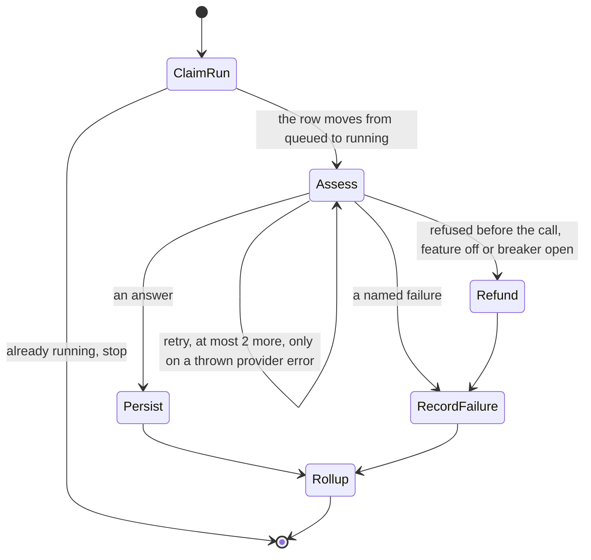

# ADR-0014 — Run the assessment as a Step Functions workflow

- **Status:** Accepted 2026-09-17, by the owner (gate 72)
- **Date:** 2026-09-17
- **Supersedes in part:** ADR-0002 (one function for everything) and ADR-0005 (no retry).
  Everything else in both records still stands.

## Context

Until now the phone waited while the model answered. That put the model call under three platform
clocks: API Gateway cuts a request at 30 seconds, CloudFront at 25, the function at 22. So the model
had about 16 seconds, a retry was impossible, and one function held every permission.

The owner compared two asynchronous shapes and chose the smaller one. The comparison is in
`docs/400-architecture/08-async-options-short.md`.

## Decision

**The API answers at once. A Step Functions workflow makes the model call in the background.**

Step Functions is an AWS service that runs steps in order, retries the steps you mark, and keeps a
history of every run. The Standard type is used. It is Always Free up to 4,000 steps a month.

The pieces:

| Piece | What it does | Its permissions |
| --- | --- | --- |
| `api` function | Everything up to the model call: session, kill-switch, breaker, daily limit, photo checks, the `queued` row. Then `StartExecution` and a `202` | The table, the bucket, Cognito, Parameter Store. **Not the model key** |
| `assess` function | The one model call. Reserved concurrency **1** | The model key, read the two `CONFIG` rows, write the breaker row. **Nothing else** |
| The state machine | Runs `assess`, writes the result and the rollup with DynamoDB integrations, no Lambda in between | Invoke `assess`, update assessment and usage rows |
| One EventBridge rule | On `FAILED`, `TIMED_OUT` or `ABORTED`, invokes `mark-failed`, which writes `failed` on the row | Update one row |

The rules that make it safe:

- **The execution is named with the assessment id.** A second `StartExecution` with the same name
  returns the first run. `ClaimRun` moves the row from `queued` to `running` with a condition, so a
  duplicate stops at once.
- **The retry fires only on a thrown error.** The adapter still returns values (ADR-0005). The
  `assess` handler throws exactly three of them as errors: `ProviderTimeout`, `ProviderThrottled`,
  `ProviderUnavailable`. The retry list is those three plus `Lambda.TooManyRequestsException`,
  which is a free refusal from reserved concurrency. `MaxAttempts: 2`, 2 seconds then 4.
- **The CDK default retry is switched off.** `retryOnServiceExceptions: false`, or CDK adds six
  hidden attempts on Lambda service errors, one of which can arrive after the call was made.
- **Every task has its own timeout and its own `Catch`.** There is no timeout on the whole machine,
  because that ends a run without running any `Catch`. `Assess` has 25 seconds per attempt, the
  function 30, the model abort 18.
- **The write steps retry on DynamoDB errors**, three attempts. A throttled write costs steps,
  never money, and never loses a paid answer.
- **`assess` re-reads the kill-switch and the breaker before the call.** If either says stop, no
  call is made and `Refund` gives the attempt back (ADR-0008).
- **`assess` writes the breaker row.** Retries count toward its five failures. With concurrency 1,
  the half-open test is exactly one call.

## Consequences

- **The model may take as long as it needs**, up to the task timeout. No platform clock is ever
  the first to fire.
- **One photo may cost up to 3 calls, about $0.012.** The cap is two lines: `MaxAttempts: 2` here
  and `maxRetries: 0` in the adapter. Both must stay.
- **The 30-second promise is kept by the waiting screen**, not by the answer. ADR-0015 says how
  the answer reaches the phone. The screen gives up after 60 seconds.
- **The circuit breaker moves.** `assess` writes it, not the API.
- **Two more deployable units**, `assess` and `mark-failed`, in one new stack.
- **A result that finishes while the app is closed is unreachable in run 1.** The pot history is
  backbone 4.

## Alternatives considered

- **Keep the phone waiting (Option A).** Lost on the three limits above. It stays the record of
  run 1's first choice.
- **Option F, upload straight to S3 with every write an event.** Not taken. Nothing planned needs
  its two extra pieces. Its direct upload is the first piece to add if photos pass 2 MB.
- **An SQS queue read by a worker.** An idle queue read by Lambda still costs requests, and the
  retry rule would live in code instead of in one declared line.
- **Step Functions Express.** No free amount, and it runs a step at least once, which can call the
  model twice with no rule saying so.

## Agent-Readable Summary

> The model call runs inside a **Step Functions Standard** workflow, in the `assess` function, and
> nowhere else. Do not call `LlmProvider` from the `api` function. Do not use Express workflows. Do
> not put a timeout on the state machine; put `TimeoutSeconds` and a `Catch` on every task. Set
> `retryOnServiceExceptions: false` and retry only `ProviderTimeout`, `ProviderThrottled`,
> `ProviderUnavailable` and `Lambda.TooManyRequestsException`, with `MaxAttempts: 2`. Keep
> `maxRetries: 0` in the adapter. Name every execution with the assessment id. Keep `assess` at
> reserved concurrency 1 until a second user exists. Do not give `assess` any permission beyond the
> model key, the two `CONFIG` rows and the breaker row.
