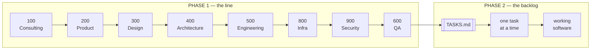
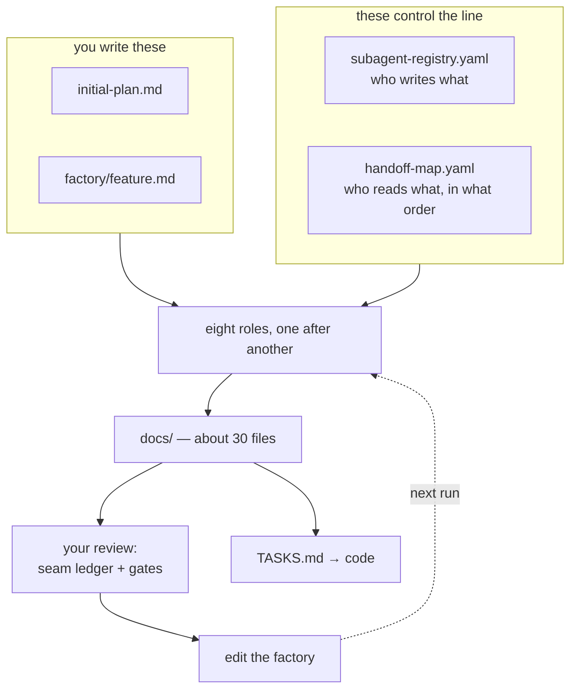
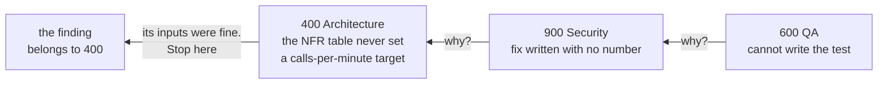
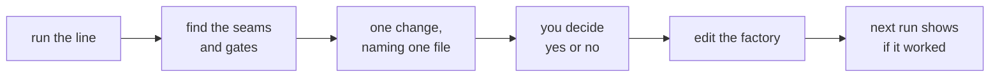

# AI-Native Delivery

**How to build software where the specifications are written by AI, kept in git, and used by every
session after.**

## How to read this

| | What | How to read it |
| --- | --- | --- |
| **Part one** — sections 1–3 | the idea, and the pieces it is made of | once, in order |
| **Part two** — sections 4–12 | **one real run, start to finish** | follow along. Every idea is explained at the moment the run needs it |
| **Section 13** | the glossary | when a word stops you |

Part two is a story, not a manual. It starts with two files on disk and ends with specifications a
developer could build from. Nothing is explained before you have seen why it is needed.

The project is real: **`zamphora`**, a plant-care app for someone whose houseplants keep dying. The
file names, the numbers and the mistakes are the ones you will actually meet.

---

## Contents

**Part one — the idea**

1. [The idea in one page](#1-the-idea-in-one-page)
2. [AI-assisted or AI-native](#2-ai-assisted-or-ai-native)
3. [The seven building blocks](#3-the-seven-building-blocks)

**Part two — one run, empty folder to finished specs**

4. [Day zero: what is on disk before anything runs](#4-day-zero-what-is-on-disk-before-anything-runs)
5. [Step 1 — Consulting, and why it gets only two files](#5-step-1--consulting-and-why-it-gets-only-two-files)
6. [Step 2 — Product, and the first handover](#6-step-2--product-and-the-first-handover)
7. [Step 3 — Design turns stories into screens](#7-step-3--design-turns-stories-into-screens)
8. [Step 4 — Architecture, and the first human gate](#8-step-4--architecture-and-the-first-human-gate)
9. [Steps 5 and 6 — Engineering, then Infra](#9-steps-5-and-6--engineering-then-infra)
10. [Steps 7 and 8 — Security, then QA, and the break](#10-steps-7-and-8--security-then-qa-and-the-break)
11. [The run is over: the review is the real output](#11-the-run-is-over-the-review-is-the-real-output)
12. [From specs to code, and the commands you type](#12-from-specs-to-code-and-the-commands-you-type)

**Reference**

13. [Glossary](#13-glossary)

---

## 1. The idea in one page

### The problem

You open the editor, ask for a component, paste it in, it works. That is normal, and it is fine for
one file. On a real project it fails in a specific way:

- the AI does not know what the project already decided, so it invents an answer
- the invented answer looks correct, because AI output always looks correct
- nobody notices, because nothing was written down to compare it against
- next week a new session knows none of it, so you type the context again

A real case. You ask for a photo assessment feature. Nowhere is it written how often the answer must
be right, or what to do when the model is unsure. So the AI picks something: a confident verdict
every time, even when the model is guessing. Nobody decided that. It happened because no file said
otherwise.

### The idea

> **Write the specifications first, using AI, as files in git. Then build the code from those
> files.**

That is all "AI-native" means. Not a better prompt, not a bigger model. The output of one session
becomes a file the next session reads.

The short form: **files, not chats, are the unit of delivery.** If a decision mattered and it is not
in a file, it did not happen.

### The two phases



Phase 1 is **the line**: eight AI roles run one after another, each writing documents the next one
reads. Phase 2 is **the backlog**: a task list generated from those documents, worked one task at a
time, each task pointing at the spec section it must follow.

Different commands, different rules, same repository.

**One run** is one pass of all eight roles over **one feature**. It produces the documents, plus a
record of how it went in `factory/runs/<name>/`. A product with six features has six runs — and you
can also re-run the same feature after fixing the setup, and compare the two.

**Remember:** the backlog is generated from the specs, never the other way round.

---

## 2. AI-assisted or AI-native

### The one question that decides it

Both kinds of team use the same tools. The difference is one thing:

> **Does the output become a shared, versioned file?**

| | AI-assisted | AI-native |
| --- | --- | --- |
| Where the prompt lives | in your head | in the repo, in `.claude/skills/` |
| How often it is used | once | every session, by every session |
| Who reviewed it | nobody | reviewed and committed like code |
| Can you measure it | no | yes, it is a file with a git history |

### Three maturity levels

A way to place a team, not a badge. Installing a tool does not move you.

- **L1** — people use AI on their own, in chat. Output stays in the chat window.
- **L2** — some prompts and rules are saved and shared. Reuse starts.
- **L3** — every stage of the work has a defined AI touchpoint with an expected output file.

One test settles it, and it works for one person as well as for a team: **a new developer joins on
Friday — is the whole setup working on Monday without them asking anyone?** If the answer is yes,
it is in files. If it needs you to explain something, it is in your head, and that is L1 no matter
what tools are installed. In this project the answer lives in the `ai-factory` plugin and in
`.claude/`.

If you ever have to score a team properly, five things get scored 1–3 and averaged — AI
capabilities, reusability, a named owner, tracked numbers, daily use — but read them one by one,
never as an average. A team at 2.0 with nobody owning the setup is a team whose setup leaves when
one person does.

### The seven anti-patterns

| Anti-pattern | What it looks like |
| --- | --- |
| **Chat as delivery** | the useful output stayed in the chat window |
| **File hoarding** | you wrote a good skill and never shared it |
| **Individual hero** | the setup lives in one person's habits and leaves when they do |
| **Babysitting the agent** | you watch every token and correct it live |
| **Biggest model by default** | a premium model on a task the default model handles |
| **Tool cargo cult** | buying tools and waiting for results. Also: locking into one vendor's tooling |
| **Anecdote as metric** | "it feels faster" is the whole measurement |

The first one blocks every other improvement, so fix it first. The last one is why most teams cannot
answer "what did AI actually save us?" — nobody wrote a number down before they started.

### What it costs

Two different spends, and mixing them up is why people think this is expensive. **Spec spend** is
human time, paid once — expensive in hours, cheap in money. **Run spend** is model calls, paid every
run, mostly at the cached price of roughly a tenth of normal.

One number worth knowing: **a multi-agent run costs about 15× a single chat.** Fine once for a real
feature. Not fine three times in a row because nobody read the first two.

**A budget is a number that stops something.** "Be careful with cost" stops nothing. Write the limit
into the setup — this project uses 250,000 tokens per role — and say what happens when it is
reached: stop and ask a person. Without the number and the stop rule, cost is a surprise on a bill
instead of a thing you designed.

**Choosing a model is a test, not a feeling.** Write down the 3 or 4 things that matter first, put
**one identical prompt** through two models, and score them with a sentence of evidence each. Pick
on the thing that matters most, not on the total.

Then write the **active constraint**: what could change this within 30 days. People drop that line,
and models move fast, so a choice with no expiry date quietly becomes a rule nobody agreed to.

**Remember:** AI-native is one question — does the output become a versioned file someone else
reads?

---

## 3. The seven building blocks

### The problem

You want the AI to always use `type` instead of `interface`. There are seven places you could write
that rule, and they behave very differently. Put it in the wrong one and it either never loads, or
it loads on every unrelated turn and pushes out something you needed.

The only real difference between them is **when the model sees the file**.

| Block | Lives in | Loads |
| --- | --- | --- |
| **Rule file** | `CLAUDE.md`, `AGENTS.md` | every session, always |
| **Context file** | `docs/` | when a task points at it |
| **Skill** | `skills/<name>/SKILL.md` | when the task matches its `description` |
| **Subagent** | `agents/<name>.md` | when dispatched, in its own context |
| **Command** | `commands/<name>.md` | when you type `/name` |
| **Hook** | `settings.json` | on an event, as a shell command |
| **MCP server** | `.mcp.json` | at session start, giving the agent tools |

Those paths sit under `.claude/` in a project, and under the plugin root in a plugin. Same files,
same behaviour — only the folder they arrive from differs.

### What each one is for

**Rule file** — loads in full every session, so keep it short. Conventions that must always be
present, plus a table saying which document to read for which kind of work. Past a few hundred lines
it stops working: the model holds all of it at once, so the important lines carry less weight. Rules
and pointers here, explanations in `docs/`. `AGENTS.md` beside it is 20 lines saying "the rules are
in `CLAUDE.md`", so a different tool lands in the same place. A pointer, never a copy.

**Context file** — the layer that does the most work. The stack, the conventions, the specs, the
decisions. Three layers exist:

| Layer | Where | Loaded |
| --- | --- | --- |
| **hot** | `CLAUDE.md` | always. Keep it short |
| **warm** | `docs/` | when relevant. The real detail lives here |
| **cold** | `context/cold/gap-log.md` | rarely. Things that only existed in a conversation |

The real risk in the warm layer is a document that **no longer matches the code**, not a thin one. A
thin document is obviously thin, so nobody trusts it. An out-of-date one looks fine and is trusted.
One rule fixes it: **update the context file in the same pull request that made it wrong.**

**Skill** — a saved way of doing one kind of task: how to review a branch, how to diagnose a bug
before editing. Its `description` line decides whether it loads, so it names the trigger, not the
topic.

> **A skill must survive being copied into another repository.** No paths, no version numbers, no
> domain facts.

That is the most common mistake here. A "skill" that hardcodes `apps/web/src/features/plants` is a
context file with the wrong label on it.

**Subagent** — runs in its own context window and hands back only its result. Use it when the doing
is useful but the reading would fill your session: searching 40 files for one pattern. Do not use
one when you need those files open to edit right after — you would read everything twice.

**Command** — a prompt file you run by typing `/name`. It can run shell commands and paste the real
output in before the model reads anything. So the session starts with the true state, not with your
memory of it.

**Hook** — a shell command on an event. Not the model deciding, a script running. **Hooks help, CI
required checks enforce.** A hook runs on your machine, so it protects you and nobody else. A
required check on `main` protects the branch.

**MCP server** — the other six give the agent words. This one gives it **tools**: a standard way to
plug it into a tracker, a database, a browser. New actions it can take, not new text to read. Two
rules, the same as everywhere else here — **only add a server whose tools a role actually needs**,
and **say which role may use it**, next to `writes:` in the registry, exactly like web access. This
project has no MCP server, which is the right answer until one job needs one.

### How to pick — narrowest first

Go down the list and stop at the first one that works. Picking too wide is the expensive mistake.

| If the rule… | Use |
| --- | --- |
| must hold on every pull request, no exceptions | CI required check |
| must run automatically on your machine | hook |
| must always be present in every session | rule file |
| only matters for one kind of task | skill |
| only matters for one kind of work in this repo | context file |
| is something you will type repeatedly | command |
| involves so much reading it would fill up your session | subagent |
| needs the agent to *act on* a system outside the repo | MCP server |

### Skill or context file?

The pair that gets mixed up most.

- A **skill** is *how to do a task*. "How to review a branch." It still makes sense in another
  repository.
- A **context file** is *what is true here*. "This repo uses Next.js 15 and DynamoDB." It makes no
  sense anywhere else.

If you are writing a repo path inside a skill, you are writing a context file. Move it.

**Remember:** the only real difference between the seven blocks is when the model sees the file.

---


## 4. Day zero: what is on disk before anything runs

The `docs/` folder is empty. Four files decide everything that follows. You wrote two of them, and
they sit in this repository. The other two are not here at all — they arrive from a plugin.

### The two files you wrote

**`initial-plan.md`** — what you want, in your own words. Written before any of this existed:

> I have a problem maintaining my plants at my apartment like my monstera, cactus. The problems are
> the intervals of watering, soil replacement, where to put each plant. Document the state of my
> plants — so a camera, and AI needs to interpret the image to assess my plant. Notifications.
> i18n. Mobile first.

It is messy, and that is fine. It is the only place your real goal exists.

**`factory/feature.md`** — the one feature this run is about, and more importantly what it is
**not** about:

```
The feature: photograph a plant that looks unwell, get back an assessment and a next action.

Out of scope for this run:
  watering-schedule engine · push delivery · sharing a plant · admin screens
  · plant identification · a follow-up chat
```

That "out" list is the fence. When a role tries to grow the feature — and one will — this is the
file it hits.

**"Out" means not this run, not never.** The line runs once per feature: edit this file, run again.

Why not all six at once? The stops are what you are buying, and eight roles designing six features
produce a review with 200 handovers that nobody will do. So run 1 takes the **hardest** feature — a
camera, an upload, storage that costs money, and a model call that can be wrong.

### Run 1 is not like the runs after it

Most of what run 1 writes is not about photos at all. It is the foundation, and later runs read it
instead of deciding it again:

| Written once in run 1 | Rewritten for every feature |
| --- | --- |
| architecture, ADRs, C4, patterns | stories and the PRD |
| conventions, the stack file | the screens for that feature |
| environments, CI/CD, cost limits | the contracts and endpoints it adds |
| the design tokens | its threats and its test cases |

So run 2 is much cheaper. Ask one question of the new feature: **does it change the shape of the
system** — a new data store, a new outside call, a new deployment unit, a new trust boundary? **No**
means four roles run instead of eight (Product, Design, Engineering, QA). **Yes** means all eight,
but Architecture and Infra *extend* their documents — a new ADR is added, an accepted one is never
edited.

Write that answer in the run record with its reason. "We skipped Security" is itself a finding if
nobody wrote down why.

### The two files that control the machine

These two are the whole factory. Everything else is built from them. **Neither is in this
repository** — they live in the `ai-factory` plugin, and the next part explains why.

**`factory/subagent-registry.yaml` — who exists, and what each one may write.**

```yaml
- id: "900-security"
  role: Security
  owns_folder: docs/900-security/        # the only folder it may touch
  tools: Read, Write, Glob, Grep, WebSearch, WebFetch
  writes:                                 # the only files it may create
    - docs/900-security/00-assets.md
    - docs/900-security/01-threats.md
    - docs/900-security/02-mitigations.md
    - docs/900-security/03-evidence.md
```

**`factory/handoff-map.yaml` — what each one may read, and in what order.**

```yaml
reads:
  "900-security":
    - docs/400-architecture/02-containers.mmd
    - docs/500-engineering/03-api-spec.md
    - docs/800-infra/01-iac-plan.md
```

Security opens those three files. Not the PRD. Not the design spec. Not this chat.

**Want to change how the line works? Change one of these two files.** Never edit a file that was
built from them.

### Why the line is a plugin, and the product is not

The line knows nothing about plants. It would run on a banking app unchanged. The product is the
opposite — it is only ever this product. Those two things change for different reasons and at
different times, so they live in different repositories:

| Repository | Holds | Changes when |
| --- | --- | --- |
| `ai-factory` | the roles, the registry, the handoff map, the scripts, the commands | you improve the **method** |
| `zamphora` | `docs/`, `feature.md`, the app, the contracts, the infra | you build the **product** |

`ai-factory` is a Claude Code plugin. One committed line in `.claude/settings.json` turns it on, and
every command then carries its name: `/ai-factory:start`, not `/start`.

**The split is by reuse. It is not by front end and back end.** Two repositories for the web app
and the API was considered, then rejected. The reason is how a coding agent works: it reads one
repository at a time. Put the API somewhere else, and the agent changing the web app cannot see who
calls the code it is changing. One change then needs one pull request in each repository. The
measured cost is four to six pull requests for a single change that touches both sides.

The web app, the API, the shared contracts and the infrastructure all change inside one feature. So
they stay together. The line does not change with a feature, so it moved out.

Two more things you get:

- **The agents cannot fall behind the contracts they are built from.** You write a slot contract by
  hand. A script turns it into an agent file. Both files are now in `ai-factory`, so its CI can
  compare them on every push. Edit the contract, forget to run the script, and CI fails. If the two
  files were in different repositories, nothing would notice.
- **The next project installs the line. It does not copy it.** Copy the folder into a second
  project, then fix a mistake in one role. The second project still has the mistake, and nobody
  goes back for it. With a plugin you push the fix once, and every project picks it up by raising a
  version number.

### Five things that go wrong when you ship a plugin

A plugin is a folder with a **manifest** — a small JSON file that says what is inside. The folder
can hold any file: YAML, Node scripts, whatever the commands need. Writing the plugin is quick.
Making it load is the slow part. All five below happened here, and none of them said what was
really wrong.

- **You need two JSON files, not one.** `plugin.json` describes the plugin. `marketplace.json` is
  the catalog that lists it. You cannot install a plugin from GitHub without the catalog, even when
  the repository holds only one plugin. In that case the catalog entry says `"source": "./"`, which
  means "the plugin is at the top of this repository".
- **Do not name your folders in `plugin.json` if they use the default names.** The `agents` field
  wants file paths, not a folder. So `"agents": "./agents/"` fails with `Invalid input`. Use the
  normal layout — `agents/`, `commands/`, `skills/`, `hooks/hooks.json` — write none of those
  fields, and Claude Code finds them on its own.
- **Run `claude plugin validate .` before every push.** It finds both mistakes above in one second.
  Without it, all you see is an install error that names a temporary cache folder. That name tells
  you nothing.
- **The setting is `enabledPlugins`, not `plugins`.** Put `extraKnownMarketplaces` next to it, so a
  new clone knows where the catalog is. Both belong in `.claude/settings.json`, the file you
  commit. Put them in your personal settings instead and the plugin works on your machine only.
  Then the project is back at L1.
- **`${CLAUDE_PLUGIN_ROOT}` only works inside text.** Claude Code replaces it in a command, a skill
  or an agent file. It does **not** set it for a script that the command starts. A script reading
  `process.env.CLAUDE_PLUGIN_ROOT` gets nothing, falls back to the current folder, and then looks
  for the line's own files inside the product. A script already knows where it is saved, so read
  that instead: `import.meta.url`.

One more, and this one is not about the JSON files. **A session that is already running keeps the
version it started with.** You fix a script, push it, update the catalog — and nothing changes
until you run `/reload-plugins`. Also raise the version number in `plugin.json` every time you
release. The same number means "the same plugin", and it is never downloaded again.

### The order, and the two placements that look wrong

The same file holds `execution_order`. It is not number order, and two placements surprise people:

- **Infra (800) before Security (900).** Security reviews the deployment. You cannot threat-model a
  deployment nobody has described yet.
- **QA (600) last.** A real test plan needs the engineering spec, the infra plan and the security
  fixes already written. A test plan written early only tests the happy path.

### What you are about to watch



Notice the dotted line. The documents are not the point — **the loop is.** That will only make
sense after you have watched a run break, so leave it for now.

---

## 5. Step 1 — Consulting, and why it gets only two files

You type this:

```
/run-role 100-consulting
```

### What actually happens

Your main session does not do the work. It hands it over, then stops:

1. It looks up the next role in `execution_order`. That is `100-consulting`.
2. It starts that role as **a brand-new session that remembers nothing** — no chat history, no
   earlier thinking. Only files.
3. It gives that session **only the files on its `reads:` list** — for role 100, two of them:
   `factory/feature.md` and `initial-plan.md`.
4. The role writes its four files, one line goes into the log, and everything stops until you say go
   again.

Step 3 is the first thing worth understanding.

### Why it gets only two files — this is called isolation

It would be easy to give role 100 the whole repository. Do not.

**Isolation** means a role reads only its declared inputs. The reason is not tidiness. A role that
can read everything will always find something close enough, use it, and never mention it. A role
that cannot will **stop and tell you the fact is missing.** That stop is what you are paying for.

A second rule sits beside it. **Single writer:** every file has exactly one role allowed to create
it. Otherwise the second role overwrites the first and nobody can say which version was meant.

Giving each role less information sounds wrong. It is the most useful part of the design.

### What Consulting writes

Four files land in `docs/100-consulting/`:

`00-context-brief.md` (everything everyone "just knows" but nobody wrote down) · `01-use-cases.md`
(the jobs the app does, ranked) · `02-decisions.md` (choices already made, so no later role re-opens
them) · `03-market.md` (real products, and what they do badly).

**The brief has four parts, and each must be there** even if the answer is "none known":

| Part | For zamphora |
| --- | --- |
| **business** | one developer, part-time. AWS free plan **ends on a written date** |
| **product** | one person with houseplants in an apartment, on a phone, in two languages |
| **engineering** | Next.js, Nest.js, shared Zod contracts. Not up for debate |
| **regulatory** | a plant photo shows the inside of a home. Personal data from file one |

Miss the engineering part and every later role invents its own stack rules.

### It is allowed on the web — most roles are not

Role 100 can search. Only four roles can, each for one narrow reason:

| Role | May look up | Must not |
| --- | --- | --- |
| 100 Consulting | products that exist, their prices, what they do badly | invent a number it could not source |
| 400 Architecture | standards, RFCs, named patterns | treat a technology named in an input as already decided |
| 800 Infra | a current cloud price or free-tier allowance | quote a price with no check date |
| 900 Security | a CVE, an OWASP entry, a control definition | accept an earlier decision without re-checking it |

**Every outside fact carries its source link and the date it was checked.** Anything unverified is
labelled unverified, not left to read as fact.

Research only happens because someone asked for it. `03-market.md` exists because the slot contract
names it. To make the line investigate something, say **which role**, **what question**, and **which
file the answer lands in**. An expectation held only in your head produces nothing.

### What to check before moving on

Open `00-context-brief.md` and ask two things: are all four parts there, and **does it name the date
the free account closes** or just say "cost matters"? The second one looks small. It is not, and
section 11 shows why.

---

## 6. Step 2 — Product, and the first handover

```
/run-role 200-product
```

Role 200 starts, remembering nothing about role 100's session. It gets four files:

```yaml
"200-product":
  - factory/feature.md
  - docs/100-consulting/00-context-brief.md
  - docs/100-consulting/01-use-cases.md
  - docs/100-consulting/03-market.md
```

**This is the first handover, and handovers are where this whole thing lives or dies.**

### A handover has a name: a seam

A **seam** is one file crossing from one role to the next. Role 100 gives `00-context-brief.md` to
role 200. That is one seam. There are about 34 of them in the whole run, and every one is already
listed in `handoff-map.yaml` under `edges:`.

The word is borrowed from sewing: a seam is where two pieces of cloth are joined. Cloth rarely tears
in the middle. It tears at the seam. Same here — **the run almost never breaks inside a role. It
breaks at a seam**, when the next role did not get what it needed.

Later you will give every seam one of five labels:

| Label | Means |
| --- | --- |
| **clean** | the next role got what it needed |
| **under-supply** | it got less than it needed |
| **over-supply** | it got more than it needed, so the feature grew |
| **missing** | the file was not there at all |
| **routing** | the file went to the wrong role |

Do not label anything yet. You cannot see most of them until the run is over.

### What Product writes

`00-prd.md` (one page: what it must do, how success is measured) · `01-user-stories.md`
(US-01…US-NN with pass/fail rules) · `02-traceability.md` (every story → the metric that proves it
worked).

Every story uses the **JTBD** shape, which puts the **moment** into the requirement:

> When **I notice a leaf turning yellow**, I want **to photograph it and be told what to do**, so I
> can **fix it before the plant dies**.

That tells you the answer must arrive fast and be right, because the user is standing in front of
the plant holding a dying leaf. It is a requirement on the system, not a UI detail.

An **AI story carries two extra fields** a normal story does not: how often it must be right, as a
number, and what it does when it is not sure.

| | |
| --- | --- |
| ✅ | "Wrong verdicts under 2 in 100 on the golden set. Answer in under 4 seconds, 9 times out of 10. Below **0.6** confidence it says 'not sure' and offers the care checklist." |
| ❌ | "The assessment should be accurate." Three people will build three different things. |

The PRD also carries a **guardrail metric** — the number that must *not* move. Photo uploads going
up is good; the monthly model bill going up with them is what you are watching.

### The first problem, and you cannot see it yet

Role 200 reads the brief. The brief says **"cost matters"**. It does not say **"the free account
closes on 14 March"**. Role 200 writes a fine PRD anyway. Nothing looks wrong and you would sign it
off.

Hold that thought. In section 11 it becomes finding number one, and by then it will already have
changed the architecture.

### What to check before moving on

- is there a **number** in every acceptance rule?
- does the AI story say what happens when the model is **unsure**?

One vague word here costs three later roles: Design cannot draw an unsure state, Architecture cannot
budget for it, QA cannot test it.

---

## 7. Step 3 — Design turns stories into screens

```
/run-role 300-design
```

Design reads the brief, the PRD and the stories. It writes four files, and **the handover is two
text files, never a picture.**

| File | What is in it |
| --- | --- |
| `00-journey-map.md` | the whole path, and where the user feels worst |
| `01-CONTEXT.md` | the feature in one sentence, the hard limits as MUST NOTs, what is excluded |
| `02-SPEC.md` | every component by exact name, every screen state, tokens by name |
| `03-tokens.md` | the colour, spacing and type names — never hex values in the spec |

A picture cannot be read by the next role. A text spec can, and it shows up in a pull request diff.

### The rule that catches the most bugs: count the states

The journey map found something useful: **the worst moment is not taking the photo. It is the
wait.** Three different waits, in fact — resizing, uploading, and the model thinking.

So the camera screen does not have two states. It has **ten**: empty · camera permission denied ·
no camera, pick a file · resizing · uploading · assessing · result confident · result unsure ·
offline · failed.

| | |
| --- | --- |
| ✅ | the camera screen lists **10 states**, including "camera permission denied" |
| ❌ | the camera screen shows a photo and a result. That is a demo, not something you can ship |

There is one negative rule too: **the verdict never appears without its confidence.** A rule about
what the screen must *not* do is worth more than three about what it should.

### What to check before moving on

Count the states on the main screen. **Under 6 means the spec is not finished** — Engineering will
build one spinner for three different waits, and the unsure state will quietly not exist.

---

## 8. Step 4 — Architecture, and the first human gate

```
/run-role 400-architecture
```

This is the biggest step. It reads the brief, the PRD, the stories and both design files, and writes
eight things.

### Options before diagrams

First `00-options.md`: **three options that really differ** — serverless against containers,
single-table against relational — scored on at least three limits, where scoring well on one means
scoring worse on another. Draw a diagram before the choice is made and you are married to your first
idea.

For zamphora, serverless wins — and **why it wins matters.** The deciding limit came from role 100's
brief: the free account plan. A limit written in step 1 chose the architecture in step 4. That is
the line working.

### Diagrams as text, not pictures

`01-context.mmd` and `02-containers.mmd` are **Mermaid** files — diagrams written as text, in the
repo. An agent can read and update a text file. A picture in a slide deck stops matching the system
within weeks and nobody notices.

> One real bug this catches: a container diagram had a box called "queue that receives stock
> updates" with **no arrow pointing into it.** On paper it looked wired up. Nothing was sending it
> data. Code built from that diagram would wait forever.

### ADR or NFR — the pair that gets mixed up

| | Is a… | Example |
| --- | --- | --- |
| **ADR** | *decision* | "we use DynamoDB with a single table" |
| **NFR** | *target* | "the assessment returns in under 4 seconds, 95% of the time" |

Different files on purpose. **Every ADR ends with an Agent-Readable Summary** — a plain instruction
with an explicit "do not", such as *"all model calls go through `LlmProvider`. Do not import the
Anthropic SDK outside `packages/llm/src/adapters/`."* Without it an agent reads the whole record,
agrees with it, and still writes the import, because what to actually *do* was never said.

Once an ADR is accepted, **the file is never edited** — a new one replaces it and both stay, so the
history survives.

### A number only counts if it has three links

> a written number → an automatic test that checks it → that test blocks a release if it fails

Miss any one of the three and the number is a wish. `06-nfrs.md` is a table where every row carries
all three. Here are the three rows for this feature, and what each one actually means:

| NFR | Target | How it is checked | Which CI job runs it |
| --- | --- | --- | --- |
| how long the user waits | **p90 under 4 s** | a test that runs the whole flow with a fake model and times it | `test` |
| what one assessment costs you | **under $0.012** | count the tokens, multiply by the price, fail the test above that | `test` |
| how often the verdict is right | **98 out of 100** | run the 40 known photos through the real model and count the wrong ones | `ai-eval` |

Three things in that table are worth unpacking, because they are the parts people skim.

**`p90` means "9 times out of 10".** So `p90 < 4 s` says: 90 out of 100 assessments finish inside 4
seconds. It is written that way instead of "average 4 seconds" because an average hides the bad
cases — a few 20-second waits vanish into a nice-looking average, and those are exactly the users
who give up.

**Cost really can be a unit test.** You do not call the model. You take the prompt you send, count
its tokens, multiply by the published price per token, and assert the result is under $0.012. If
someone later adds three paragraphs to the prompt, that test fails on their pull request — before
the bill arrives. `$0.012` is not a guess either: it comes from the free-account limit in role 100's
brief, divided by the number of assessments you expect.

**The 40 photos have a name: a golden set.** Forty real plant photos where a human has already
written down the right verdict. The model runs against all 40 and you count how many it got right.
This is the only honest way to test an AI feature, because there is no "correct output" to compare a
string against — only "right often enough". Section 10 shows how it is built.

**The last column is a GitHub Actions job name.** `test` runs on every pull request. `ai-eval` costs
real money per run, so it runs less often — but it still **blocks the release**, which is the third
link in the chain. A number checked by a job that cannot stop anything is back to being a wish.

Two of those three rows do not exist on a normal project. **AI features need a cost-per-call number
and a how-often-is-it-right number**, and both have to be decided here, at design time, by the role
that also chose the architecture.

### The timed flow, and why every step is written down

`03-flow-plant-check.md` lists every step with a number:

```
tap capture            →  client resize to 1568px long edge    180 ms
request pre-signed URL →  API Gateway + Lambda                  90 ms
upload to S3           →  direct from browser                  650 ms
POST /assess           →  Lambda → LlmProvider → model        2400 ms
render result                                                   40 ms
                                                     total   3360 ms
```

3360 ms against a 4000 ms budget. **The point is that the numbers must actually add up.** A
ten-second check that catches a design nobody totalled — one published example claimed 87 ms when
its own steps came to 92.

### Pick the simplest shape that works

> plain code (if / else) → one AI call → a fixed chain of AI calls → a free-roaming agent

Stop at the first one that does the job. Photo assessment is **one AI call**. Reaching for an agent
by default is the most common mistake right now, and an agent is the hardest thing to test, to debug
and to predict the cost of.

### The pre-mortem needs a session with nothing to defend

`07-adversarial.md` is written by a **brand-new session that never saw the design being built**. It
is asked one question: this failed badly — why?

The session that built the design will defend it, exactly as a person defends their own work. A new
session has nothing to defend. That is why the run plan says "open a fresh session here".

### And here the line stops

Part-way through, role 400 stops and asks you: *"How long do we keep a user's photos? I need it to
size the storage."* Nobody ever decided this. It is not in any file, so the role stops.

**This is a human gate: a question the AI is not allowed to answer, even if it could guess well.**

Why not? A photo of someone's living room is personal data. Pick 30 days and you may break a law.
Pick 10 years and you keep something you should not. **The AI cannot see that this is a legal
question wearing a technical costume.** So it must not choose.

The roles write. **You choose.**

You do not have to remember which questions are gates. They are listed once, in `handoff-map.yaml`:

```yaml
human_gate_policy:
  stop_when:
    - a subagent tries to accept a risk without named human approval
    - a subagent chooses scope beyond factory/feature.md
    - a subagent asks for secrets, credentials or production data
    - a subagent needs a policy, compliance, budget or release decision
    - a subagent proposes spending money or deploying anything
    - a subagent proposes a new tool the model may call
    - a subagent's output would contradict an accepted ADR
```

Write every gate into `factory/runs/<name>/human-gates.md`. Three things can happen:

| What happened | Called |
| --- | --- |
| It asked, you were away, so it carried on and wrote "assuming 90 days — **not confirmed by a human**" | `recorded-open` |
| It stopped and waited. Nothing else got written until you answered | `hard-stop` |
| **It never asked.** It wrote "photos are kept 30 days" as if that were a known fact | `missed` |

The first two are fine. **`missed` is the one to watch for**, because nothing warns you — the
document looks finished, the number looks agreed, and a decision was taken from you in silence.

### Your answer has to end up in a file

You decide: 90 days. You type it in the chat. The run carries on and it feels done. It is not.
**The next role starts in a fresh session and cannot see your chat.** Tomorrow that conversation is
gone and your decision with it.

So write it into a file a role reads — here, `factory/feature.md`. Then in `human-gates.md` note
**which file you wrote it into, and which role reads it next.** That note is the **return path**:
proof your answer went back into the line instead of staying in a chat. Skip it and you are
hand-feeding the line — the run looks clean and nothing was really decided.

### What to check before moving on

- do the milliseconds in the timed flow **add up**?
- does every ADR end in a **"do not"** line?
- does every NFR row **name the test** that checks it? A row with "TBD" in the test column hands QA
  a number it cannot check, so the number means nothing.

---

## 9. Steps 5 and 6 — Engineering, then Infra

### Engineering turns targets into types

```
/run-role 500-engineering
```

It reads the stories, the design spec, the architecture options, the container diagram, the NFR
table and every ADR. It writes five files:

`00-conventions.md` (naming, folders, what is banned) · `01-contracts.md` (the Zod schemas — the
only place a wire type is defined) · `02-web-spec.md` · `03-api-spec.md` (every endpoint, its body,
its errors) · `docs/context/stack.md`.

#### Watch one number travel through four roles

This is the clearest proof that the line is doing something. Follow `0.6`:

| Role | What it did with the number |
| --- | --- |
| **200** Product | wrote the rule: *"below 0.6 confidence, say not sure"* |
| **300** Design | drew the screen for it — the unsure state |
| **500** Engineering | made it a `confidence` field in a Zod schema in `packages/contracts` |
| **600** QA | writes a test that sends a 0.55 answer and checks the unsure state appears |

The Zod schema is the important step. **It is one definition, used by the API and by the web app.**
Without it, the API believes 0.6 and the web app believes something the front-end developer typed
from memory. The two numbers stop matching, and nobody notices until a user sees a confident wrong
verdict.

#### Who may import what

A second thing role 500 writes, and it is unrelated to the number above. The API is built in three
layers, and each has one job:

| Layer | Its one job |
| --- | --- |
| **controller** | speaks HTTP. Reads the request, returns the response |
| **service** | the actual rules. "Below 0.6, say not sure" lives here |
| **repository** | talks to the database. Nothing else |

The spec writes down which layer may import which, so the layers cannot quietly merge:

| Layer | May import | Must not |
| --- | --- | --- |
| controller | service, contracts | repository, the data client |
| service | repository, other services, contracts | `Request`, `Response` |
| repository | the data client, contracts | service |

The row that matters most: **a service never sees `Request` or `Response`.** If it does, your
business rules are welded to HTTP. You can no longer test "below 0.6, say not sure" without building
a fake HTTP request first — so the rule that matters most becomes the hardest thing to check.

A table like this is only real if a **lint rule** enforces it, so the spec names the rule beside each
row. A boundary nobody checks is a boundary that lasts about three weeks.

**Check before moving on:** is the `confidence` field in the **contract schema**, or only in the API
spec? If the API spec describes it and the contract does not, the web app will invent its own type
and the unsure state will never fire.

### Infra decides what it costs to be wrong

```
/run-role 800-infra
```

Four questions, and a plan that misses one is not a plan: **what exactly ships** · **the deployment
written as code**, never a console click · **a pipeline with gates that fail the change, not the
customer** · **a one-step rollback**, named and tested.

On the AWS free account plan there is one thing to understand, and it changes how you think about
cost: **it cannot send you a surprise bill. It closes the account instead**, and takes the resources
with it. Data is kept 90 days.

So here cost is not a finance problem. **It is a correctness problem.** A cost mistake does not make
you poorer, it deletes your work.

The traps that cost money by default:

| Trap | Cost | Instead |
| --- | --- | --- |
| DynamoDB **on-demand** (the default) | billed from the first request | provisioned — the free allowance covers only this |
| **NAT Gateway** | ~$33/month at zero traffic | never create one |
| **Secrets Manager** | $0.40 per secret | Parameter Store `SecureString`, free |
| a **customer-managed KMS key** | $1/month forever | AWS-managed keys, free |

`02-cost-guardrails.md` turns that into numbers that stop things: 20 assessments per user per day at
the gateway, a budget alarm at 50%, a kill-switch at 100%.

**Check before moving on:** provisioned, not on-demand? No NAT Gateway? A plan that took the
framework default for the table has already picked the billed mode.

---

## 10. Steps 7 and 8 — Security, then QA, and the break

### Security reviews something that now exists

```
/run-role 900-security
```

This is why Infra runs first. Security reads the container diagram, the contracts, the API spec, the
environments file and the infrastructure plan — **a real described system**, not an intention.

It writes `00-assets.md`, `01-threats.md`, `02-mitigations.md` and `03-evidence.md`, and **it runs
two threat lists, because there are two different things to protect:**

| List | Protects | Why separate |
| --- | --- | --- |
| **OWASP LLM Top 10** | **the product** — one model call reading a photo | the model reads text it did not write |
| **OWASP Agentic Top 10** | **the factory** — eight roles with tools, web access, and the power to write files | an agent has memory, tools and permission to act. A single call has none of those |

The second list surprises people. **Your factory is itself an attack surface.** Role 100 browses the
web and writes files — a page it fetches could contain text telling it to write something else.

The test worth memorising is the **lethal trifecta**. Any two are usually fine. All three at once is
the dangerous shape:

> private data · untrusted outside content · a way to send data out

What it finds on zamphora: the photo carries **EXIF GPS — the location of the user's home** · a plant
nickname is free text reaching the model, a **prompt injection** path · the paid endpoint is a
**denial-of-wallet** target, not breaking anything, just spending your money until the account
closes.

One more rule: **check a package is real before adding it.** Models invent plausible package names,
the same invented name returns across sessions, and attackers register those names and wait. This
has a name — **slopsquatting**.

### And here is the break

Role 900 writes this into `02-mitigations.md`:

> **Risk:** anyone can call the paid assessment endpoint in a loop and empty the budget.
> **Fix:** add a rate limit to the endpoint.

Read that on its own and it is fine. It found a real risk. It named a real fix. You would approve it.

### QA cannot use it

```
/run-role 600-qa
```

QA writes the test plan, the test cases and the AI evaluation plan. It gets to the rate limit and
stops.

**A rate limit of what?** Ten calls a minute? A thousand a day? There is no number, so there is
nothing to test.

Neither document is broken. Security did its job. QA did its job. **The mistake is in what passed
between them** — and reading either file will never show it, because both look finished.

That is the whole problem in one example. After a run you have eight folders that all look good.

### What QA writes anyway

`00-test-plan.md` (in scope, out of scope **with a reason**, top 3 risks, entry/exit rules) ·
`01-test-cases.md` · `02-ai-evals.md` (the golden set, the rubric, the pass bar).

Two things here have no equal in a normal project.

**Force at least five negatives.** "Write tests for this" produces tests that pass, because that is
what the words ask for. The valuable half: a photo of a wall · a photo too dark to judge · a healthy
plant the user thinks is sick · a model reply that does not match the schema · a model timeout.

**The golden set and its judge.** 40 photos with known correct verdicts, and a pass bar of 98% taken
straight from the NFR table. If a model scores the answers, **score a sample by hand too** and write
down how often the two agree. Skip that and your 98% measures the judge, not the model, and you will
not know which one is wrong.

**Check before moving on:** five negatives present, and does a failed eval actually **block the
release**, or is it advisory? Calling something critical and leaving it advisory is the same as not
writing it.

---

## 11. The run is over: the review is the real output

Eight folders. About thirty documents. It looks finished. **It is not** — the folders are not the
output. The run's value is the twenty-minute review you are about to do.

### Walk every seam

Every seam is already listed in `handoff-map.yaml` under `edges:` — about 34 lines, so you do not
have to hunt for them.

**When:** after the last role, before you build anything. **Who:** you — an AI can draft the table,
but **you set the labels.** Only you know what you actually wanted, and an AI marking its own eight
documents will call almost everything clean.

**How:** type `/ai-factory:factory-run`, then go down the `edges:` list asking one question at each line:

> Did the role on the right have what it needed from this file?

Write one row per edge into `factory/runs/<name>/seam-ledger.md`. Most will say clean. **You are
looking for three.**

### A finding names a file and a fact

- ✅ "600-qa under-supplied by 900-security on `02-mitigations.md` — the rate-limit fix has no
  number, so no test case could be written against it."
- ❌ "the roles should communicate better."

The first one names the line you go and change. The second one will still be true next run.

### Walk it backwards — the role that noticed is rarely the one that caused it

You found the rate-limit problem at QA. Do not fix it at QA. Ask one question, again and again:

> **Why did that role write it that way? What did it have to work with?**

Open that role's `reads:` list. Inputs fine? The fault is its own. Inputs thin too? Step back one
more role.



Security had nothing to be specific about. Architecture had everything it needed and still left the
target out. **The finding belongs to Architecture.**

Fix it at QA instead and you invent a number on the spot — worse than no test, because from then on
the number looks agreed.

### Do not answer the question yourself

Now the hard part. Role 900 stopped mid-run and asked you: *"The NFR table has no calls-per-minute
target. What should the rate limit be?"* You know it. It is 20 a day. Typing it takes five seconds.

**Do not type it.**

Type it and everything looks fine. Security writes a good document, QA writes a good test, every
seam says clean. But `06-nfrs.md` is still empty, so next run it happens again — and you paid for
eight role calls to learn nothing.

Do this instead:

1. Write it in the seam ledger: **under-supply at 400 Architecture**
2. Let the run stop
3. Put the number in `06-nfrs.md` before the next run

**Role 100 is the exception.** It runs first, so nothing comes before it — **you are its input.**
When it asks something only you know, answer. From role 200 on, the answer should already be in an
earlier document, so a question means that document failed.

### Gate or seam? They feel identical when it happens

Both look the same from where you sit: a role stops and asks you something. But they need opposite
reactions. Ask yourself one thing:

> **Is there a role whose job this was?**

- Role 500 asks *"what is the rate limit?"* — **yes.** Role 400 owns the NFR numbers and left it
  empty. That is a **seam**. Do not answer. Fix the Architecture file, then let 500 read it.
- Role 900 asks *"how long may we keep photos?"* — **no.** No role in the line owns that answer.
  That is a **gate**. Answer it. It was always yours.

The *asking* role tells you nothing. What tells you is whether some **other** role owed it that fact.

In a normal company a human architect would pick the rate limit too. Here you gave that job to role
400 on purpose, and `factory/subagent-slots/400-architecture.md` lists what it may **not** decide —
a rate-limit number is not on that list. So the split is not important versus unimportant. It is
**on the list or not on the list**, and the lists are written down.

One more case: if role 400 itself asks you for the rate limit, that is neither one. That is the role
dodging its own job. Still do not answer — add a line to its contract instead.

### What this run actually found

Three findings:

1. **100 → 400, under-supply.** The brief said "cost matters" but never named the date the free
   account closes. The options table scored cost with no deadline. *(This is the thing from
   section 5. It travelled three roles before it did any damage.)*
2. **900 → 600, under-supply.** The rate-limit fix had no number — traced back to Architecture.
3. **300 → 500, clean but late.** The offline state appeared in the design spec, but no story ever
   mentioned offline. It entered scope without passing Product.

And two gates: one **recorded-open** — the photo retention period, still waiting on you — and one
**missed**: Architecture set the 0.6 confidence threshold as if it were a technical value, when
Product already owned it.

**That missed gate is the most valuable thing in the run.** No amount of re-reading the documents
would have found it.

### Then fix the factory, not just the one document

Architecture left the rate-limit number out. You could open `06-nfrs.md`, type it, and move on.

**Do not stop there.** Next run, on the next feature, Architecture leaves out a *different* number.
You fixed one document. You did not fix the thing that writes the documents.

So change the factory. One line in `factory/subagent-slots/400-architecture.md`:

> ❌ DON'T — ship an NFR row with no number in it

Now that mistake cannot happen again, on any feature.



Two things make such a change real:

- **It names the file it edits.** "Improve the security prompt" is not something anyone can act on.
  "Add a DON'T row to `factory/subagent-slots/900-security.md` forbidding a fix with no number" is.
- **You do not know yet if it worked.** Only the next run tells you. That is why `run-record.md` has
  a column called "Did the next run fix it?" that you fill in later.

### When is a run finished

Not when the eight folders look full. A run is finished when it has:

- **at least 3 seam findings**, each naming a file and a fact
- **at least 2 gates written down**
- **at least 1 change to the factory**, naming the file it edits
- one row per role, with the model used and why

That list sounds backwards, so read it again: **a run with no problems in it has failed.**

Think about what "no problems" means. Every seam said clean because you answered each question as it
came up. Nothing stopped. Nothing got written down. You paid for eight role calls, got eight folders
you could have written yourself, and learned nothing about where your line is weak.

**A run that stopped twice and wrote down why is the good one.**

---

## 12. From specs to code, and the commands you type

### Phase two is a different machine

The run is over. The documents now turn into `TASKS.md`, and you switch from `/ai-factory:run-role` to
`/ai-factory:next-task` — one task at a time, until there is working software.

**The backlog is generated from the specs, never the other way round.** Every task points at the
spec section it must follow. A task that cannot name its spec section is a task nobody agreed to.

### The folder

Two repositories, because the line is reusable and the product is not.

```
ai-factory/                the line, shipped as a Claude Code plugin
├── .claude-plugin/        plugin.json (what it is) + marketplace.json (the catalog)
├── agents/                the role adapters (generated) + explore-subagent
├── commands/              start, learn, factory-run, run-role, next-task, spec-check
├── skills/                method skills: adr-writer, code-review, root-cause, spec-driven-tasks
├── hooks/                 one script that runs before a code review
├── factory/
│   ├── subagent-registry.yaml   who exists, what each writes
│   ├── handoff-map.yaml         who reads what, run order, gate policy
│   ├── subagent-slots/          the role contracts — the editable source
│   └── runs/_templates/         seam ledger, human gates, run record
└── scripts/               the checks the commands run

project/                   the product: web, API, contracts and infra together
├── CLAUDE.md              loaded every session. Rules, routing, what to do first
├── AGENTS.md              20 lines pointing at CLAUDE.md, for other tools
├── .claude/
│   ├── settings.json      what the agent may run, may never run, and the plugin it turns on
│   ├── memory/            facts that survive between sessions
│   └── skills/            the skills that name this stack
├── factory/
│   ├── feature.md               the one feature the line runs on
│   ├── COST_GUARDRAILS.md       how many calls, which model, when to stop
│   └── runs/<slug>/             this run's seam ledger, gates and record
├── docs/                  where the roles write, one folder per role
│   ├── ADR/               decisions, each ending in an explicit "do not"
│   └── learn/             this note. No role may write here
├── context/cold/          reasoning that only ever existed in a conversation
└── .github/workflows/     CI, ready before any code exists
```

`apps/`, `packages/` and `infra/` are missing on purpose. How the repository is arranged is role
400's decision, and it writes an ADR before anything is installed.

### Two files per role, and only one is yours

Each role has two files, and it matters which one you open. Both are in the `ai-factory` repository.

| | `factory/subagent-slots/900-security.md` | `agents/900-security.md` |
| --- | --- | --- |
| Who creates it | **you**, by hand | the script `derive-agents.mjs` |
| What is inside | how the role should think: its goal, its do and do-not table, what it must refuse | which files to read, which to write |

**The script is not clever.** It is 110 lines. It copies a name and description out of the slot, a
read list out of the handoff map, and a write list out of the registry. **No AI is used.** Delete all
eight generated files, run it again, and the same eight come back exactly.

Why not write one file by hand? Because the read list is already in the handoff map. Writing it a
second time gives you two copies of the same list, and one day you change one and forget the other.

If you edit the generated file, **your change disappears the next time the script runs**, and nothing
warns you. That is why it starts with a "do not edit" line.

### The commands

Every one comes from the plugin, so every one carries its name.

| Type this | It does |
| --- | --- |
| `/ai-factory:start` | where the project is, and the one thing to do next. **Run it first, every session** |
| `/ai-factory:learn` | write what was just learned into the right notes file. **Run it before saying done** |
| `/ai-factory:factory-run` | which roles have run, and how to close a finished run |
| `/ai-factory:run-role 400-architecture` | run one role with only its declared inputs |
| `/ai-factory:next-task` | backlog state, then work the next unblocked task |
| `/ai-factory:spec-check` | audit code against specs — mismatches, dead links, untraced stories |

### The scripts underneath

You never type these. The commands run them for you. They matter because each one reads the real
state on disk instead of trusting a document. They answer four questions: which roles have run, is
the wiring sound, what may this one role read, and do the generated agents still match the slot
contracts.

The most useful one is the wiring check. It reads the two control files — the registry says who
**writes** what, the handoff map says who **reads** what — and asks whether they agree. Five things
can be wrong:

| The mistake | What it costs you |
| --- | --- |
| Two roles are allowed to write the same file | The second role quietly overwrites the first role's work |
| A role reads a file that no role ever writes | The role starts, finds nothing, and stops |
| A role reads a file written by a role that runs **later** | It opens an empty folder every single run |
| The handoff map's `edges:` arrows disagree with its own `reads:` lists | You edited one and forgot the other, so the two now describe different lines |
| A file the run needs is not in your project | The first role stops before it writes anything |

The first four mistakes are inside the plugin. The last one is inside your project. The check reads
both repositories at the same time, so one command answers both questions.

**Every one of these is cheap to fix now and expensive to find later.** Without the check you meet
them as a role that stopped for no clear reason, halfway through a run you already paid for.

### How a fresh session knows anything at all

| Layer | Where | Answers |
| --- | --- | --- |
| **Rules** | `CLAUDE.md` | how should I behave in this repo? |
| **Facts** | `.claude/memory/` | who is the user, what is already decided? |
| **State** | the files on disk | how far along is the work? |

The first two load automatically. The third has **no progress file** — `/ai-factory:start` counts the documents
on disk. A progress file would be a second copy of the truth, and two copies stop matching. Counting
real files cannot be wrong, because the files **are** the work.

### Your session plan

One row is one sitting. Stop at the end of each and read what came out.

| Session | Type | Produces |
| --- | --- | --- |
| 1 | `/ai-factory:run-role 100-consulting`, then `200-product` | brief, market scan, PRD, stories with numbers |
| 2 | `/ai-factory:run-role 300-design` | journey map, CONTEXT + SPEC, tokens |
| 3 | `/ai-factory:run-role 400-architecture` | options, C4, timed flow, ADRs, NFR table |
| 4 | **a fresh session, no history** | the pre-mortem |
| 5 | `/ai-factory:run-role 500-engineering`, then `800-infra` | specs, deployment plan, cost limits |
| 6 | `/ai-factory:run-role 900-security`, then `600-qa` | threats, fixes, test plan, evals |
| 7 | `/ai-factory:factory-run` | seam ledger, gates, then `TASKS.md` |

---

## 13. Glossary

Look a word up here instead of guessing. One plain sentence each.

### The process

| Word | Plain meaning |
| --- | --- |
| **AI-native** | The output of an AI session becomes a file in git that the next session reads. Not a better prompt. |
| **The line** | The role agents running one after another, each handing a file to the next. |
| **Role / slot** | One job in the line, such as Security. Its contract is a file in `factory/subagent-slots/`. |
| **Subagent** | An agent that runs in its own separate context and hands back only its result. |
| **Adapter** | The generated copy of a slot, in the plugin's `agents/`. Never edit it; edit the slot and regenerate. |
| **Isolation** | Each role reads only its declared inputs. A missing input becomes a visible stop, not a guess. |
| **Single writer** | Every output file has exactly one role allowed to write it. |
| **Seam** | One file crossing from one role to the next. This is where the line usually breaks. A seam is a join, like a sewn join in cloth. |
| **Seam ledger** | The table where you record every seam, one row each, with its label and what happened. "Ledger" is an old accounting word for a book of one-line entries. |
| **Human gate** | A point where the line stops and a person decides. Example: accepting a risk. |
| **Run** | One pass of the whole line over one feature. Its evidence lives in `factory/runs/<name>/`. |
| **Hot / warm / cold** | Hot is `CLAUDE.md`, loaded always. Warm is `docs/`, loaded when needed. Cold is old notes, rarely read. |
| **Skill** | A saved procedure for one kind of task. It must work in any repository. |
| **Hook** | A shell command that runs automatically on an event, such as before a code review. |
| **Command** | A saved prompt you run by typing `/name`. |
| **MCP server** | A standard way to give an agent tools that reach outside the repo — a tracker, a database, a browser. The other blocks give it words; this gives it actions. |
| **Return path** | Where the answer to a stopped gate is written down, and which role reads it next. An answer given only in chat does not count. |
| **Token budget** | An upper limit written into the setup, with a rule for what happens when it is reached. A limit with no stop rule is only a wish. |
| **Active constraint** | The note on a decision saying what could change it within 30 days. Stops an old choice becoming a rule nobody agreed to. |

### The documents

| Word | Plain meaning |
| --- | --- |
| **PRD** | Product Requirements Document. One page saying what the product must do and how success is measured. |
| **BA** | Business Analyst. Turns a business need into requirements a developer can build. |
| **SME** | Subject Matter Expert. The person who knows the domain. |
| **Acceptance criterion** | The exact rule that decides if a feature is done. It must pass or fail, with no opinion. |
| **ADR** | Architecture Decision Record. What was decided, why, what was rejected. Never edited once accepted. |
| **NFR** | Non-Functional Requirement. A quality target with a real number: speed, cost, uptime, how often the answer is right. |
| **C4** | A way to draw a system at four zoom levels. Only levels 1 and 2 are drawn; the code is levels 3 and 4. |
| **Mermaid** | A way to write a diagram as text, so it lives in git and an agent can read and update it. |
| **Delta-spec** | For a change to existing code: what is ADDED, MODIFIED and REMOVED. The REMOVED part is written even when empty. |

### Testing and AI quality

| Word | Plain meaning |
| --- | --- |
| **LLM-as-judge** | Using a model to score another model's answer against a rule, instead of checking every one by hand. |
| **Eval** | A test for an AI feature. It measures how often the answer is right, not whether the code runs. Its examples are the **golden set** — here, 40 photos with known verdicts. |
| **Negative case** | A test for something that should fail or be refused. A generated suite is mostly cases that pass. |
| **Guard test** | The test added in the same pull request as a bug fix, so the bug cannot come back. |
| **Judge calibration** | Scoring a sample by hand and comparing it with the model judge. Without it, the pass bar measures the judge. |

### The code

| Word | Plain meaning |
| --- | --- |
| **Zod** | A library that checks at runtime that data has the right shape. TypeScript types vanish when the code runs; Zod does not. |
| **Contract** | A Zod schema in `packages/contracts` describing something that crosses between the browser and the API. |
| **problem+json** | A standard shape for error responses (RFC 9457), so every error looks the same to the front end. |
| **LlmProvider** | The one place in the code that talks to an AI model. Swapping providers means writing one new adapter. |

### AWS

| Word | Plain meaning |
| --- | --- |
| **Lambda** | Runs your code only when a request arrives. No server to keep running, no bill when idle. |
| **Cold start** | The extra delay the first time a Lambda runs after being idle, because it must start up first. |
| **API Gateway** | The front door that receives HTTP requests and passes them to Lambda. It can also check tokens and rate limits. |
| **DynamoDB** | A database that is fast when you ask by key, and bad at questions you did not design for in advance. |
| **Provisioned vs on-demand** | Two DynamoDB billing modes. The free allowance covers **provisioned** only, and on-demand is the default. |
| **S3** | File storage. Here it holds the plant photos. |
| **Pre-signed URL** | A short-lived link letting the browser upload one file straight to S3 without the API touching it. |
| **CloudFront** | The cache in front of your site, close to the user. Makes the web app load fast worldwide. |
| **Cognito** | The AWS service that handles sign-up, sign-in and tokens, so you do not write your own. |
| **Parameter Store** | Where server secrets are kept. `SecureString` is the encrypted kind, and it is free. |
| **KMS** | The key service that does the encrypting. AWS-managed keys are free; your own key costs $1 a month forever. |
| **CDK** | Writing your cloud setup as TypeScript instead of clicking in the console. One command rebuilds everything. |
| **IaC** | Infrastructure as Code. The general name for what CDK does. |
| **NAT Gateway** | Lets private servers reach the internet. About $33 a month even at zero traffic. |
| **CloudWatch** | Where logs, metrics and alarms live. |
| **OIDC** | How GitHub Actions proves who it is to AWS without a stored password. Short-lived, safer. |

### Security

| Word | Plain meaning |
| --- | --- |
| **Trust boundary** | A line where data moves from somewhere you control to somewhere you do not. Threats live on these lines. |
| **STRIDE** | A checklist of six threat kinds used to find problems in a diagram, one boundary at a time. |
| **OWASP LLM Top 10** | The standard list of the ten most common ways AI features get attacked. Covers one model call. |
| **OWASP Agentic Top 10** | The 2026 list for **agents** — things with memory, tools and permission to act. Covers the factory, not just the feature. |
| **Lethal trifecta** | Private data, untrusted outside content, and a way to send data out. Any two are usually fine; all three together are the dangerous shape. |
| **Slopsquatting** | An attacker registers a package name that models keep inventing, and waits for someone to install it. |
| **Prompt injection** | Text hidden in user content that tries to give the model new orders. A nickname or a note in a photo can do this. |
| **Denial-of-wallet** | An attack that costs you money instead of breaking anything. Here, a loop calling the paid AI endpoint. |
| **CIA** | Confidentiality, Integrity, Availability. The three things security protects. |
| **L×I** | Likelihood times Impact, scored 1 to 25. A simple way to rank risks. |
| **Blast radius** | How much damage one problem causes, written as a real number. "Many users" is not a blast radius. |
| **Least privilege** | Give each part only the access it needs. Not "be careful with the admin key" — never hand over the admin key. |
| **Kill-switch** | A tested way to stop a feature fast. A named, reachable person, independent of the broken part. |
| **EXIF** | Hidden data inside a photo file. It usually includes the GPS location where the photo was taken. |
| **JWT** | A signed token proving who the user is. The signature proves who issued it, not that the contents are what you expect. |
| **PKCE** | The safe sign-in flow for apps that cannot keep a secret, such as anything running in a browser. |
| **JWKS** | The public keys an API downloads to check a token's signature. No shared password needed. |
| **Required check** | A CI job that must pass before a pull request can merge. A hook helps; only this enforces. |
| **Rollback** | Going back to the previous working version. It must be one step, and it must have been tested. |
| **SLO** | The uptime or speed you promise, written as a number you can check. |

---

## The twelve rules, on one screen

1. **Files, not chats.** A decision not written in a file did not happen.
2. **Specs first, code second.** The backlog is generated from the specs.
3. The only real difference between the seven building blocks is **when the model sees the file**.
4. **A skill must work in another repo.** Anything repo-specific belongs in the rule file or `docs/`.
5. **Hooks help, CI required checks enforce.**
6. Two YAML files are the only source of truth. **Edit the slot, regenerate the adapter.**
7. **Isolation plus single writer** turn a missing fact into a visible stop instead of a guess.
8. **Do not fill a gap by hand.** The stop is the finding. Fix the file it came from.
9. **Trace a break back to the earliest role** that could have carried the missing piece.
10. A number counts only with **a test that checks it and a check that blocks the release**.
11. **A missed human gate is as serious as a broken seam.**
12. Some decisions are never the agent's: **what ships, accepting a risk, spending money, the final
    merge.**
