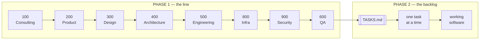
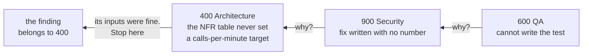

# AI-Native Delivery

**How to build software where the specifications are written by AI, kept in git, and used by every
session after.**

## How to read this

| | What | How to read it |
| --- | --- | --- |
| **Part one** — sections 1–3 | the idea, and the pieces it is made of | once, in order |
| **Part two** — sections 4–12 | **one real run, start to finish** | follow along. Every idea is explained at the moment the run needs it |
| **Section 13** | the glossary | when a word stops you |

Part two is a story, not a manual. It starts with two files on disk and ends with specifications a
developer could build from, and nothing is explained before you have seen why it is needed. The
project is real: **`zamphora`**, a plant-care app for someone whose houseplants keep dying. The file
names, the numbers and the mistakes are the ones you will actually meet.

---

## Contents

**Part one — the idea**

1. [The idea in one page](#1-the-idea-in-one-page)
2. [AI-assisted or AI-native](#2-ai-assisted-or-ai-native)
3. [The seven building blocks](#3-the-seven-building-blocks)

**Part two — one run, empty folder to finished specs**

4. [Day zero: what is on disk before anything runs](#4-day-zero-what-is-on-disk-before-anything-runs)
5. [Step 1 — Consulting, and why it gets only two files](#5-step-1--consulting-and-why-it-gets-only-two-files)
6. [Step 2 — Product, and the first handover](#6-step-2--product-and-the-first-handover)
7. [Step 3 — Design turns stories into screens](#7-step-3--design-turns-stories-into-screens)
8. [Step 4 — Architecture, and the first human gate](#8-step-4--architecture-and-the-first-human-gate)
9. [Steps 5 and 6 — Engineering, then Infra](#9-steps-5-and-6--engineering-then-infra)
10. [Steps 7 and 8 — Security, then QA, and the break](#10-steps-7-and-8--security-then-qa-and-the-break)
11. [The run is over: the review is the real output](#11-the-run-is-over-the-review-is-the-real-output)
12. [From specs to code, and the commands you type](#12-from-specs-to-code-and-the-commands-you-type)

**Reference**

13. [Glossary](#13-glossary)

---

## 1. The idea in one page

### The problem

You open the editor, ask for a component, paste it in, it works. That is fine for one file. On a real
project it fails in a specific way:

- the AI does not know what the project already decided, so it invents an answer
- the invented answer looks correct, because AI output always looks correct
- nobody notices, because nothing was written down to compare it against
- next week a new session knows none of it, so you type the context again

A real case. You ask for a photo assessment feature. Nowhere is it written how often the answer must
be right, or what to do when the model is unsure. So the AI picks: a confident verdict every time,
even when guessing. Nobody decided that. It happened because no file said otherwise.

### The idea

> **Write the specifications first, using AI, as files in git. Then build the code from those
> files.**

That is all "AI-native" means. Not a better prompt, not a bigger model. The output of one session
becomes a file the next session reads.

The short form: **files, not chats, are the unit of delivery.** If a decision mattered and it is not
in a file, it did not happen.

### The two phases



Phase 1 is **the line**: eight AI roles run one after another, each writing documents the next one
reads. Phase 2 is **the backlog**: a task list generated from those documents, worked one task at a
time, each task pointing at the spec section it must follow.

**One run** is one pass of all eight roles over **one feature**. It produces the documents, plus a
record of how it went in `factory/runs/<name>/`. A product with six features has six runs — and you can
also re-run the same feature after fixing the setup, then compare the two.

**Remember:** the backlog is generated from the specs, never the other way round.

---

## 2. AI-assisted or AI-native

### The one question that decides it

Both kinds of team use the same tools. The difference is one thing:

> **Does the output become a shared, versioned file?**

| | AI-assisted | AI-native |
| --- | --- | --- |
| Where the prompt lives | in your head | in the repo, in `.claude/skills/` |
| How often it is used | once | every session, by every session |
| Who reviewed it | nobody | reviewed and committed like code |
| Can you measure it | no | yes, it is a file with a git history |

Three levels describe a team, and installing a tool does not move you up. **L1** — people use AI in
chat and the output stays there. **L2** — some prompts and rules are saved and shared. **L3** — every
stage of the work has a defined AI touchpoint with an expected output file.

One test settles it, and it works for one person as well as a team: **a new developer joins on Friday
— is the whole setup working on Monday without them asking anyone?** If yes, it is in files. If it
needs you to explain something, it is in your head, and that is L1 whatever tools are installed.

### The seven anti-patterns

| Anti-pattern | What it looks like |
| --- | --- |
| **Chat as delivery** | the useful output stayed in the chat window |
| **File hoarding** | you wrote a good skill and never shared it |
| **Individual hero** | the setup lives in one person's habits and leaves when they do |
| **Babysitting the agent** | you watch every token and correct it live |
| **Biggest model by default** | a premium model on a task the default model handles |
| **Tool cargo cult** | buying tools and waiting for results. Also: locking into one vendor |
| **Anecdote as metric** | "it feels faster" is the whole measurement |

The first blocks every other improvement, so fix it first. The last is why most teams cannot answer
"what did AI actually save us?" — nobody wrote a number down before they started.

### What it costs

Two different spends, and mixing them up is why people think this is expensive. **Spec spend** is human
time, paid once — expensive in hours, cheap in money. **Run spend** is model calls, paid every run, and
**a multi-agent run costs about 15× a single chat.** Fine once for a real feature. Not fine three times
because nobody read the first two.

**A budget is a number that stops something.** "Be careful with cost" stops nothing. Write the limit
into the setup — this project uses 250,000 tokens per role — and say what happens when it is reached:
stop and ask a person.

**Remember:** AI-native is one question — does the output become a versioned file someone else reads?

---

## 3. The seven building blocks

### The problem

You want the AI to always use `type` instead of `interface`. There are seven places you could write
that rule, and they behave very differently. Put it in the wrong one and it either never loads, or it
loads on every unrelated turn and pushes out something you needed.

The only real difference between them is **when the model sees the file**.

| Block | Lives in | Loads | Use it when the rule… |
| --- | --- | --- | --- |
| **Rule file** | `CLAUDE.md`, `AGENTS.md` | every session, always | must always be present |
| **Context file** | `docs/` | when a task points at it | only matters for one kind of work in this repo |
| **Skill** | `skills/<name>/SKILL.md` | when the task matches its `description` | only matters for one kind of task |
| **Subagent** | `agents/<name>.md` | when dispatched, in its own context | involves so much reading it would fill your session |
| **Command** | `commands/<name>.md` | when you type `/name` | is something you will type repeatedly |
| **Hook** | `settings.json` | on an event, as a shell command | must run automatically on your machine |
| **MCP server** | `.mcp.json` | at session start, giving the agent tools | needs the agent to *act on* a system outside the repo |

Go down that last column and stop at the first one that works — **picking too wide is the expensive
mistake**. Above all seven sits one more: a rule that must hold on every pull request with no
exceptions belongs in a **CI required check**. Those paths sit under `.claude/` in a project and under
the plugin root in a plugin — same files, same behaviour, only the folder differs.

### The four that are easy to get wrong

**Rule file** — loads in full every session, so keep it short. Past a few hundred lines it stops
working: the model holds all of it at once, so the important lines carry less weight. Rules and
pointers here, explanations in `docs/`. `AGENTS.md` beside it is 20 lines saying "the rules are in
`CLAUDE.md`", so a different tool lands in the same place. A pointer, never a copy.

**Context file** — the layer that does the most work: the stack, the conventions, the specs, the
decisions. It comes in three temperatures:

| Layer | Where | Loaded |
| --- | --- | --- |
| **hot** | `CLAUDE.md` | always. Keep it short |
| **warm** | `docs/` | when relevant. The real detail lives here |
| **cold** | `context/cold/gap-log.md` | rarely. Things that only existed in a conversation |

The real risk in the warm layer is a document that **no longer matches the code**, not a thin one. A
thin document is obviously thin, so nobody trusts it. An out-of-date one looks fine and is trusted.
One rule fixes it: **update the context file in the same pull request that made it wrong.**

**Skill** — a saved way of doing one kind of task: how to review a branch, how to diagnose a bug
before editing. Its `description` line decides whether it loads, so it names the trigger, not the
topic.

> **A skill must survive being copied into another repository.** No paths, no version numbers, no
> domain facts.

That is the most common mistake here. A "skill" that hardcodes `apps/web/src/features/plants` is a
context file with the wrong label on it. Keep the pair straight: a **skill** is *how to do a task* and
still makes sense elsewhere; a **context file** is *what is true here* and makes sense nowhere else.

**Hook** — a shell command on an event. Not the model deciding, a script running. **Hooks help, CI
required checks enforce.** A hook runs on your machine, so it protects you and nobody else. A required
check on `main` protects the branch.

The remaining three are shorter:

- **Command** — a prompt file you run by typing `/name`. It can run shell commands and paste the real
  output in before the model reads anything, so the session starts with the true state.
- **Subagent** — runs in its own context and hands back only its result. Good for searching 40 files,
  bad when you need those files open to edit right after: you would read everything twice.
- **MCP server** — gives the agent tools instead of text: a tracker, a database, a browser. Only add
  one whose tools a role actually needs, and say which role may use it. This project has none, which
  is the right answer until one job needs one.

**Remember:** the only real difference between the seven blocks is when the model sees the file.

---

## 4. Day zero: what is on disk before anything runs

The `docs/` folder is empty. Four files decide everything that follows. You wrote two of them, and
they sit in this repository. The other two are not here at all — they arrive from a plugin.

### The two files you wrote

**`initial-plan.md`** — what you want, in your own words, written before any of this existed:

> I have a problem maintaining my plants at my apartment like my monstera, cactus. The problems are
> the intervals of watering, soil replacement, where to put each plant. Document the state of my
> plants — so a camera, and AI needs to interpret the image to assess my plant. Notifications. i18n.
> Mobile first.

It is messy, and that is fine. It is the only place your real goal exists.

**`factory/feature.md`** — the one feature this run is about, and more importantly what it is **not**
about:

```
The feature: photograph a plant that looks unwell, get back an assessment and a next action.

Out of scope for this run:
  watering-schedule engine · push delivery · sharing a plant · admin screens
  · plant identification · a follow-up chat
```

That "out" list is the fence. When a role tries to grow the feature — and one will — this is the file
it hits. **"Out" means not this run, not never:** the line runs once per feature, so you edit this file
and run again. Why not all six features at once? The stops are what you are buying, and eight roles designing six
features produce a review with 200 handovers nobody will do. So run 1 takes the **hardest** feature — a
camera, an upload, storage that costs money, and a model call that can be wrong.

### Run 1 is not like the runs after it

Most of what run 1 writes is not about photos at all. It is the foundation, and later runs read it
instead of deciding it again:

| Written once in run 1 | Rewritten for every feature |
| --- | --- |
| architecture, ADRs, C4, patterns | stories and the PRD |
| conventions, the stack file | the screens for that feature |
| environments, CI/CD, cost limits | the contracts and endpoints it adds |
| the design tokens | its threats and its test cases |

**That table is also the folder rule, and getting it wrong is silent.** A file in the right-hand
column goes in a run folder — `docs/200-product/001-photo-assessment/00-prd.md`, numbered so the runs
sort in order. A file in the left-hand column stays flat and is extended. Miss this and run 2 writes
to `docs/200-product/00-prd.md` again, overwrites run 1, and nothing warns you: the path was still
valid, so even the wiring check passed. One line in `factory/feature.md` names the slug, and every
`{feature}` path resolves from it.

So run 2 is much cheaper. Ask one question of the new feature: **does it change the shape of the
system** — a new data store, a new outside call, a new deployment unit, a new trust boundary? **No**
means four roles run instead of eight (Product, Design, Engineering, QA). **Yes** means all eight, but
Architecture and Infra *extend* their documents. Write that answer in the run record with its reason:
"we skipped Security" is itself a finding if nobody wrote down why.

### The two files that control the machine

These two are the whole factory, and everything else is built from them. **Neither is in this
repository** — they live in the `ai-factory` plugin.

**`factory/subagent-registry.yaml` — who exists, and what each may write.**

```yaml
- id: "900-security"
  owns_folder: docs/900-security/         # the only folder it may touch
  tools: Read, Write, Glob, Grep, WebSearch, WebFetch
  writes: [00-assets.md, 01-threats.md, 02-mitigations.md, 03-evidence.md]
```

**`factory/handoff-map.yaml` — what each may read, and in what order.**

```yaml
reads:
  "900-security":
    - docs/400-architecture/02-containers.mmd
    - docs/500-engineering/03-api-spec.md
    - docs/800-infra/01-iac-plan.md
```

Security opens those three files. Not the PRD. Not the design spec. Not this chat.

**Want to change how the line works? Change one of these two files.** Never edit a file that was
built from them.

The same file holds `execution_order`, and two placements surprise people. **Infra (800) runs before
Security (900)**, because you cannot threat-model a deployment nobody has described yet. **QA (600)
runs last**, because a real test plan needs the engineering spec, the infra plan and the security fixes
already written — a test plan written early only tests the happy path.

### Why the line is a plugin, and the product is not

The line knows nothing about plants. It would run on a banking app unchanged. The product is the
opposite — it is only ever this product. Those two things change for different reasons and at
different times, so they live in different repositories:

| Repository | Holds | Changes when |
| --- | --- | --- |
| `ai-factory` | the roles, the registry, the handoff map, the scripts, the commands | you improve the **method** |
| `zamphora` | `docs/`, `feature.md`, the app, the contracts, the infra | you build the **product** |

`ai-factory` is a Claude Code plugin. One committed line in `.claude/settings.json` turns it on, and
every command then carries its name: `/ai-factory:start`, not `/start`.

**The split is by reuse. It is not by front end and back end.** Two repositories for the web app and
the API was considered, then rejected, because a coding agent reads one repository at a time. Put the
API somewhere else and the agent changing the web app cannot see who calls the code it is changing.
The measured cost is four to six pull requests for a single change that touches both sides.

Two more things the plugin buys you:

- **The agents cannot fall behind the contracts they are built from.** You write a slot contract by
  hand, a script turns it into an agent file, and both sit in `ai-factory` — so its CI compares them
  on every push. In two repositories nothing would notice.
- **The next project installs the line. It does not copy it.** Copy the folder into a second project,
  fix a mistake in one role, and the second project keeps the mistake. With a plugin you push the fix
  once and every project picks it up by raising a version number.

### Five things that go wrong when you ship a plugin

A plugin is a folder with a **manifest** — a small JSON file saying what is inside. The folder can hold
any file: YAML, Node scripts, whatever the commands need. Writing it is quick. Making it load is the
slow part. All five below happened here, and none of them said what was really wrong.

| The mistake | What to do instead |
| --- | --- |
| You need **two** JSON files, not one | `plugin.json` describes the plugin; `marketplace.json` is the catalog that lists it. Even a one-plugin repository needs the catalog, with `"source": "./"` |
| Naming default folders in `plugin.json` | The `agents` field wants file paths, so `"agents": "./agents/"` fails with `Invalid input`. Use the normal layout and write none of those fields |
| Pushing without checking | `claude plugin validate .` finds both mistakes above in one second. Without it you get an install error naming a temporary cache folder |
| The setting is `enabledPlugins`, not `plugins` | Put `extraKnownMarketplaces` beside it, in `.claude/settings.json` — the file you commit. In personal settings it works on your machine only, and the project is back at L1 |
| `${CLAUDE_PLUGIN_ROOT}` only works inside text | Claude Code replaces it in a command, skill or agent file. It does **not** set it for a script the command starts. A script already knows where it is saved: read `import.meta.url` |

One more, and it is not about JSON. **A running session keeps the version it started with.** Fix a
script, push it, update the catalog — nothing changes until `/reload-plugins`. Also raise the version
in `plugin.json` on every release: the same number means "the same plugin", and it is never downloaded
again.

**One thing to hold on to before the run starts:** the eight roles write about thirty documents, but
the documents are not the point. **The loop is** — run the line, find the seams and gates, change the
factory, run again. That will only make sense after you have watched a run break.

---

## 5. Step 1 — Consulting, and why it gets only two files

### What a consultant actually does

A consultant is called in by a company that wants something built. They write no code. They ask
questions until the problem is clear, they look at what already exists on the market, they write down
the decisions that have already been taken so nobody argues them again, and they hand over a folder.
Somebody else builds it from that folder.

Role 100 is that person. It gets two files, does one shift, and hands over four. Everything it knows
comes from reading, asking and searching — never from building.

You type `/ai-factory:run-role 100-consulting`. Your main session does not do the work. It starts the
role as **a new session that remembers nothing** — no chat history, only files — hands it the two files
on its `reads:` list, and stops when the role is done.

### The four files, and what each is really for

They land in `docs/100-consulting/`. Read them in this order.

| File | In one sentence | The real-life version |
| --- | --- | --- |
| `00-context-brief.md` | everything everyone "just knows" and nobody wrote down | the notes from the first meeting |
| `01-use-cases.md` | the jobs the app must do, ranked, each one judged | "what do you actually need it to do" |
| `02-decisions.md` | choices already taken, and why, so no later role re-opens them | the minutes: agreed this, rejected that |
| `03-market.md` | products that already exist, their prices, what they do badly | the competitor scan |

None of them is a plan and none is a design. A consultant does not decide what gets built or when it
ships — those belong to the owner, and to roles 200 and 400.

**The brief has four parts, and each must be there** even if the answer is "none known":

| Part | For zamphora |
| --- | --- |
| **business** | one developer, part-time. AWS free plan **ends on a written date** |
| **product** | one person with houseplants in an apartment, on a phone, in two languages |
| **engineering** | Next.js, Nest.js, shared Zod contracts. Not up for debate |
| **regulatory** | a plant photo shows the inside of a home. Personal data from file one |

Miss the engineering part and every later role invents its own stack rules.

### `01-use-cases.md` is the long one. It is doing one small thing many times.

That file feels heavy because of its size, not its idea. It lists seven jobs — take a photo and get an
assessment, turn the result into a care task, sign in, delete a photo, and so on. Then it asks **the
same four questions about every one of them**:

| The question | What it really asks |
| --- | --- |
| **Value** | does the user want this enough to reach for it? |
| **Usability** | can they get it while standing in front of a plant, holding a phone in one hand? |
| **Feasibility** | can one part-time developer actually build it? |
| **Viability** | is it worth *running* afterwards — the money, the attention, the risk of being wrong? |

Seven jobs times four questions is twenty-eight small judgements. That is the whole file. Nothing in
it is harder than one of those rows.

These four are a known set, from Marty Cagan's *Inspired*. They are chosen because a feature can die
of any one of them, and teams normally only check the third. A job that fails a question is not
deleted — it is marked `open` and handed to a person. UC-5 (how long a photo is kept) sat `open` on
Viability until the owner chose 180 days.

**How to read it in two minutes:** open the ranked list near the top, then read only the four gate
rows of UC-1. That is the shape of every other one.

### Why it gets only two files — this is called isolation

It would be easy to give role 100 the whole repository. Do not. **Isolation** means a role reads only
its declared inputs, and the reason is not tidiness: a role that can read everything will always find
something close enough, use it, and never mention it. A role that cannot will **stop and tell you the
fact is missing.** That stop is what you are paying for.

A second rule sits beside it. **Single writer:** every file has exactly one role allowed to create it.
Otherwise the second role overwrites the first and nobody can say which version was meant.

Giving each role less information sounds wrong. It is the most useful part of the design.

### It is allowed on the web — most roles are not

Role 100 can search. Only four roles can, each for one narrow reason:

| Role | May look up | Must not |
| --- | --- | --- |
| 100 Consulting | products that exist, their prices, what they do badly | invent a number it could not source |
| 400 Architecture | standards, RFCs, named patterns | treat a technology named in an input as already decided |
| 800 Infra | a current cloud price or free-tier allowance | quote a price with no check date |
| 900 Security | a CVE, an OWASP entry, a control definition | accept an earlier decision without re-checking it |

**Every outside fact carries its source link and the date it was checked.** Anything unverified is
labelled unverified, not left to read as fact. And research only happens because someone asked for it:
to make the line investigate something, name **which role**, **what question**, and **which file the
answer lands in**. An expectation held only in your head produces nothing.

**Check before moving on:** are all four parts of the brief there, and does it **name a date** where a
constraint has one, or just say "cost matters"? A rule with no number cannot be tested later.

---

## 6. Step 2 — Product, and the first handover

Role 200 starts, remembering nothing about role 100's session. It gets four files:

```yaml
"200-product":
  - factory/feature.md
  - docs/100-consulting/00-context-brief.md
  - docs/100-consulting/01-use-cases.md
  - docs/100-consulting/03-market.md
```

### The first handover has a name: a seam

A **seam** is one file crossing from one role to the next. Role 100 gives `00-context-brief.md` to role
200. That is one seam. There are about 34 in the whole run, all listed in `handoff-map.yaml` under
`edges:`.

The word comes from sewing: cloth rarely tears in the middle, it tears where two pieces are joined.
**The run almost never breaks inside a role. It breaks at a seam**, when the next role did not get
what it needed.

Later you give every seam one of five labels: **clean** · **under-supply** (less than it needed) ·
**over-supply** (more than it needed, so the feature grew) · **missing** (the file was not there) ·
**routing** (it went to the wrong role). Do not label anything yet — you cannot see most of them until
the run is over.

### What Product writes

`00-prd.md` (one page: what it must do, how success is measured) · `01-user-stories.md` (US-01…US-NN
with pass/fail rules) · `02-traceability.md` (every story → the metric that proves it worked).

Every story uses the **JTBD** shape, which puts the **moment** into the requirement:

> When **I notice a leaf turning yellow**, I want **to photograph it and be told what to do**, so I
> can **fix it before the plant dies**.

That tells you the answer must arrive fast and be right, because the user is standing in front of the
plant holding a dying leaf. It is a requirement on the system, not a UI detail.

### Why an AI story needs three extra answers

"The plant is saved" either happened or it did not: you tap, you check the row. **"The plant has
spider mites" can be wrong while every line of code works.** There is no correct answer to compare it
against, so *done* has no meaning until a person writes down what done is. An **Eval Card** is those
three answers, and it goes into the story before anyone builds it.

| The question | Answered here | If nobody answers it |
| --- | --- | --- |
| **How often must it be right?** | a person agrees with a `likely` verdict **8 times in 10**, over the first 20 real assessments | you ship on a feeling, and QA has no pass mark |
| **What does it do when unsure?** | show the verdict, say it may be wrong, say what a better photo looks like. No care task unless the user says yes | whoever builds the screen decides it alone |
| **What when it cannot tell?** | show no verdict, show a reason from a fixed list, and no task can be made | the model invents a fault rather than say nothing |

**The right-hand column is the argument.** Those three get answered either way. Skip the card and the
app shows a confident verdict every time, because that is the cheapest thing to build — which is
exactly the failure this note opens with in section 1.

**No percentage appears anywhere in it, on purpose.** A confidence score the model writes about
itself is not a measurement — it is the model's own opinion of its own answer, with nothing to check
it against. Agreement with a person can be counted, so that is the bar: `likely`, `unsure`,
`cannot-tell`.

The PRD also carries a **guardrail metric**: the number that must *not* move while the success one
goes up. Photo uploads rising is good; the model bill rising with them is what you watch. This run
adds a second — the share of `cannot-tell`: a model hiding there is never wrong and never useful.

### What the real run showed, 2026-08-24

Two things role 200 did here matter more than the 14 stories it wrote.

**It guessed three numbers and refused a fourth.** Nothing said how long a session lasts, how fast
the kill-switch acts, or how long the flow may take, so it proposed 30 days, 60 seconds and 30
seconds and marked each as needing a person. Then it reached the daily limit on assessments per user
— all that stands between an open endpoint and an empty credit balance — proposed nothing, and
stopped the line. **Guess what costs a re-write. Never guess what costs money.**

**It broke its own rule inside its own file.** Section 8 of the PRD says build order is not decided
here; section 3 gives every feature a run number that appears in no input. The rule was in its own
contract and the file broke it anyway — which is why you read the output even when the contract is
good.

**Check before moving on:** is there a **number** in every acceptance rule, and does the AI story say
what happens when the model is **unsure**? One vague word here costs three later roles: Design cannot
draw an unsure state, Architecture cannot budget for it, QA cannot test it.

---

## 7. Step 3 — Design turns stories into screens

Design reads the brief, the PRD and the stories. It writes four files, and **the handover is two text
files, never a picture.**

| File | What is in it |
| --- | --- |
| `00-journey-map.md` | the whole path, and where the user feels worst |
| `01-CONTEXT.md` | the feature in one sentence, the hard limits as MUST NOTs, what is excluded |
| `02-SPEC.md` | every component by exact name, every screen state, tokens by name |
| `03-tokens.md` | the colour, spacing and type names — never hex values in the spec |

A picture cannot be read by the next role. A text spec can, and it shows up in a pull request diff.

### The rule that catches the most bugs: count the states

The journey map found something useful: **the worst moment is not taking the photo. It is the wait.**
Three different waits, in fact — resizing, uploading, and the model thinking.

So the camera screen does not have two states. It has **ten**: empty · camera permission denied · no
camera, pick a file · resizing · uploading · assessing · result confident · result unsure · offline ·
failed.

| | |
| --- | --- |
| ✅ | the camera screen lists **10 states**, including "camera permission denied" |
| ❌ | the camera screen shows a photo and a result. That is a demo, not something you can ship |

There is one negative rule too: **the verdict never appears without its confidence.** A rule about what
the screen must *not* do is worth more than three about what it should.

**Check before moving on:** count the states on the main screen. **Under 6 means the spec is not
finished** — Engineering will build one spinner for three different waits, and the unsure state will
quietly not exist.

---

## 8. Step 4 — Architecture, and the first human gate

This is the biggest step. It reads the brief, the PRD, the stories and both design files, and writes
eight things. Seven are described below. The eighth is `05-patterns.md`: the shapes the system
repeats — the data keys, how sign-in works, how failure is carried, how the counter cannot be raced.
An ADR says *why* one thing was chosen; a pattern says *how the same problem is solved every time it
comes up*, so nobody invents a second way in task 40.

### Options before diagrams

First `00-options.md`: **three options that really differ** — serverless against containers,
single-table against relational — scored on at least three limits, where scoring well on one means
scoring worse on another. Draw a diagram before the choice is made and you are married to your first
idea.

**A close score is a gate, not a tie-break.** On run 1 the winner beat the runner-up 16 to 15, and
one point is not a defensible margin. The role took the winner, wrote down the single trade that
separates them, and handed the choice to the owner as gate 26. A role that quietly breaks its own
tie has decided what gets built.

For zamphora, serverless wins — and **why it wins matters.** The deciding limit came from role 100's
brief: the free account plan. A limit written in step 1 chose the architecture in step 4. That is the
line working.

### C4 — two diagrams, and why only two

**C4** is four zoom levels of the same system: **context, containers, components, code.** You draw
the first two and stop.

| Level | Name | One box is | Drawn here? |
| --- | --- | --- | --- |
| 1 | Context | The whole product, plus the people and the outside services around it | Yes — `01-context.mmd` |
| 2 | Containers | One part inside the product that runs on its own | Yes — `02-containers.mmd` |
| 3 | Components | A module or class inside one of those parts | No |
| 4 | Code | The classes themselves | No |

**Levels 3 and 4 are the code, and the code already says what the code is.** A drawing of it is
wrong within a week and nobody notices. Levels 1 and 2 are the part the code never says out loud.

**"Container" here has nothing to do with Docker.** The test is: can this be started, stopped and
deployed by itself? If yes, it is a level-2 box. If it belongs to somebody else and you only call it,
it is an outside box on level 1.

On run 1 that gives **6 boxes on level 1** — the plant keeper, the admin, zamphora itself, Cognito,
the Anthropic API, email delivery. Level 2 opens zamphora up into **seven parts**: `edge`, `web`,
`api`, `llm adapter`, `contracts`, `table`, `photos`. Only two of the six on level 1 are people, and
that is normal: level 1 is mostly about who is outside and cannot be changed.

`01-context.mmd` and `02-containers.mmd` are **Mermaid** files — diagrams written as text, in the repo,
so an agent can read and update them. A picture in a slide deck stops matching the system within weeks
and nobody notices. The bug this catches is a **missing arrow**: on run 1, `02-containers.mmd` had a
`web` box whose own description said it "fetches every value from the api", and no arrow from `web`
to `api`. Every box had at least one arrow, so a shallow check passed it. The missing arrow was
hiding an undecided question — does the browser call the API, or does the server call it and forward
the cookie? **Check that every arrow the prose claims is actually drawn, not just that no box is
alone.**

### ADR or NFR — the pair that gets mixed up

| | Is a… | Example |
| --- | --- | --- |
| **ADR** | *decision* | "we use DynamoDB with a single table" |
| **NFR** | *target* | "the result is on screen inside 30 seconds, 95% of the time" |

Different files on purpose. **Every ADR ends with an Agent-Readable Summary** — a plain instruction with an explicit "do not", such
as *"all model calls go through `LlmProvider`. Do not import the Anthropic SDK outside
`packages/llm/src/adapters/`."* Without it an agent reads the whole record, agrees with it, and still
writes the import, because what to actually *do* was never said. Once an ADR is accepted, **the file is
never edited** — a new one replaces it and both stay, so the history survives.

### A number only counts if it has three links

> a written number → an automatic test that checks it → that test blocks a release if it fails

Miss one and the number is a wish. `06-nfrs.md` is a table where every row carries all three:

| NFR | Target | How it is checked | Which CI job runs it |
| --- | --- | --- | --- |
| NFR-01 how long the user waits | **p95 under 30,000 ms** | Playwright runs the whole flow on a throttled connection, with the model replaced by a stub that sleeps for the budgeted 8,000 ms | `perf-flow` |
| NFR-10 what one assessment costs | **≤ $0.0040** on Haiku 4.5 | the cost is read from the `usage` block the API returns, never estimated, and asserted against the published prices | `test` |
| NFR-20 how often the verdict is right | **≥ 8 in 10**, provisional | run the 40 known photos through the real model and count how often a person agrees | `ai-eval` |

Three things in that table are worth unpacking, because they are the parts people skim.

**Cost really can be a unit test.** You do not call the model. You take the prompt you send, count its
tokens, multiply by the published price, and assert the result is under the ceiling. Add three
paragraphs to the prompt later and that test fails on the pull request, before the bill arrives.

**The 40 photos have a name: a golden set.** Real photos where a human already wrote down the right
verdict — the only honest way to test an AI feature, because there is no "correct output" to compare
a string against, only "right often enough".

**The last column is a GitHub Actions job name.** `test` runs on every pull request. `ai-eval` costs
real money — 40 photos at $0.0040 is $0.16 a run, and nightly would be about $4.80 a month against a
$5.00 credit balance — so it runs on demand only. It still **blocks the release**, which is the third
link. A test that empties the balance it is testing is not a test.

Two of those three rows do not exist on a normal project. **AI features need a cost-per-call number and
a how-often-is-it-right number**, both decided here, at design time, by the role that also chose the
architecture.

### The timed flow, and the simplest shape that works

`001-photo-assessment/03-flow.md` lists all fifteen steps with a number, in two columns — the run
most people get, and the run the design has to survive:

```
typical   8,191 ms   warm function, decent signal
budget   15,245 ms   cold function, weak signal, first call of the day
                     against a 30,000 ms promise
```

**The point is that the numbers must add up.** A ten-second check that catches a design nobody
totalled — one published example claimed 87 ms when its own steps came to 92.

**A third row used to sit under those two: a retry at 25,230 ms.** The owner deleted the retry on
2026-08-26 once the pre-mortem showed it broke the cost ceiling and squeezed the time budget. **The
table is the thing that made that visible** — the retry was not obviously wrong until somebody added
it up next to the ceiling it had to fit under.

### The budget also has to fit under the platform's own ceiling

This is the finding of run 1, and it hides because both numbers are the same. The owner promised the
user 30 seconds. An API Gateway HTTP API **cuts any request off at 30 seconds, and that limit cannot
be raised.** When it fires, the person sees a 504 that no part of the product wrote — which breaks
the story saying every failure message ends in one of two chosen sentences.

The fix is three deadlines in order, each one a constant in the code:

| Layer | Deadline | What the user sees if it fires |
| --- | --- | --- |
| The application | 20,000 ms | Its own failure message |
| The function | 22,000 ms | Nothing. This is the net under the net |
| The gateway | 30,000 ms | A 504 nobody wrote. Must never be reached |

**A target number is not finished until it has been checked against the platform's own limit.** Ask
it of every budget: what cuts this off first, and who writes the message when it does?

**And a deadline is a permission, not a prediction.** The first version of this stack was checked
against the run the design *expects*, which left 4,770 ms of apparent headroom. Checked against the
run the design *permits* — the app using its whole 24,000 ms — the headroom was 480 ms. Worse, the
800 ms cold start had been subtracted inside the app's own deadline, and the code that starts that
clock cannot run until the cold start has finished. **Anything that happens before your code runs is
budgeted outside your deadline, not inside it.**

Then pick the shape: **plain code (if / else) → one AI call → a fixed chain of AI calls → a
free-roaming agent.** Stop at the first that does the job. Photo assessment is **one AI call**.
Reaching for an agent by default is the most common mistake right now, and an agent is the hardest
thing to test, debug and predict the cost of.

Last, `07-adversarial.md` is a **pre-mortem written by a brand-new session that never saw the design
being built**, asked one question: this failed badly — why? The session that built the design will
defend it, exactly as a person defends their own work. A new session has nothing to defend.

**On run 1 it paid for itself.** It found three real defects in a pack that had already been checked
by hand: the most frequent read in the product cannot be done in one call, because the key it needs
sits inside the item it has not read yet; the headroom in the timed flow was measured on the friendly
run and not on the run the design permits; and one requirement caps the cost of an assessment at a
figure that a second attempt — allowed by the requirement printed next to it — goes past. **Run the
pre-mortem before the next role reads those files, not after.** A wrong document that has already
been read has spread.

### And here the line stops

Part-way through, role 400 stops and asks you: *"How long do we keep a user's photos? I need it to
size the storage."* Nobody ever decided this. It is not in any file, so the role stops.

**This is a human gate: a question the AI is not allowed to answer, even if it could guess well.**

Why not? A photo of someone's living room is personal data. Pick 30 days and you may break a law. Pick
10 years and you keep something you should not. **The AI cannot see that this is a legal question
wearing a technical costume.** So it must not choose. The roles write. **You choose.**

You do not have to remember which questions are gates. `handoff-map.yaml` lists them under
`human_gate_policy` — accepting a risk, choosing scope beyond `feature.md`, asking for secrets or
production data, needing a policy, compliance, budget or release decision, spending money, deploying,
proposing a new tool the model may call, or contradicting an accepted ADR. Write every one into
`factory/runs/<name>/human-gates.md`. Four things can happen:

| What happened | Called |
| --- | --- |
| It asked, you were away, so it carried on and wrote "assuming 90 days — **not confirmed by a human**" | `recorded-open` |
| It stopped and waited. Nothing else got written until you answered | `hard-stop` |
| You answered, and the answer is now in a file a role can read | `closed` |
| **It never asked.** It wrote "photos are kept 30 days" as if that were a known fact | `missed` |

The first three are fine. **`missed` is the one to watch for**, because nothing warns you — the
document looks finished, the number looks agreed, and a decision was taken from you in silence.

### Your answer has to end up in a file

You decide: 180 days. You type it in the chat. The run carries on and it feels done. It is not. **The
next role starts in a fresh session and cannot see your chat.** Tomorrow that conversation is gone and
your decision with it.

So write it into a file a role reads — here, `factory/feature.md`. Then in `human-gates.md` note
**which file you wrote it into, and which role reads it next.** That note is the **return path**: proof
your answer went back into the line instead of staying in a chat. Skip it and you are hand-feeding the
line — the run looks clean and nothing was really decided.

**Check before moving on:** do the milliseconds add up, does every ADR end in a **"do not"** line, and
does every NFR row **name the test** that checks it? A row with "TBD" in the test column hands QA a
number it cannot check, so the number means nothing.

---

## 9. Steps 5 and 6 — Engineering, then Infra

### Engineering turns targets into types

It reads the stories, the design spec, the architecture options, the container diagram, the NFR table
and every ADR. It writes five files: `00-conventions.md` (naming, folders, what is banned) ·
`01-contracts.md` (the Zod schemas — the only place a wire type is defined) · `02-web-spec.md` ·
`03-api-spec.md` (every endpoint, its body, its errors) · `docs/context/stack.md`.

**Watch one decision travel through four roles.** This is the clearest proof the line works. Follow
the word `unsure`:

| Role | What it did with it |
| --- | --- |
| **200** Product | wrote the rule: *"on `unsure`, show the verdict, say it may be wrong, write no task without a yes"* |
| **300** Design | drew the screen for it — the unsure state |
| **500** Engineering | made `confidence` a field with three allowed values, in a Zod schema in `packages/contracts` |
| **600** QA | writes a test that sends an `unsure` answer and checks the unsure state appears |

The Zod schema is the important step. **It is one definition, used by the API and by the web app.**
Without it the API allows three values and the web app checks for a word someone typed from memory.
The two stop matching, and nobody notices until a user sees a confident wrong verdict.

**Who may import what.** The API has three layers, each with one job: the **controller** speaks HTTP,
the **service** holds the actual rules ("on `unsure`, write no task"), the **repository** talks to the
database and nothing else. The spec writes down which may import which:

| Layer | May import | Must not |
| --- | --- | --- |
| controller | service, contracts | repository, the data client |
| service | repository, other services, contracts | `Request`, `Response` |
| repository | the data client, contracts | service |

The row that matters most: **a service never sees `Request` or `Response`.** If it does, your business
rules are welded to HTTP, and you can no longer test "on `unsure`, write no task" without a fake
HTTP request first — so the rule that matters most becomes the hardest thing to check. A table like
this is only real if a **lint rule** enforces it, so the spec names the rule beside each row. A
boundary nobody checks lasts about three weeks.

**Check before moving on:** is the `confidence` field in the **contract schema**, or only in the API
spec? If the API spec describes it and the contract does not, the web app will invent its own type and
the unsure state will never fire.

### Infra decides what it costs to be wrong

Four questions, and a plan that misses one is not a plan: **what exactly ships** · **the deployment
written as code**, never a console click · **a pipeline with gates that fail the change, not the
customer** · **a one-step rollback**, named and tested.

On the AWS free account plan one fact changes how you think about cost: **it cannot send you a
surprise bill. It closes the account instead**, and takes the resources with it. So cost here is not a
finance problem. **It is a correctness problem.** A cost mistake does not make you poorer, it deletes
your work.

The traps that cost money by default:

| Trap | Cost | Instead |
| --- | --- | --- |
| DynamoDB **on-demand** (the default) | billed from the first request | provisioned — the free allowance covers only this |
| **NAT Gateway** | ~$33/month at zero traffic | never create one |
| **Secrets Manager** | $0.40 per secret | Parameter Store `SecureString`, free |
| a **customer-managed KMS key** | $1/month forever | AWS-managed keys, free |

`02-cost-guardrails.md` turns that into numbers that stop things: 10 assessments per user per day, a
budget alarm at 50%, a kill-switch at 100%. The owner set the 10, not a role — see section 6.

**Check before moving on:** provisioned, not on-demand? No NAT Gateway? A plan that took the framework
default for the table has already picked the billed mode.

---

## 10. Steps 7 and 8 — Security, then QA, and the break

### Security reviews something that now exists

This is why Infra runs first. Security reads the container diagram, the contracts, the API spec, the
environments file and the infrastructure plan — **a real described system**, not an intention.

It writes `00-assets.md`, `01-threats.md`, `02-mitigations.md` and `03-evidence.md`, and **it runs two
threat lists, because there are two different things to protect:**

| List | Protects | Why separate |
| --- | --- | --- |
| **OWASP LLM Top 10** | **the product** — one model call reading a photo | the model reads text it did not write |
| **OWASP Agentic Top 10** | **the factory** — eight roles with tools, web access, and the power to write files | an agent has memory, tools and permission to act. A single call has none of those |

The second list surprises people. **Your factory is itself an attack surface.** Role 100 browses the
web and writes files — a page it fetches could contain text telling it to write something else.

The test worth memorising is the **lethal trifecta**. Any two are usually fine. All three at once is
the dangerous shape:

> private data · untrusted outside content · a way to send data out

What it finds on zamphora: the photo carries **EXIF GPS — the location of the user's home** · a plant
nickname is free text reaching the model, a **prompt injection** path · the paid endpoint is a
**denial-of-wallet** target, not breaking anything, just spending your money until the account closes.

One more rule: **check a package is real before adding it.** Models invent plausible package names, the
same invented name returns across sessions, and attackers register those names and wait. This has a
name — **slopsquatting**.

### And here is the break

Role 900 writes this into `02-mitigations.md`:

> **Risk:** anyone can call the paid assessment endpoint in a loop and empty the budget.
> **Fix:** add a rate limit to the endpoint.

Read that on its own and it is fine. It found a real risk. It named a real fix. You would approve it.

Then QA runs, gets to the rate limit, and stops. **A rate limit of what?** Ten calls a minute? A
thousand a day? There is no number, so there is nothing to test.

Neither document is broken. Security did its job. QA did its job. **The mistake is in what passed
between them** — and reading either file will never show it, because both look finished. That is the
whole problem in one example. After a run you have eight folders that all look good.

### What QA writes anyway

`00-test-plan.md` (in scope, out of scope **with a reason**, top 3 risks, entry/exit rules) ·
`01-test-cases.md` · `02-ai-evals.md` (the golden set, the rubric, the pass bar). Two things here have
no equal in a normal project.

**Force at least five negatives.** "Write tests for this" produces tests that pass, because that is
what the words ask for. The valuable half: a photo of a wall · a photo too dark to judge · a healthy
plant the user thinks is sick · a model reply that does not match the schema · a model timeout.

**The golden set and its judge.** 40 photos with known correct verdicts, and the 8-in-10 pass bar
taken straight from the NFR table. If a model scores the answers, **score a sample by hand too** and
write down how often the two agree. Skip that and your pass bar measures the judge, not the model,
and you will not know which one is wrong.

**Check before moving on:** five negatives present, and does a failed eval actually **block the
release**, or is it advisory? Calling something critical and leaving it advisory is the same as not
writing it.

---

## 11. The run is over: the review is the real output

Eight folders. About thirty documents. It looks finished. **It is not** — the folders are not the
output. The run's value is the twenty-minute review you are about to do.

### Walk every seam

Every seam is already listed in `handoff-map.yaml` under `edges:`, so you do not have to hunt for them.

- **When:** after the last role, before you build anything.
- **Who:** you. An AI can draft the table, but **you set the labels** — only you know what you actually
  wanted, and an AI marking its own eight documents will call almost everything clean.
- **How:** type `/ai-factory:factory-run`, then go down the `edges:` list asking one question at each
  line:

> Did the role on the right have what it needed from this file?

Write one row per edge into `factory/runs/<name>/seam-ledger.md`. Most will say clean. **You are
looking for three.**

### Why the first seam is almost always `under-supply`

Open the ledger after run 1 and the top rows look broken — six of them in a row, all `under-supply`.
That is not six different faults.

Role 100 is first, so its only supplier is the two files a person wrote by hand. Nothing was missing,
misrouted or too long, so `under-supply` is the only label left.

It says one thing: **the hand-written input is the weakest part of the run, and no role can repair
it.** A first seam full of `clean` rows would mean the role guessed instead.

### A finding names a file and a fact

- ✅ "600-qa under-supplied by 900-security on `02-mitigations.md` — the rate-limit fix has no number,
  so no test case could be written against it."
- ❌ "the roles should communicate better."

The first one names the line you go and change. The second one will still be true next run.

### Walk it backwards — the role that noticed is rarely the one that caused it

You found the rate-limit problem at QA. Do not fix it at QA. Ask one question, again and again:

> **Why did that role write it that way? What did it have to work with?**

Open that role's `reads:` list. Inputs fine? The fault is its own. Inputs thin too? Step back one more
role.



Security had nothing to be specific about. Architecture had everything it needed and still left the
target out, so **the finding belongs to Architecture.** Fix it at QA instead and you invent a number on
the spot — worse than no test, because from then on the number looks agreed.

### Gate or seam? They feel identical, and you must not answer one of them

Now the hard part. A role stops and asks you something. Both kinds look the same from where you sit,
and they need opposite reactions. Ask one thing:

> **Is there a role whose job this was?**

- Role 500 asks *"what is the rate limit?"* — **yes.** Role 400 owns the NFR numbers and left it empty.
  That is a **seam**. Do not answer. Fix the Architecture file, then let 500 read it.
- Role 900 asks *"how long may we keep photos?"* — **no.** No role in the line owns that answer. That
  is a **gate**. Answer it. It was always yours.

The *asking* role tells you nothing. What tells you is whether some **other** role owed it that fact.

When it is a seam, the temptation is enormous. You know the rate limit. Typing it takes five seconds —
and then everything looks fine: Security writes a good document, QA writes a good test, every seam says
clean. But `06-nfrs.md` is still empty, so next run it happens again, and you paid for eight role calls
to learn nothing. Instead: write **under-supply at 400 Architecture** in the ledger, let the run stop,
and put the number in `06-nfrs.md` before the next run.

Two exceptions. **Role 100 is not covered by this** — it runs first, so **you are its input**; when it
asks something only you know, answer. And if role 400 itself asks for the rate limit, that is neither
gate nor seam but the role dodging its own job. Still do not answer — add a line to its contract.

The split is not important versus unimportant. `factory/subagent-slots/400-architecture.md` lists what
that role may **not** decide, and a rate-limit number is not on it. It is **on the list or not on the
list**, and the lists are written down.

### What a review turns up

Three findings, of the kind `factory/runs/001-photo-assessment/seam-ledger.md` really fills up with:

1. **100 → 400, under-supply.** The brief said "cost matters" but never named the date the free account
   closes, so the options table scored cost with no deadline. *(This is the thing from section 5. It
   travelled three roles before it did any damage.)*
2. **900 → 600, under-supply.** The rate-limit fix had no number — traced back to Architecture.
3. **300 → 500, clean but late.** The offline state appeared in the design spec, but no story ever
   mentioned offline. It entered scope without passing Product.

And two gates: one **recorded-open** — whether the EU AI Act applies, still waiting on you — and one
**missed**: Architecture decided what the app does on `cannot-tell` as if that were a technical value,
when Product already owned it. **That missed gate is the most valuable thing in the run.** No amount
of re-reading the documents would have found it.

### Then fix the factory, not just the one document

Architecture left the rate-limit number out. You could open `06-nfrs.md`, type it, and move on.

**Do not stop there.** Next run, on the next feature, Architecture leaves out a *different* number. You
fixed one document. You did not fix the thing that writes the documents. So change the factory — one
line in `factory/subagent-slots/400-architecture.md`:

> ❌ DON'T — ship an NFR row with no number in it

Now that mistake cannot happen again, on any feature. That is the loop from section 4, closing: run
the line → find the seams and gates → one change naming one file → you approve it → edit the factory →
the next run shows whether it worked.

Two things make such a change real. **It names the file it edits** — "improve the security prompt" is
not something anyone can act on; "add a DON'T row to `factory/subagent-slots/900-security.md`
forbidding a fix with no number" is. And **you do not know yet if it worked** — only the next run tells
you, which is why `run-record.md` has a column called "Did the next run fix it?".

### When is a run finished

Not when the eight folders look full. A run is finished when it has:

- **at least 3 seam findings**, each naming a file and a fact
- **at least 2 gates written down**
- **at least 1 change to the factory**, naming the file it edits
- one row per role, with the model used and why

That list sounds backwards, so read it again: **a run with no problems in it has failed.** Every seam
said clean because you answered each question as it came up. Nothing stopped, nothing got written down,
and you paid for eight role calls to get eight folders you could have written yourself.

**A run that stopped twice and wrote down why is the good one.**

---

## 12. From specs to code, and the commands you type

### Phase two is a different machine

The run is over. The documents turn into `TASKS.md`, and you switch from `/ai-factory:run-role` to
`/ai-factory:next-task` — one task at a time, until there is working software. Every task points at the
spec section it must follow, and a task that cannot name its spec section is one nobody agreed to.

### The folder

Two repositories, because the line is reusable and the product is not.

```
ai-factory/                       the line, shipped as a Claude Code plugin
├── .claude-plugin/               plugin.json + marketplace.json (the catalog)
├── agents/                       the role adapters — generated, never hand-edited
├── commands/                     start, learn, factory-run, run-role, next-task, spec-check
├── skills/                       method skills: adr-writer, code-review, root-cause, tasks
├── hooks/                        one script that runs before a code review
├── factory/
│   ├── subagent-registry.yaml    who exists, what each writes
│   ├── handoff-map.yaml          who reads what, run order, gate policy
│   ├── subagent-slots/           the role contracts — the editable source
│   └── runs/_templates/          seam ledger, human gates, run record
└── scripts/                      the checks the commands run

project/                          the product: web, API, contracts and infra together
├── CLAUDE.md                     loaded every session. Rules, routing, what to do first
├── AGENTS.md                     20 lines pointing at CLAUDE.md, for other tools
├── .claude/
│   ├── settings.json             what the agent may run, may never run, the plugin
│   ├── memory/                   facts that survive between sessions
│   └── skills/                   the skills that name this stack
├── factory/
│   ├── feature.md                the one feature the line runs on
│   ├── COST_GUARDRAILS.md        how many calls, which model, when to stop
│   └── runs/<slug>/              this run's seam ledger, gates and record
├── docs/                         where the roles write, one folder per role
│   ├── ADR/                      decisions, each ending in an explicit "do not"
│   └── learn/                    this note. No role may write here
├── context/cold/                 reasoning that only ever existed in a conversation
└── .github/workflows/            CI, ready before any code exists
```

`apps/`, `packages/` and `infra/` are missing on purpose. How the repository is arranged is role 400's
decision, and it writes an ADR before anything is installed.

### Two files per role, and only one is yours

Each role has two files, both in `ai-factory`. `factory/subagent-slots/900-security.md` is written
**by you, by hand**: how the role should think — its goal, its do and do-not table, what it must
refuse. `agents/900-security.md` is generated from it by `derive-agents.mjs`: which files to read,
which to write.

**The script is not clever.** It is 110 lines, uses **no AI**, and copies the read list out of the
handoff map and the write list out of the registry. Delete all eight generated files, run it again,
and the same eight come back exactly. Writing them by hand instead would mean two copies of the same
read list, and one day you change one and forget the other. Edit a generated file and **your change
disappears the next time the script runs**, with no warning. That is why it starts with a "do not
edit" line.

### The commands

Every one comes from the plugin, so every one carries its name.

| Type this | It does |
| --- | --- |
| `/ai-factory:start` | where the project is, and the one thing to do next. **Run it first, every session** |
| `/ai-factory:learn` | write what was just learned into the right notes file. **Run it before saying done** |
| `/ai-factory:factory-run` | which roles have run, and how to close a finished run |
| `/ai-factory:run-role 400-architecture` | run one role with only its declared inputs |
| `/ai-factory:next-task` | backlog state, then work the next unblocked task |
| `/ai-factory:spec-check` | audit code against specs — mismatches, dead links, untraced stories |

### The scripts underneath

You never type these — the commands run them. Each reads the real state on disk instead of trusting a
document: which roles have run, is the wiring sound, what may this role read, do the generated agents
still match the slot contracts.

The most useful is the wiring check. It reads the two control files — who **writes** what, who
**reads** what — and asks whether they agree:

| The mistake | What it costs you |
| --- | --- |
| Two roles are allowed to write the same file | The second role quietly overwrites the first role's work |
| A role reads a file that no role ever writes | The role starts, finds nothing, and stops |
| A role reads a file written by a role that runs **later** | It opens an empty folder every single run |
| The handoff map's `edges:` arrows disagree with its own `reads:` lists | You edited one and forgot the other, so the two now describe different lines |
| A file the run needs is not in your project | The first role stops before it writes anything |

The first four are inside the plugin, the last is inside your project, and the check reads both at
once. **Every one is cheap to fix now and expensive to find later.** Without the check you meet them as
a role that stopped for no clear reason, halfway through a run you already paid for.

### How a fresh session knows anything at all

| Layer | Where | Answers |
| --- | --- | --- |
| **Rules** | `CLAUDE.md` | how should I behave in this repo? |
| **Facts** | `.claude/memory/` | who is the user, what is already decided? |
| **State** | the files on disk | how far along is the work? |

The first two load automatically. The third has **no progress file** — `/ai-factory:start` counts the
documents on disk. A progress file would be a second copy of the truth, and two copies stop matching.
Counting real files cannot be wrong, because the files **are** the work.

### Your session plan

**One role per sitting, then stop and read what came out.** Pairing two saves an hour and costs you the
review, which is the part you are actually paying for.

| Session | Type | Produces |
| --- | --- | --- |
| 1 | `/ai-factory:run-role 100-consulting` | brief, use cases, decisions, market scan |
| 2 | `/ai-factory:run-role 200-product` | PRD, stories with numbers, traceability |
| 3 | `/ai-factory:run-role 300-design` | journey map, CONTEXT + SPEC, tokens |
| 4 | `/ai-factory:run-role 400-architecture` | options, C4, timed flow, ADRs, NFR table |
| 5 | **a fresh session, no history** | the pre-mortem |
| 6 | `/ai-factory:run-role 500-engineering` | conventions, contracts, web and API specs |
| 7 | `/ai-factory:run-role 800-infra` | environments, IaC plan, cost limits, CI/CD |
| 8 | `/ai-factory:run-role 900-security` | assets, threats, mitigations, evidence |
| 9 | `/ai-factory:run-role 600-qa` | test plan, test cases, AI evals |
| 10 | `/ai-factory:factory-run` | seam ledger, gates, then `TASKS.md` |

---

## 13. Glossary

Look a word up here instead of guessing. One plain sentence each. AWS services are not here — those
belong in the AWS study notes.

### The process

| Word | Plain meaning |
| --- | --- |
| **AI-native** | The output of an AI session becomes a file in git that the next session reads. Not a better prompt. |
| **The line** | The role agents running one after another, each handing a file to the next. |
| **Role / slot** | One job in the line, such as Security. Its contract is a file in `factory/subagent-slots/`. |
| **Subagent** | An agent that runs in its own separate context and hands back only its result. |
| **Adapter** | The generated copy of a slot, in the plugin's `agents/`. Never edit it; edit the slot and regenerate. |
| **Isolation** | Each role reads only its declared inputs. A missing input becomes a visible stop, not a guess. |
| **Single writer** | Every output file has exactly one role allowed to write it. |
| **Seam** | One file crossing from one role to the next. This is where the line usually breaks. A seam is a join, like a sewn join in cloth. |
| **Seam ledger** | The table where you record every seam, one row each, with its label and what happened. "Ledger" is an old accounting word for a book of one-line entries. |
| **Human gate** | A point where the line stops and a person decides. Example: accepting a risk. |
| **Return path** | Where the answer to a stopped gate is written down, and which role reads it next. An answer given only in chat does not count. |
| **Run** | One pass of the whole line over one feature. Its evidence lives in `factory/runs/<name>/`. |

### The documents

| Word | Plain meaning |
| --- | --- |
| **PRD** | Product Requirements Document. One page saying what the product must do and how success is measured. |
| **The four risks** | Value, Usability, Feasibility, Viability — the four ways a feature can die, from Marty Cagan's *Inspired*. `01-use-cases.md` asks all four about every job, because teams normally check only Feasibility. |
| **JTBD** | Jobs To Be Done. A story shape that puts the moment into the requirement: "when I notice X, I want Y, so I can Z". |
| **Acceptance criterion** | The exact rule that decides if a feature is done. It must pass or fail, with no opinion. |
| **ADR** | Architecture Decision Record. What was decided, why, what was rejected. Never edited once accepted. |
| **NFR** | Non-Functional Requirement. A quality target with a real number: speed, cost, uptime, how often the answer is right. |
| **C4** | Four zoom levels of one system: **c**ontext, **c**ontainers, **c**omponents, **c**ode. Only 1 and 2 are drawn. Levels 3 and 4 are the code, which says what it is by itself. See section 8. |
| **Container (C4)** | Not Docker. Any part of the product that runs on its own — here `web`, `api`, `table`, `photos`. |
| **Mermaid** | A way to write a diagram as text, so it lives in git and an agent can read and update it. |
| **p90** | "Nine times out of ten". Written instead of an average, because an average hides the slow cases. |

### Testing, AI quality and the code

| Word | Plain meaning |
| --- | --- |
| **Eval** | A test for an AI feature. It measures how often the answer is right, not whether the code runs. |
| **Golden set** | The examples an eval runs against — here, 40 photos where a human already wrote down the right verdict. |
| **LLM-as-judge** | Using a model to score another model's answer against a rule, instead of checking every one by hand. |
| **Judge calibration** | Scoring a sample by hand and comparing it with the model judge. Without it, the pass bar measures the judge. |
| **Negative case** | A test for something that should fail or be refused. A generated suite is mostly cases that pass. |
| **Required check** | A CI job that must pass before a pull request can merge. A hook helps; only this enforces. |
| **Zod** | A library that checks at runtime that data has the right shape. TypeScript types vanish when the code runs; Zod does not. |
| **Contract** | A Zod schema in `packages/contracts` describing something that crosses between the browser and the API. |
| **problem+json** | A standard shape for error responses (RFC 9457), so every error looks the same to the front end. |
| **LlmProvider** | The one place in the code that talks to an AI model. Swapping providers means writing one new adapter. |

### Security

| Word | Plain meaning |
| --- | --- |
| **OWASP LLM Top 10** | The standard list of the ten most common ways AI features get attacked. Covers one model call. |
| **OWASP Agentic Top 10** | The 2026 list for **agents** — things with memory, tools and permission to act. Covers the factory, not just the feature. |
| **Lethal trifecta** | Private data, untrusted outside content, and a way to send data out. Any two are usually fine; all three together are the dangerous shape. |
| **Prompt injection** | Text hidden in user content that tries to give the model new orders. A nickname or a note in a photo can do this. |
| **Slopsquatting** | An attacker registers a package name that models keep inventing, and waits for someone to install it. |
| **Denial-of-wallet** | An attack that costs you money instead of breaking anything. Here, a loop calling the paid AI endpoint. |
| **Kill-switch** | A tested way to stop a feature fast. A named, reachable person, independent of the broken part. |
| **EXIF** | Hidden data inside a photo file. It usually includes the GPS location where the photo was taken. |

---

## The twelve rules, on one screen

1. **Files, not chats.** A decision not written in a file did not happen.
2. **Specs first, code second.** The backlog is generated from the specs.
3. The only real difference between the seven building blocks is **when the model sees the file**.
4. **A skill must work in another repo.** Anything repo-specific belongs in the rule file or `docs/`.
5. **Hooks help, CI required checks enforce.**
6. Two YAML files are the only source of truth. **Edit the slot, regenerate the adapter.**
7. **Isolation plus single writer** turn a missing fact into a visible stop instead of a guess.
8. **Do not fill a gap by hand.** The stop is the finding. Fix the file it came from.
9. **Trace a break back to the earliest role** that could have carried the missing piece.
10. A number counts only with **a test that checks it and a check that blocks the release**.
11. **A missed human gate is as serious as a broken seam.**
12. Some decisions are never the agent's: **what ships, accepting a risk, spending money, the final
    merge.**
