# AWS and the pipeline

**How this project runs on AWS, and how the build reaches AWS without any password existing.**

This note is one of four. `backend-concepts.md` explains **the ideas on their own**, away from this
project. `ai-native-delivery.md` is about the **process**. `monorepo-architecture.md` is about the
**shape of the code**. This one is about the **running system** — what is in the cloud, who is
allowed to change it, and what stops it costing money.

**If a term here is unfamiliar, it is defined in `backend-concepts.md`**, which is a dictionary
rather than a walkthrough. This note says what *this system* does; that one says what the *idea* is,
how else it is done, and the trap. The concepts this note leans on hardest are **46** servers,
containers and serverless · **47** cold starts · **50** the CDN and the edge · **39** least privilege
and IAM · **45** infrastructure as code · **55** observability · **59** cost as a correctness
property · **43** defence in depth · **64** CI and CD.

**Part A is the system.** Read it in order, once. It is the part worth understanding six months from
now, because the shape of the running system is what you have to hold in your head before you can
change anything.

**Part B is the pipeline** — how code gets from your machine to AWS safely. Read it once too. After
that, it mostly looks after itself.

**Part C is lookup.** Come back to it when you need a number.

---

## Contents

**Part A — the running system**

1. [The account, and why that changes everything](#1-the-account-and-why-that-changes-everything)
2. [The nine stacks, and the picture they make](#2-the-nine-stacks-and-the-picture-they-make)
3. [The path of one request](#3-the-path-of-one-request)
4. [Four clocks, stacked — and then taken apart](#4-four-clocks-stacked--and-then-taken-apart)
5. [One table, and the "wrong" choice made on purpose](#5-one-table-and-the-wrong-choice-made-on-purpose)
6. [The photo path](#6-the-photo-path)
7. [The function itself, and the build that nearly did not work](#7-the-function-itself-and-the-build-that-nearly-did-not-work)
8. [What stops it costing money](#8-what-stops-it-costing-money)
9. [What you can see when it breaks](#9-what-you-can-see-when-it-breaks)
10. [Two switches that look the same and are not](#10-two-switches-that-look-the-same-and-are-not)

**Part B — the pipeline**

11. [How the build signs in to AWS with no password](#11-how-the-build-signs-in-to-aws-with-no-password)
12. [A public repository, and the two walls](#12-a-public-repository-and-the-two-walls)
13. [What has to be green before a merge](#13-what-has-to-be-green-before-a-merge)

**Part C**

14. [Lookup: what was chosen, and what lost](#14-lookup-what-was-chosen-and-what-lost)

---

# Part A — the running system

## 1. The account, and why that changes everything

This runs on the **AWS free account plan**. That plan does not send a bill. When you go past what is
free, it **closes the account** and takes the resources with it.

So a runaway loop is not an accounting problem. It is the product disappearing. That is why every
resource is written in CDK and kept in git: a lost account is one deploy away from coming back.

**Two facts that surprise most people.**

**First, AWS has two kinds of free offer, and this plan only has one of them switched on:**

- **Always Free** — free forever. Lambda, DynamoDB, CloudFront, Cognito.
- **Twelve-month trial** — free for a year on a *paid* plan. **This account gets none of it.**

So **API Gateway, S3 and Route 53 bill from the very first request.** The amounts are tiny at one
user — under a cent a month — but "the whole stack is free" was never true, and the plan says so.

**S3 is on that list because of a date, and this is worth remembering rather than re-deriving.**
AWS replaced the old S3 free tier on **2025-07-15**. Accounts opened after that date get the
one-time credit instead. This account was opened 2026-07-01, so it gets no S3 allowance at all. An
account opened before that date would still have one. So if you ever read "S3 gives you 5 GB free"
somewhere, check when the account was created before believing it.

**Second, the DynamoDB free amount is measured in hours, not in a ceiling.** This is the fact that
is easiest to get wrong, and it changed a decision here. The free amount is not "25 capacity units,
at every moment". It is 25 units held for a whole month, which is about **18,250 capacity-unit-hours
a month, per Region**. A capacity unit is room held open for one request a second.

That difference matters because it changes what a mistake costs:

| If you think it is a ceiling | What is actually true |
| --- | --- |
| A second table steals capacity from the first | A second table spends unit-hours. The first table keeps its own speed |
| A preview table left running breaks production | It costs a small amount of money at the end of the month |
| Two open pull requests cannot both have a preview | They can. A pull request that lives a few hours costs a fraction of a cent |

This project ran on the wrong model for four days. It split `prod` down to 20/20 to make room for a
`preview` table at 5/5, and wrote a rule saying only one preview may exist at a time. The split is
kept because it keeps the monthly total inside the free amount with no arithmetic to redo. The rule
was withdrawn, because it was protecting against something that does not happen.

---

## 2. The nine stacks, and the picture they make

Everything is CDK. A **stack** is one group of AWS resources that is created, updated and deleted
together. There are nine, and each is a separate deployable unit — so one can be replaced without
touching the others. **Eight of them are in one Region and one is not.**

That one Region is **eu-central-1**, Frankfurt, because a photo of the inside of a home is personal
data and it should stay under EU rules. The exception is explained at the end of this section, and
it holds no data at all.

The newest of the eight is **`ZamphoraWorkflowStack`**, which arrived when the assessment moved
into the background.

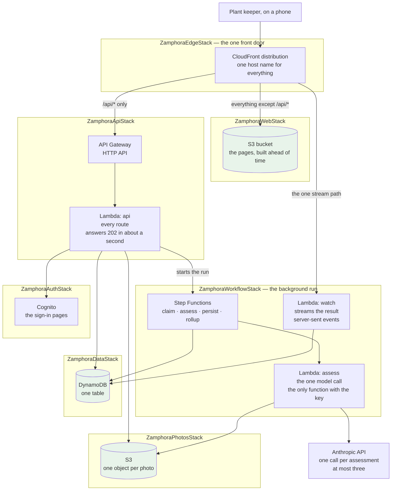

**How to read it.** It is a **flowchart**: boxes are things that exist, arrows are calls, and each
dashed outline is one CDK stack — one group of resources created and destroyed together. Start at the
top left with the phone and follow the arrows down. **The two things worth noticing are absences:**
the `web` box has **no arrow to the table or the bucket**, because the pages hold no credentials and
reach nothing; and only `assess` has an arrow to Anthropic, because it is the only function that can
read the model key.

One of the eight is **`ZamphoraOpsStack`** — the alarms, the dashboard and the notification topic.
It is not part of the product. It watches it, and it is not in the picture above for that reason.
Section 9 covers what it can see.

**Why there are three functions and not one.** The `api` function used to make the model call
itself, while the phone waited. Now the `api` function does the checks, writes the assessment row
as `queued`, starts a **Step Functions** workflow and answers `202` — "accepted" — in about a second.
Step Functions is the AWS service that runs a list of steps with retries and error handling written
as configuration. It runs a small second function, `assess`, which makes the one model call, and it
writes the result straight into the table. A third function, `watch`, holds one open connection to
the phone and pushes the result when it lands. Section 4 has the clocks and section 7 has why.

**Four things to notice, because each one is a decision and not an accident.**

- **The web pages hold no credentials and reach no database.** They are plain files, built ahead of
  time and put in a bucket. Every piece of data goes through the API. That is why the browser only
  ever has one cookie, and why a bug in the web app cannot read or write anything.
- **There is one Lambda for every route, not one per route.** One deployable unit is easier to
  reason about, one cold start is paid instead of many, and the free amount is a million requests a
  month. The two other functions are split by **job**, not by route: one makes the paid call, one
  streams the answer. The honest price is in section 7.
- **There is no VPC.** A VPC is a private network inside AWS. It would need a NAT Gateway to reach
  Anthropic, and a NAT Gateway is charged by the hour with no free offer. It would be the largest
  line in the whole product.
- **The web holds no credentials, and the model key is in exactly one function.** The `api`
  function holds the Cognito client secret and the permissions on the table and the bucket. Only
  `assess` can read the Anthropic key, and `assess` never decodes a photo. That split is what
  closed the biggest open security question of run 1 (gate 70).

**The ninth stack, and the one thing outside eu-central-1.** CloudFront publishes its measurements
only to **us-east-1**, and there is no way to change that. An alarm has to be created in the same
Region as the metric it watches, so the two alarms on the front door live in
**`ZamphoraCloudFrontAlarmsStack`**, a small stack in that Region that holds alarms and nothing else
— no function, no table, no bucket, and nothing a person's data ever passes through. The rule "one
Region for everything that serves a request" still holds.

**This is worth remembering as a shape, not as a CloudFront fact.** Some AWS services report from
one fixed Region whatever you do. When that happens, the thing that *watches* moves and the thing
that *runs* stays. An alarm written in the wrong Region does not fail — it deploys, and then never
fires. That is how this one was nearly missed.

**The host name is CloudFront's own**, like `d111111abcdef8.cloudfront.net`. A bought domain needs a
Route 53 hosted zone at **$0.50 every month**, which at this size would cost more than the compute,
the storage and the gateway put together. A hosted zone is the DNS record set for a domain name.

---

## 3. The path of one request

Everything arrives at one CloudFront distribution, on one host name. CloudFront then looks at the
path and sends the request to one of three places. That single routing rule is the whole reason the
product has no CORS configuration anywhere.

**CORS** is the set of browser rules for talking to a different host than the page came from. Every
one of those rules is a place where a wrong value either breaks the app or opens it. Because
everything here is one host, none of them exists.

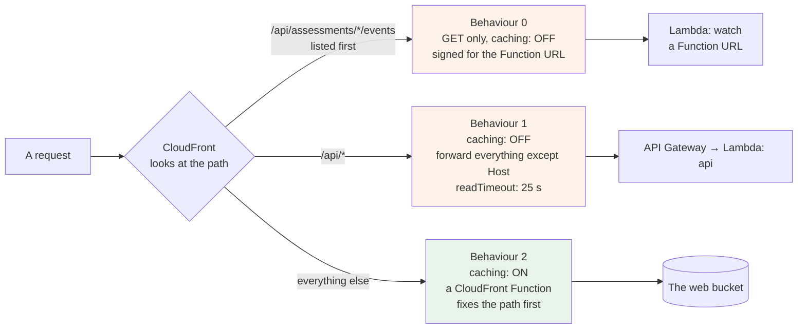

**How to read it.** This is a **routing** flowchart, and **the order of the branches is the
meaning**, not decoration. CloudFront tries each rule from the top and takes the first that matches,
so a rule written lower can be unreachable. Every arrow label is a URL pattern: that is the whole
public surface of the product in four lines.

**The stream path's position in that list is not decoration.** CloudFront tries behaviours in
order and takes the first match, so the events path has to be listed before `/api/*` or it never
matches. It goes to a **Lambda Function URL** — an HTTPS address a function can have on its own,
with no gateway — because the API Gateway HTTP API cannot stream a response, and the older REST API
that can would corrupt the photo upload. The URL only accepts requests signed by this distribution.
That signing needs a hash of the body on a `POST`, which a browser cannot supply through CloudFront,
so this path is `GET` only and every `POST` stays on the gateway.

**Three traps live in that small picture, and all three are silent.**

**Caching must be OFF for `/api/*`.** A cached `GET /api/me` would hand one person another person's
answer. Nothing would report an error. It would simply be wrong, for whoever asked second.

**The `Host` header must not be forwarded.** API Gateway refuses a request that arrives carrying
somebody else's `Host`. Forwarding the viewer's `Host` is the usual first mistake, and it produces a
403 that looks exactly like a permission problem — so you spend an afternoon in IAM. Everything else
*must* be forwarded, including cookies and the query string, or the session cookie never reaches the
API. The CDK setting that does both is `ALL_VIEWER_EXCEPT_HOST_HEADER`.

**A static export needs the path fixed before it reaches the bucket.** Next.js with
`output: 'export'` writes `/hu/index.html`. A browser asks for `/hu`. A bucket reached through
origin access control answers **403** for `/hu`, not 404 — so the error tells you nothing. A small
**CloudFront Function** adds `index.html` to any path that names a folder. It does one more job at
the same time: it sends `/` to `/hu` or `/en`, because a static site has no server to read the
browser's language.

**Where the session lives, on this path.** The browser holds one cookie, `__Host-session`, and it is
an opaque id — a string that means nothing on its own. No access token, ID token or refresh token
ever reaches the browser. The API swaps the code for tokens, reads what it needs, throws the tokens
away, and writes a session row in the table. That shape has a name: **backend for frontend**. It is
why signing out is a row delete rather than a token to revoke.

The `__Host-` prefix is a browser rule that only works if the cookie has no `Domain` attribute — so
it is sent to exactly one host and no other, not even a sibling subdomain. **One host name is what
makes that prefix usable at all.** The domain shape was never a deployment detail; it decided which
cookie protections were available.

---

## 4. Four clocks, stacked — and then taken apart

This is the most useful thing in the note for any project, not only this one. **The first half is
the shape this project started with**, kept because the lesson holds whatever the shape. The second
half says what the clocks look like now.

The product promises **30 seconds** from the tap that takes the photo to something on screen. The
slowest part is a call to a model, which takes several seconds and has no fixed length. So the
question is: when the model is slow, **who answers first — your application, or the platform?**

If the platform answers first, the person gets a **504** with a body nobody in the product wrote. It
has no explanation, no next step, and none of the two sentences every failure message here must end
with.

So the application must fail **before** the platform does. Four clocks, in this order:

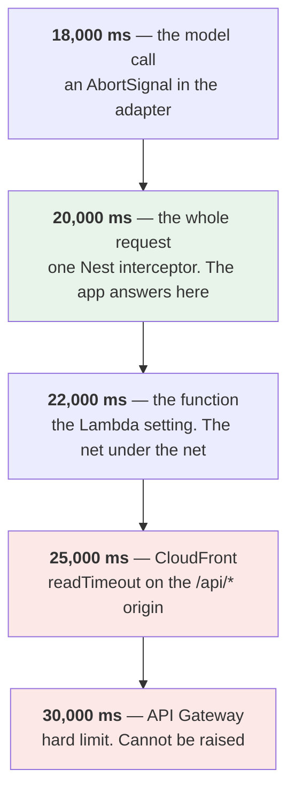

**Only the green one should ever fire.** It is the one where the application writes its own answer:
a failure message that says whether trying again will help. The two red ones must never be reached.

**Three things about this that are easy to get wrong.**

**The cold start sits outside the deadline.** The code that starts the clock cannot run until the
function has started. So the start-up time is spent before the app knows a request exists. It has to
be budgeted separately, not subtracted from the app's own number. Most people subtract it and are
wrong.

**CloudFront has its own clock, and it is easy to forget.** A CloudFront custom origin times out at
**30 seconds by default and 60 seconds at most**. This project never set it, so CloudFront — not API
Gateway — was quietly the outermost clock, and it was the last open path to a 504 the app did not
write. It is now 25 seconds, which puts it between the app and the gateway.

That 60-second ceiling is also worth remembering for later: it means "escape the 30-second limit"
is bounded by CloudFront, not only by API Gateway.

**Reserve time for the work after the answer.** The model can answer at 19,900 ms. Then the app still
has to check the answer, validate it, work out the cost and write two rows. If there is no budget
left for that, the call was **already paid for**, one of the person's ten attempts was **already
spent**, and the result is thrown away.

So there was a constant, `WRITE_BUDGET_MS = 1500`, and the model's abort fired at
`min(18,000, time left − 1,500)`. The rule behind it is still the rule: **once the model has
answered, the write always finishes, because the money is already spent.**

### What the clocks look like now

The model call left the request. The `api` function now answers `202` in about a second, and the
call runs inside a Step Functions workflow where **every step has its own clock and the platform
has none**. That is the whole gain: the two red boxes above are no longer on the paid path.

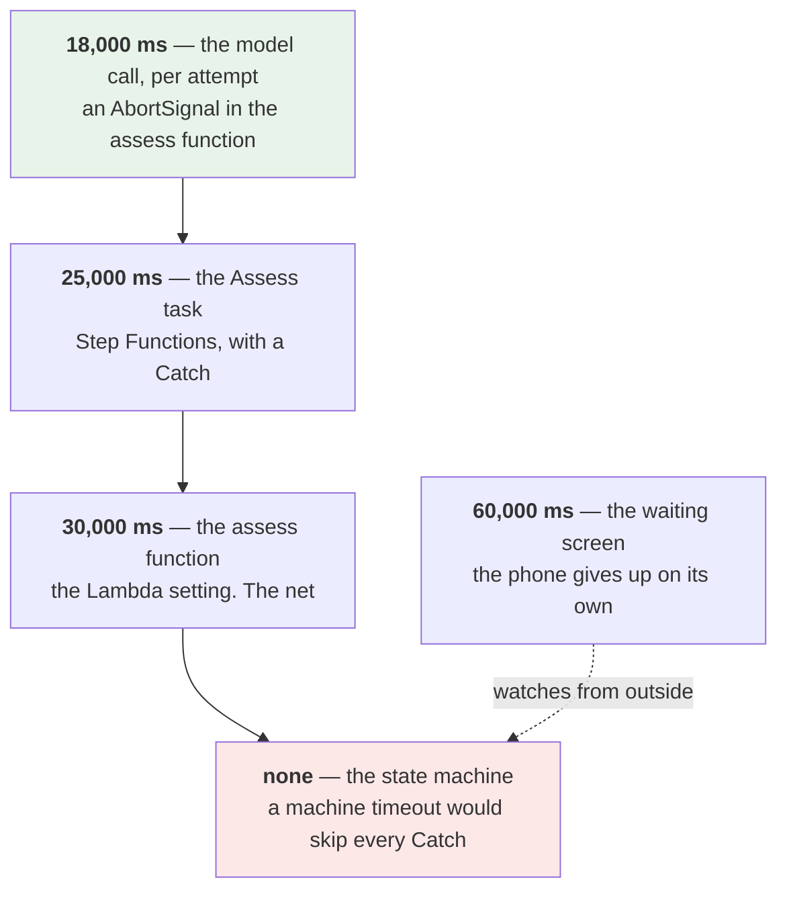

**Three things this changed, and one it did not.**

- **The 30-second promise is kept by the waiting screen.** The screen confirms the run started
  inside 30 seconds, and the result arrives on its own inside 60. Two client timers, not one.
- **A retry is allowed again, with a cap.** While the phone waited, a second call ate the same
  clock. Now the workflow retries a timeout, a 429 or a 503 at most twice, after 2 and 4 seconds.
  The cap is one line in CDK and a test reads it back. Every retry is a paid call, so the cap is a
  cost control.
- **Nothing on the machine as a whole.** A timeout on the whole state machine ends the run without
  running any error handler, so the row would stay `running` for ever. Each task has a timeout and
  a `Catch`; the machine has none. This is the trap of the new shape, the way the CloudFront clock
  was the trap of the old one.
- **The cold start still sits outside every deadline**, only now it sits in front of the `202`
  instead of in front of the answer.

---

## 5. One table, and the "wrong" choice made on purpose

All the data is in **one DynamoDB table**. DynamoDB is a key-value store: you reach an item by its
key, and there is no join and no search.

Everything a person owns has the **same partition key** — their user id. The sort key says what kind
of thing it is, using a readable prefix:

```
PK = USER#<sub>          SK = PROFILE                      the account
PK = USER#<sub>          SK = POT#<potId>                  one plant pot
PK = USER#<sub>          SK = ASSESS#<potId>#<timestamp>   one assessment
PK = USER#<sub>          SK = TASK#<due date>#<taskId>     one care task
PK = USER#<sub>          SK = QUOTA#<yyyy-mm-dd>           today's attempt count
PK = USER#<sub>          SK = IDEM#<requestId>             one claimed request
PK = SESSION#<opaque id> SK = SESSION                      one sign-in
PK = CONFIG              SK = AI_ENABLED | BREAKER | ...   settings
```

**This removes the most common access-control bug by construction, not by a check.** If the owner id
*is* the key, a query with no owner cannot be written. The repository layer takes a branded `UserId`
type, and that type can only be created where the session is read — so a query without an owner does
not compile. Nobody can forget the check, because there is no check to forget.

**And the API never answers 403.** A row belonging to somebody else answers exactly like a row that
does not exist. A 403 tells an attacker "this exists, you just cannot have it". A 404 tells them
nothing.

### The choice that AWS itself recommends against

DynamoDB has two ways to pay: **on demand** (you pay per request) and **provisioned** (you reserve a
fixed rate and pay for holding it). AWS's own documentation says on demand is *"the default and
recommended throughput option for most DynamoDB workloads"*.

**This project uses provisioned, fixed, with auto scaling switched off.** Two reasons, and the
second one is the interesting one.

**First: the free amount only covers provisioned.** An on-demand table spends credit on its first
read. That alone settles it here.

**Second, and this is the part worth carrying to other projects: it fails in the better direction.**

| | A runaway loop hits the table |
| --- | --- |
| **Provisioned, fixed** | DynamoDB **refuses** the extra requests. Things break loudly. An alarm fires. Somebody notices |
| **On demand** | DynamoDB **serves** every one of them, perfectly, and eats the credit that keeps the account open |

Auto scaling is off for the same reason. It would quietly raise the numbers past the free line
without asking anybody.

**When you write down a choice like this, write down that it is the worse engineering choice and
why.** ADR-0002 does exactly that — it quotes AWS recommending the opposite, and then explains why
the constraint here outranks the recommendation. On a paid account, on demand would be the answer.

### Changing the shape of an item

DynamoDB has no schema and no migration tool. And an assessment row has **no clock** — the text is
kept as long as the pot exists. So an item written today can still be read in three years.

Every item carries **`v`**, a whole number, `1` today. Three rules go with it:

1. **A reader ignores a field it does not know.** So adding a field is always safe.
2. **Never rename a field and never change what one means.** Write a new field, stop writing the old
   one, leave the old one alone.
3. **Raise `v` only when a reader must behave differently**, and keep the code that reads the older
   version until nothing on disk uses it.

Three sentences now. A hand-written scan-and-rewrite later.

---

## 6. The photo path

Photos are the only large thing this product stores, and the only thing in it that is clearly
personal data. One object per photo, in one private S3 bucket, at
`photos/<userId>/<potId>/<timestamp>.jpg`.

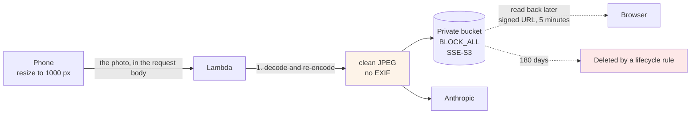

**How to read it.** Follow one photo from left to right: it arrives at the API, is re-encoded, is
written to the bucket, and is read back later through a signed link. **The arrow that is not there is
the point:** nothing goes from the browser to the bucket directly, and nothing reads the bucket
through a cache.

**Four decisions in that picture.**

**The photo goes through the API, not straight from the browser to S3.** The usual pattern is a
*presigned PUT* — the server hands the browser a short-lived link and the browser uploads directly.
It was rejected here, and the reason is worth remembering: **a presigned PUT validates nothing.**
Whatever bytes the browser sends land in the bucket. Nothing checks the size, the type or the
contents. Going through the function costs a little time and buys every check.

**The API re-encodes the photo before doing anything else with it.** It decodes the image and writes
a fresh JPEG. That single step does three jobs:

- **It strips EXIF.** A phone photo carries the GPS position where it was taken. For a plant on a
  windowsill, that is the person's home. Without this step it would sit in the bucket for 180 days
  *and* be sent to a third party.
- **It makes the type check real.** Checking the declared type is not a check — an extension is not
  evidence. A file that will not decode is not an image.
- **It fixes rotation.** Orientation is stored in the EXIF that is being removed, so it has to be
  applied first or the photo arrives sideways.

**The bucket is never a CloudFront origin.** Photos are read back through a **signed URL** — a link
that carries its own permission and lasts at most five minutes. A cache in front of it would make a
copy, and a copy is something the delete-my-photo promise would then have to find and delete too.

**Deletion at 180 days is a lifecycle rule in S3, not application code.** A rule inside the storage
service keeps working when the application is broken, stopped, or has a bug in its delete path. This
is the general shape: *if a promise must survive the application, do not put it in the
application.*

**One number to keep in mind.** S3 lifecycle expiry is late by up to a day, and DynamoDB's
time-to-live deletion is late by *"typically a few days"*. So no rule may depend on either firing on
time. The retention audit checks at day **182**, not 180. And session expiry is checked **in code**,
never by trusting that the row is gone.

---

## 7. The function itself, and the build that nearly did not work

One Lambda function, `api`, holds the entire Nest.js API. Two more functions are
built from the same codebase, each with one job.

| Setting | `api` | `assess` | `watch` | Why |
| --- | --- | --- | --- | --- |
| Runtime | `nodejs24.x` | same | same | Patched until 2028-04-30. Node 22 stops a year earlier |
| Architecture | `ARM_64` | same | same | Cheaper per second of compute |
| Memory | 1024 MB | 1024 MB | 512 MB | Lambda gives CPU in proportion to memory. Starting values, to be measured |
| Timeout | 22 seconds | 30 seconds | 60 seconds | Each is the net under its own smaller clock (section 4) |
| Reserved concurrency | **10** in prod, 2 in preview | **1** | 5 | A cost guard, not a performance setting |
| Holds the model key | no | **yes** | no | The key is in the function with no route |

**Reserved concurrency is the one worth understanding.** It is the largest number of copies of the
function that may run at the same time. Set `assess` to 1 and a runaway loop cannot start a
thousand copies that each wait 18 seconds on a **paid** model call. One at a time is all one user
needs, and it also makes the circuit breaker's test call exactly one call.

### The pattern has a name: Lambdalith

One function holding a whole framework is called a **Lambdalith**. It is a recognised pattern, not a
mistake. The alternative — one function per route — was rejected here because it multiplies cold
starts across a flow that already has a 30-second budget, and gives one developer many small things
to look at instead of one.

**It also scales, and this is worth knowing before you worry about it.** Lambda answers more
requests by starting more copies of the function. AWS states the limit **per function**, not per
account: *"for each function, your concurrency scaling rate is 1,000 execution environment
instances every 10 seconds"*
([Lambda scaling behavior](https://docs.aws.amazon.com/lambda/latest/dg/scaling-behavior.html),
checked 2026-09-01). The account starts at **1,000 copies at the same time**, and that number is
raised by asking AWS, at no cost
([Understanding Lambda function scaling](https://docs.aws.amazon.com/lambda/latest/dg/lambda-concurrency.html),
checked 2026-09-01).

So one function holding twelve routes scales exactly as well as twelve small functions would.
Lambda adds copies. It does not care how many routes live inside one copy.

**The table gives up first, and it gives up long before the function does.** 20 read units is about
20 reads a second (section 5). The default Lambda limit already allows roughly 125 assessment
requests a second. **DynamoDB throttles at about one sixth of a limit AWS has not even raised yet.**
That is not a fault. It is the free-plan choice from section 5, and ADR-0002 records that
provisioned can be switched to on demand in minutes, with no downtime and no data touched.

**So "will the Lambdalith scale" is the wrong thing to watch.** In order, the things that break
first are: the $200 credit, the Anthropic balance, the table's 20 units, the account's 1,000 copies,
and only then anything about the shape of the function.

**Where it really does hurt, and it needs eleven users, not ten thousand.** Every route shares one
function and one reserved concurrency number. Reserved concurrency is **10**. An assessment holds
its copy for six to eight seconds. So ten assessments at the same time fill all ten slots, and for
those seconds every other route — the plant list, the health check — is refused with a 429. The
fast routes queue behind the slow one. This is called the **noisy neighbour** problem, and it is the
first real reason to split, well before scale is.

**The honest price is IAM.** One function means **one execution role**. `GET /api/health` runs with
the same DynamoDB and S3 permissions as the route that spends money. One function per route would
let each carry only what it needs, which is what least privilege asks for.

That is given up on purpose. **Two different problems are being talked about here, and it is worth
keeping them apart.** The key design in section 5 answers the first one: a route that forgot to
check ownership still cannot read another person's data, because the owner id comes from the session
and the key builder will not compile without it. It does **not** answer the second one. If code
inside the function is ever made to run something it should not — a poisoned dependency, a bad image
fed to the decoder — that code holds the whole role, over every row and every object. At that point
there is no "route" any more. The trade is accepted because this is one developer, one function and
plant photos, not because the key design covers it. **If the API is ever split, split the role with
it.**

**The first split to make, when the time comes, is the assessment route.** It is the slow one, the
paid one, and the one that needs the most memory. Moving it to its own function fixes the noisy
neighbour, stops every health check paying for image-sized memory, and gives the paid route its own
smaller role — three problems with one change. Splitting the small read routes buys almost nothing.

### The build trap that fails silently

This one cost nothing to fix and would have cost an afternoon to find.

Nest.js works out what to inject into a constructor by reading **decorator metadata** — extra
information TypeScript writes into the compiled output when `emitDecoratorMetadata` is on.

**esbuild does not support `emitDecoratorMetadata`, and it never will.** CDK's `NodejsFunction`
bundles with esbuild. So pointing it at the TypeScript source produces a function that builds
cleanly, deploys cleanly, and then throws `Nest can't resolve dependencies` on its very first
request.

```
Wrong:  NodejsFunction  ->  apps/api/src/main.ts     (esbuild only)
Right:  nest build      ->  apps/api/dist/main.js  ->  NodejsFunction
```

`nest build` is `tsc`, which writes the metadata correctly. esbuild then bundles the compiled
JavaScript, which needs no decorator support at all.

**The general lesson:** when a tool works by reading extra information the compiler emits, check
that every build path in the project emits it. This project already knew the failure sentence — it
had switched the same setting on for the test runner — and still missed it on the deploy path,
because those are two different builds and nobody compared them.

### The second build trap, and it is the same shape

**This one was found by reading the plan, not by a failed deploy**, which is the only reason it is
not a story about an afternoon lost. The first trap above is about information the compiler has to
emit. This one is about code the bundler cannot touch at all.

`sharp` is the library that decodes and re-encodes the photo. It is a **native module**: most of it
is JavaScript, but the real work happens in a compiled binary, a `.node` file, that the JavaScript
loads at run time. **A bundler cannot inline a binary.** esbuild will happily produce a bundle that
mentions `sharp` and contains none of it, and the function then deploys cleanly and throws
`Cannot find module 'sharp'` on the first photo somebody sends. That is the same failure shape as
the decorator trap: green build, green deploy, broken on first real use.

There are three normal ways out and this project takes the third:

- **`bundling.nodeModules: ['sharp']`** tells CDK to install the module beside the bundle instead of
  inlining it. It is the documented answer and it is **banned here** (ADR-0012), because CDK writes
  an empty `pnpm-workspace.yaml` into its build folder, which erases the settings pnpm 11 needs.
- **A Lambda layer** is a separate zip of dependencies that several functions can share. It works.
  It was rejected because it is a second resource with its own version, and with one developer a
  second version is a second thing that drifts.
- **Mark it external and copy it in after the bundle.** `externalModules: ['sharp']` keeps esbuild
  away from it, and a `commandHooks.afterBundling` step copies the real folder into the asset. The
  code is in `docs/800-infra/01-iac-plan.md` §4.4.

**The half that is easy to miss is `@img`.** Since version 0.33, `sharp` does not ship its binaries
inside its own folder. It declares a set of **optional dependencies** — `@img/sharp-linux-arm64`,
`@img/sharp-darwin-arm64` and so on — and your package manager installs only the one that matches
the machine. So copying `node_modules/sharp` on its own gives you a loader with nothing to load.
`node_modules/@img` has to travel with it, and it has to be the **Linux arm64** one, which is why
the build runs on `ubuntu-24.04-arm` and not on the default runner.

**The general lesson, and it is the same sentence as the first trap:** when something in the build
depends on a step other than compiling — emitted metadata, a native binary, a platform-specific
package — check every build path separately. A bundler's job is to read JavaScript. Anything that is
not JavaScript is your problem, and it will not tell you.

### If money were no object: the same product as a container

Everything above is shaped by one rule: the account closes instead of billing, so nothing may run while nobody is using the app. This part answers a different question.
**If cost were not a constraint at all, what is the better system?** It is written down because the
answer is not "the same thing, bigger". It is a different shape, and knowing the shape tells you
what you are giving up today and what would have to change to get it.

**The service is Amazon ECS on Fargate.** ECS is the service that runs containers. Fargate is the
mode where AWS runs the machine for you, so there is no server to patch. Your Nest.js app becomes a
normal long-running HTTP server in a container, exactly like it is on your laptop.

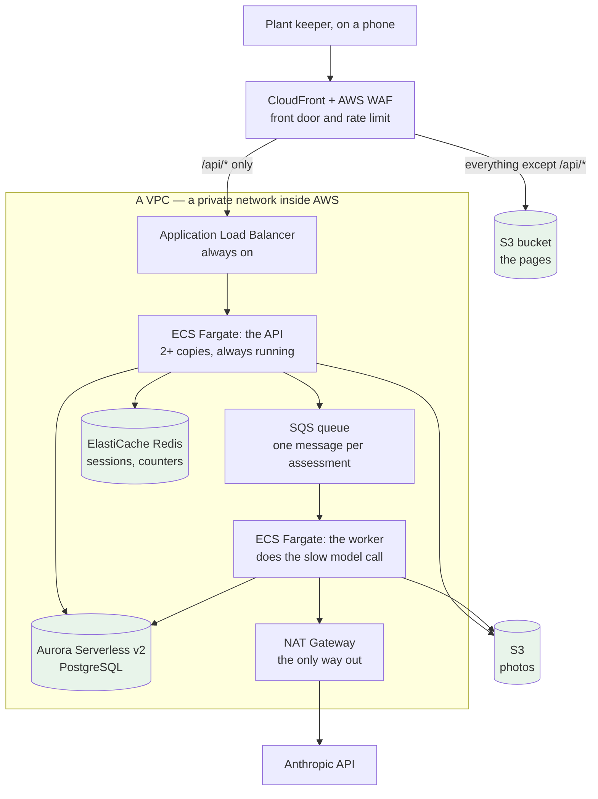

**The one change that matters most is the queue, and it is not about scale.** Originally the
phone waited while the model thought. That is why section 4 had four stacked clocks and why the
whole product was bounded by a 30-second ceiling it did not control. In the container version,
`POST /api/assessments` writes a message to **SQS** — a queue, a list of jobs waiting to be picked
up — and answers `202` straight away with an id. A separate worker picks the job up and does the
slow call. The phone is told over an open connection.

**All four clocks disappear.** There is no 30-second gateway cut-off, no 20-second app deadline, no
CloudFront read timeout to sit under. The model may take two minutes if it needs to. A retry becomes
safe again, because a retry no longer eats a deadline. **This is exactly the gain the project took,
without the container**: Step Functions plays the part of the queue and the worker, and it is free at
this size. The subsection below says how.

**What each piece replaces, and what it buys.**

| Today | If money were no object | What that buys |
| --- | --- | --- |
| One Lambda function | ECS Fargate, 2+ copies always running | No cold start ever. One long-lived process, so a database connection pool works normally |
| API Gateway HTTP API | Application Load Balancer | No 30-second ceiling |
| The phone waits for the model | SQS + a worker service | The slow work leaves the request. Retries become safe |
| DynamoDB, one table, owner-keyed | Aurora Serverless v2 PostgreSQL | Joins, reports and ad-hoc questions. Section 5's "no report over a large set" stops being a limit |
| A value in the function's memory | ElastiCache Redis | A cache shared by every copy, so sessions and counters agree across them |
| No VPC | A VPC with a NAT Gateway | The database and the cache are unreachable from the internet |
| Reserved concurrency 10, and an alarm | AWS WAF rate rules | A flood is turned away at the edge, not counted after the fact |
| One log line per request | X-Ray or OpenTelemetry tracing | Now there are three hops — API, queue, worker — so a trace finally draws something worth looking at |

**What does not change, and this is the payoff of the borders already in the code.** The Zod
contracts, every screen, the domain rules, and the `LlmProvider` port all stay exactly as they are.
Only two things get rewritten: the repository layer, because DynamoDB keys become SQL, and the
handler, because a Lambda event becomes an HTTP request. ADR-0002 already predicted the first one
and accepted it.

**Now the number, because it is the whole reason this is not the design.** Rough monthly cost with
nobody at all using the app, and these are **order-of-magnitude estimates, not checked against AWS's
own pages** — the shape of the number is the point, not the number:

| Piece | Roughly, per month, idle |
| --- | --- |
| Application Load Balancer | ~$18 |
| NAT Gateway | ~$32, plus data |
| Fargate, API and worker | ~$30 |
| Aurora Serverless v2, at its smallest | ~$45 |
| ElastiCache, smallest node | ~$12 |
| AWS WAF | ~$6 |
| **Total, before a single request** | **~$150** |

Today the same product costs about **two cents** a month, and most of that is API Gateway. So the
container version is roughly **7,000 times more expensive while nobody is using it**. On an account
with $200 that closes when the credit runs out, it would take the account down in about six weeks of
doing nothing. That is why `00-options.md` scored this shape at 12 against 16 and it lost.

**But it wins later, and there is a real crossing point.** Lambda charges per request; a container
charges per hour whether or not anyone calls it. Below a certain steady traffic level Lambda is
cheaper, and above it the container is cheaper **and** faster, because there is no cold start and
the connection pool stays warm. The move is right when two things are both true: the account is off
the free plan, and traffic is steady rather than a few requests a day.

**One cheap thing makes that move easier later, and it is worth knowing the name.** The
**AWS Lambda Web Adapter** is a small extension you copy into the function image. It turns the
Lambda event into a real HTTP request and passes it to your app listening on a port — so the app is
a plain HTTP server with no Lambda-shaped code in it, and the **same container image also runs on
Fargate unchanged**:

```
COPY --from=public.ecr.aws/awsguru/aws-lambda-adapter:0.9.1 /lambda-adapter /opt/extensions/lambda-adapter
ENV PORT=3000
```

**It is not used here, and that is on purpose.** A container image cold-starts more slowly than a
zip bundle, and it needs ECR, whose private-repository free offer is a 12-month trial and so worth
nothing on this plan (checked 2026-09-17). It is written down as the escape hatch, not as a plan.
The point is that "we picked wrong" would become "we change where the image runs", which is a much
smaller sentence.

### The free asynchronous shape, and how it was chosen

The container shape above is the answer when money is no object. There is a different question, and it has a different answer: **what does the same product look like if the
phone stops waiting, and the account stays free?** Two shapes answered it, drawn and scored in
`docs/400-architecture/00-options.md` §11, with the long reasoning in `08-async-options.md`. **The
owner chose Option E the same day** (gate 72, ADR-0014 to ADR-0016), and section 2 now draws it.

- **Option E, chosen.** It keeps everything else and moves only the model call: the API answers
  `202` at once, an **AWS Step Functions** workflow runs the call in its own small function with its
  own role, and the phone holds one open connection — server-sent events, the same mechanism the
  model provider uses to stream — until the result is pushed to it. The four stacked clocks became
  one clock per step, and the "no retry" rule became a retry with a cap written in one place. Step
  Functions gives 4,000 free workflow steps a month, forever; this product uses about 200.
- **Option F, not taken.** It went further: the phone uploads straight to S3 with a short-lived
  permission for one exact object, S3 announcing the new object starts the workflow, and every
  write to the table becomes an event that other small functions react to. It lost because nothing
  the project plans to build needs it. Every later feature — the 12-month sweep, reminders, open
  sign-up — is served by E plus two timer rules, and E keeps every upload check on the API where
  ADR-0007 put it.
- **On the four constraints the project scores on, the old design was still ahead by one point.**
  Only a fifth constraint, what a shape gives later runs, put E in front. That is why the choice was
  the owner's and not a role's, and why it is recorded as a gate.

Two lessons worth carrying from that file into any project. **An asynchronous shape moves the
runaway risk from "a loop in my code" to "a retry a service does on its own".** Lambda retries an
async call twice by default, EventBridge and its Scheduler retry a target for 24 hours, a stream
consumer retries a bad batch for a day, and Step Functions bills every retry as a step. Each has a
setting, and §8 of that file lists all thirteen. And **a review by a session with no context found
three blockers in the first draft** — a workflow that started itself from its own output, an upload
permission that let one attempt become many, and a retry that could never fire. The file says so
at the top, on purpose.

---

## 8. What stops it costing money

On an account that closes instead of billing, cost is a correctness property. So the defences are
layered, and each layer catches something the others cannot.

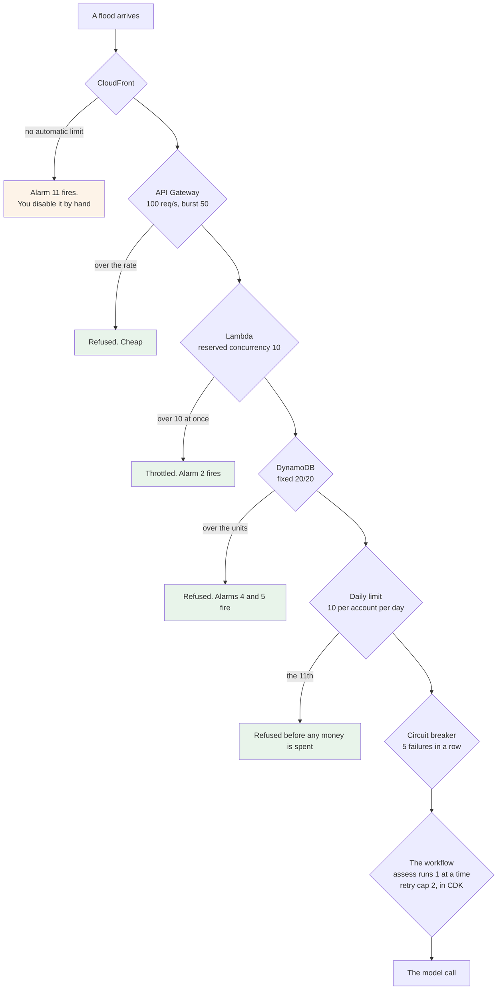

**Read that diagram from the bottom up, because that is the order the layers were built in.** The
daily limit and the circuit breaker protect the **Anthropic** balance — the $5 that buys the
feature. The throttle, the concurrency limit and the fixed capacity protect the **AWS** balance —
the credit that keeps the account open. Those are two different balances, and for a while only the
first one had any defence.

**The gateway throttle is the layer people forget, and it is the biggest hole when it is missing.**
Left unset, an API Gateway stage inherits the account default of **10,000 requests a second**. API
Gateway has no free offer, so it bills from request one: a flood at that rate is roughly **$36 an
hour**. And authentication happens *inside* the function, so a stranger who is not signed in still
costs a gateway request and an invocation.

Reserved concurrency does **not** help here. It caps the function's work. It does not cap billed
gateway requests. Those are different meters.

**The background run added one layer and three traps, all with a setting.** The layer: `assess`
runs one copy at a time and the workflow retries at most twice, so the most one photo can cost is
three calls. The traps, each a default that is wrong on this account: the CDK task adds a hidden
six-attempt retry unless `retryOnServiceExceptions` is off; an EventBridge rule retries a broken
target for 24 hours unless it is told 2 attempts and 5 minutes; and a queue that a function reads
costs requests even when it is empty, so the one queue here is a dead-letter queue nobody reads.
`docs/800-infra/02-cost-guardrails.md` §6 has the full list.

**One layer has no automatic defence, and it is written down as such.** A flood that stops at the
CloudFront edge is billed once the 10 million free requests are used, and nothing on this account
can stop it automatically. The honest answer is a manual one: an alarm fires on request count, and
you disable the distribution by hand. **An accepted risk written down is worth more than a defence
that does not exist.**

**Two things that spend money quietly, and both are switched off.**

- **Detailed API Gateway metrics** are charged as custom metrics. The basic ones are free.
- **CloudWatch Logs ingestion** is a classic free-tier killer. Log retention is 30 days in `prod`
  and 1 day in `preview`.

There is also a small trap in how measurements are counted. Putting the failure code on a metric
**dimension** — a label that splits a measurement into separate series — turns 6 custom metrics into
36, each billed. The failure code is read with a Logs Insights query instead, which is free.

**And there are no backups.** Point-in-time recovery is charged per gigabyte with no free amount.
The replacement is a calendar entry: export the table and the photo bucket by hand before the free
plan ends. That is written down plainly rather than implying a protection that is not there.

---

## 9. What you can see when it breaks — observability

**The topic has a name, and it is worth knowing as a name.** **Observability** is a standard backend
subject and close to a non-functional requirement: **can you tell what the running system is doing,
without attaching a debugger to it?** You cannot debug a Lambda function that ran once at 3 a.m. for
somebody else and no longer exists. Observability is what replaces that.

**It is three things, and all three are expected in an answer:**

| Part | The question it answers | The AWS tool | Where it is here |
| --- | --- | --- | --- |
| **Logs** | **What happened in this one request?** Which route, which outcome, that it ended in a `400` or a `409`, and why | **CloudWatch Logs** | One structured line per request, with a failure code |
| **Metrics** | **How many, how often, how fast?** How many requests, how many succeeded, how long the slowest 5% took | **CloudWatch Metrics** | AWS's own, plus six custom ones |
| **Traces** | **Which services did this one request pass through, and where did the time go?** | **AWS X-Ray** | `api` → Step Functions → `assess` → Anthropic |

**The difference that decides where something belongs.** A **log line is per event and is billed per
gigabyte**. A **metric is a number aggregated over time and is cheap to keep for a year**. So "how
many calls failed today" has to be a metric — answering it by reading a year of log lines is slow and
expensive. Most of the traps later in this section are that distinction being got wrong.

**Why traces only started to matter once the work was split.** Inside one program, a stack trace
shows the whole path. Once a request crosses four pieces — `api`, the workflow, `assess`, the provider — **no
single machine has seen the whole thing**. A trace gives the request an id that travels with it, and
each piece reports its own part against that id. It is the only one of the three that answers *which
step was slow*. Before the split there was one function, so there was nothing to trace.

`docs/learn/backend-concepts.md` 55 has the same three parts away from AWS, with the alternatives —
OpenTelemetry, Prometheus, Grafana — and 56 covers alerting.

### What is actually watched here

Twelve alarms and one dashboard, in `ZamphoraOpsStack`. Most are the ordinary ones any system has.
**Four are the ones this project actually needs**, and they are the ones about a balance:

| Alarm | Fires when | What it means |
| --- | --- | --- |
| **Runaway model calls** | more than 30 in an hour | Expected use is about 30 a **month**. Thirty in an hour is a loop or an attack |
| **Runaway spend** | more than $0.10 in an hour | At $5 of balance, a dollar an hour empties it in an evening |
| **The breaker opened** | 5 model calls failed in a row | The product stopped calling the model on its own |
| **Front door flood** | more than 50,000 CloudFront requests in an hour | The only warning of a flood that never reaches the throttled gateway |

**The count is past the free allowance, and it drifted twice.** CloudWatch gives **ten** alarm
metrics free. An eleventh was added to close the flood hole, and three files kept saying "the ten
alarms" afterwards. A twelfth arrived with the background run, and the heading still said eleven
until somebody read it against the table. So **two alarms are charged** — cents a month, far below
everything else in section 8, but the documents claimed $0 and claimed the wrong number, twice.

**The lesson is not about alarms, and the fact that it happened twice is the proof.** A number that
appears in a heading, in a sentence and in two other files is a number that will disagree with itself
the first time it changes. When a count is also a limit, write it in one place and point at it from
the others.

**Two things about measurements that are easy to get wrong, and both were found here.**

**There is no `InitDuration` CloudWatch metric.** Cold start time is written into the log line at the
end of every cold invocation, not published as a measurement. So it is read with a Logs Insights
query. A plan that says "read the `InitDuration` metric" describes something that does not exist.

**CloudFront measurements only exist in `us-east-1`.** An alarm on them, created in another Region,
deploys with no error and **never fires**. A graph of them draws an empty box. This is the worst kind
of monitoring bug: everything looks configured, and nothing is watching.

**One number that was wrong for a good reason, and is worth remembering.** The cold-start budget was
800 ms, taken from published figures. Those figures measure a **plain Node.js handler**. This is a
bundled Nest.js application with six libraries loaded before the handler runs, and a published
measurement of that shape is about **905 ms when nearly empty**. The budget is now 2,000 ms.

The lesson is not "800 was too low". It is: **check that a borrowed number describes the same kind
of thing you are building.**

---

## 10. Two switches that look the same and are not

Both stop the AI feature. They are completely separate, and each answers a different problem.

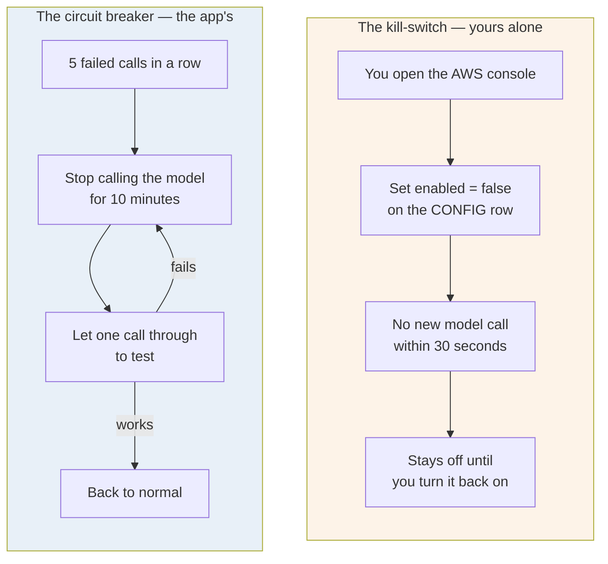

**The breaker never writes the kill-switch row.** It has its own row. That is what lets both things
be true at once:

- The kill-switch is **yours**, and it stays off until **you** turn it on. A machine never touches
  it.
- A run of failures at three in the morning stops itself, and starts again on its own when the
  problem goes away.

Without the separation, the app would have to write your switch, and the decision record that says
"only a person flips this" would have had to be reversed. **The separation kept the record true and
still got the protection.** That is usually the better shape when a rule and a feature seem to
conflict: find the version where both survive.

**One placement detail that matters to the person using the app.** The breaker is checked *before*
the daily attempt is counted. So an open breaker does not spend one of their ten tries on a call
that was never going to happen.

**One more guard on the same path, for a different problem.** The photo upload is allowed up to four
seconds on a weak signal — and a weak signal is exactly when a person taps twice. So the browser
makes one id per photo, and the API claims it with a conditional write before anything else happens.
A second tap finds the id already claimed and gets the first result back. Without it, one tap could
be two paid calls and two of the person's ten attempts, for one result on screen.

---

# Part B — the pipeline

## 11. How the build signs in to AWS with no password

This is the part of the pipeline worth understanding properly. Everything else in Part B is detail.

### The way it is normally done, and why it is dangerous

You create a user in AWS, get an **access key** and a **secret key**, and paste both into GitHub
secrets. Your build then signs in with them.

Those two strings are a **permanent password**. They work from anywhere, forever, until somebody
notices and changes them. If one ever appears in a log line, in a screenshot, or inside a
third-party tool your build ran, the account is gone. This is the most common way an AWS account
gets taken over.

**There is no access key anywhere in this project.**

### What happens instead

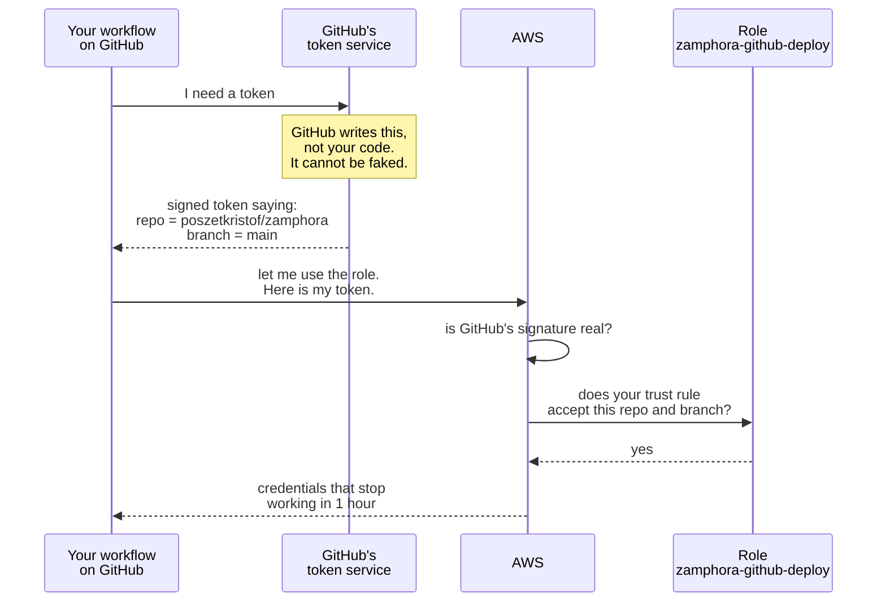

**Read step 2 again, because it is the whole idea.** The token is written and signed by **GitHub**,
not by your workflow. Your workflow cannot write its own token, and cannot change what the token
says. It only asks for one and passes it along.

**So there is nothing to steal.** Somebody can copy your entire public repository, read every file,
and still reach nothing — because they cannot make GitHub sign a statement saying they are your
repository on your branch.

### The one line that makes it safe

The role's trust rule names the **branch**, not only the repository:

```
repo:poszetkristof/zamphora:ref:refs/heads/main     <- correct
repo:poszetkristof/zamphora:*                       <- wrong, and it looks fine
```

The second one accepts **any branch** in the repository. Anyone whose pull request you approve
creates a branch. That single character is the difference between safe and not.

### Three roles, not one

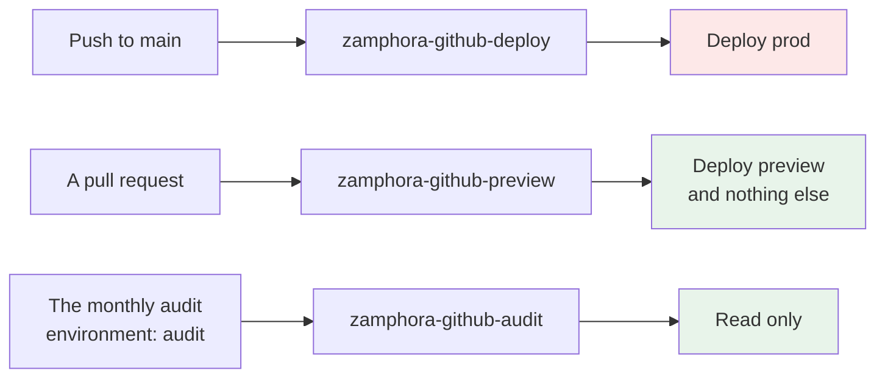

If the preview role were also the deploy role, then any pull request could change production. Two
roles cost nothing and remove that entirely.

**The third role exists because of a subtle trap.** The monthly retention audit runs on a schedule.
A scheduled workflow runs on the **default branch** — so its token says `ref:refs/heads/main`, which
matches the **deploy** role. An unattended job, running every month with nobody watching, would have
held full deploy rights on production.

The fix is to make the token say something else. The workflow declares `environment: audit`, and
GitHub then puts `environment:audit` in the token instead of the branch. The deploy role no longer
matches it, and the audit role matches nothing else.

**The general lesson: when you write "this job uses a read-only role", check that such a role
exists.** A sentence in a document is not a trust policy.

---

## 12. A public repository, and the two walls

The repository is **public**, on purpose, so anyone can read it. That means anyone can also **fork
it and open a pull request**. There is no setting to stop that, and branch protection does not do
it — branch protection stops a **merge**, never an **open**.

A pull request contains somebody else's code, and pull requests run your build. So the question is
what that code can reach.

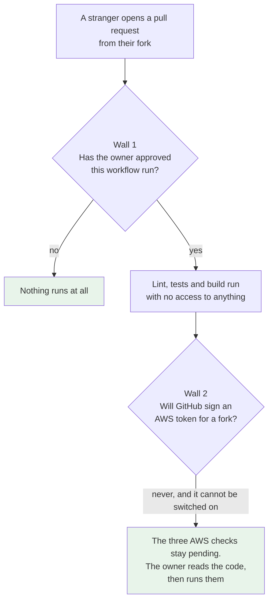

**Wall 2 is GitHub's, not ours.** GitHub refuses to hand secrets or an AWS token to a workflow
started by a fork's pull request. It is built in and there is no switch for it.

**Wall 1 is ours.** The repository is set to *"Require approval for all external contributors"*, so
nothing runs at all until the owner presses approve — every time, not only the first time.

### The one way to break it

Someone sees three checks stuck on "pending", searches the internet, and finds
**`pull_request_target`**. That trigger runs a pull request **with your secrets**. A stranger's code
plus your AWS access, in the same run.

`04-ci-cd.md` §4 says do not use it. That is why the rule is written down.

### Why every action is pinned to an exact commit

```yaml
uses: actions/checkout@v7        # a label. Its owner can move it to different code, any time.
uses: actions/checkout@8f4b7f8…  # an exact commit. It can never change.
```

`v7` is a label, not a version of code. The person who owns the action can point that label at
something else whenever they like, and your next build runs the new code without you doing
anything.

**This is the attack that OIDC does not stop**, because by then the attacker's code is already
running inside your workflow, next to the one-hour AWS credentials. Pinning to a commit removes it.

Updates still arrive: **Dependabot** raises a pull request when a new version exists. You approve
it instead of receiving it in silence.

---

## 13. What has to be green before a merge

There are **two different kinds of rule**, and confusing them is the trap.

- A **required status check** watches one job in a workflow. It can only name a job.
- A **code scanning rule** watches what CodeQL found. It is not a job, so a required status check
  can never carry it.

That is why this repository needs both kinds. One would not cover everything.

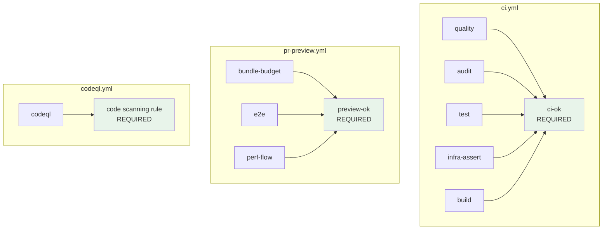

**One aggregate job per workflow, instead of naming every job in the settings.** If branch
protection lists eleven job names, then a job you add next month is a job nobody enforces, until
you remember to go and edit the settings. An aggregate covers everything it needs. Adding a job to
its `needs:` list is a code change, reviewed like any other change.

**`if: always()` on the aggregate, and this is the sharp part.** In GitHub, a **skipped** check
counts as a **pass**. Without `always()`, a failed `build` would make `ci-ok` skip, the skip would
be read as green, and the failed build would merge. So `ci-ok` runs every time and then checks each
job's result itself.

**One test that could never fail, and the fix.** The performance job replaces the model with a stub
that sleeps for the budgeted 8,000 ms — and 8,000 ms is the weakest guess in the whole design, with
no source behind it. So the job could never fail for the reason the architecture itself names as its
biggest risk. It now runs **twice**: once at 8,000 ms and once at **18,000 ms**, the model's own
abort point. Both must confirm the run inside 30 seconds and show the result inside 60. A third run
makes the stub fail twice and then answer, which is the only way to prove the retry cap is real.

**A test that can only pass is not a test.** Give it the value that would break the design and see
whether it still holds.

**Two things to remember, because both cost something real:**

- **A pull request from a fork can never satisfy `preview-ok`**, because GitHub will not sign an AWS
  token for a fork. So a stranger's pull request can never merge on its own. That was accepted: the
  owner merges their own branches.
- **A required check that never reports blocks every merge, forever.** So `preview-ok` goes into
  branch protection **in the same change that adds the workflow**, never before it.

---

# Part C

## 14. Lookup: what was chosen, and what lost

Come back to this table. Do not try to remember it.

| Question | Chosen | What lost, and why |
| --- | --- | --- |
| Compute | **One Lambda holding every route, plus two split by job: `assess` and `watch`** | One function per route: many cold starts, many small things to look at. A container: charged by the hour, so it spends credit every night nobody uses the app |
| Database | **One DynamoDB table, provisioned, fixed** | On demand: AWS recommends it, and the free amount does not cover it. It also serves a runaway loop instead of refusing it |
| Preview database | **Split the units**: prod 20/20, preview 5/5 | Two full tables at 25/25 — rejected on a price nobody had checked. No preview at all — three tests would have nothing to run against |
| Photo upload | **Through the API** | Presigned PUT straight to S3: validates nothing, so size, type and contents all go unchecked |
| Photo handling | **Decode and re-encode every photo** | Reading the header only: cannot strip EXIF, so the person's home GPS reaches storage and the model |
| Photo deletion | **An S3 lifecycle rule** | Application code on a schedule: it stops working exactly when the application is broken |
| A cache in front of the table | **None** | ElastiCache or DAX: saves 24 ms out of 8,000, is charged by the hour, and drags the function into a VPC that then needs a NAT Gateway |
| The API build | **`nest build`, then esbuild bundles the output** | esbuild alone: it cannot emit decorator metadata, so the function deploys and fails on the first request |
| Gateway rate | **100 a second, burst 50** | Unset: inherits 10,000 a second, about $36 an hour if somebody floods it |
| Region | **eu-central-1**, Frankfurt | Ireland: also EU, further away. Virginia: the data would leave the EU |
| CloudFront alarms | **A small stack in us-east-1** | Keeping them in eu-central-1: they deploy with no error and never fire |
| Host name | **CloudFront's free name** | A bought domain: $0.50 a month forever, the largest line item in the product |
| Sign-in | **Cognito, tokens kept in the API** | Tokens in the browser: a browser cannot keep a secret, so any script bug becomes token theft |
| Cognito tier | **Essentials** | Lite: it has only the older sign-in pages and no branding, and both tiers are free at this size |
| Backup | **None in run 1** | Point-in-time recovery is charged per gigabyte. Replaced by a calendar entry: export by hand before the plan ends |
| Repository | **Public** | Private: CodeQL is not free and Actions minutes are capped |
| Deploy | **A person presses the button** | Deploy on merge: normal on a paid plan, and here a bad merge can close the account |
| Sign-up | **Closed. The owner makes accounts** | Open sign-up: the daily limit is per account, so ten accounts is ten times the spend on one $5 balance |
| Breaker | **Self-healing, its own row** | Flipping the real kill-switch: it reverses ADR-0009 for no extra safety |
| Local development | **DynamoDB Local and MinIO** | Real AWS: every local test would spend the free amount and mix test data with real data |
| Required checks | **One aggregate check, `ci-ok`** | Eleven separate entries: a new job you forget to add becomes a check nobody enforces |
| Actions | **Pinned to exact commits** | Moving labels: easier to read, and the code can change under you |
| Node version | **24 everywhere** | Node 22: patched for a year less, and the decision would come back in 2027 |
| Asynchronous assessment | **Option E**: a Step Functions workflow, the result over server-sent events, a retry cap of 2, a refund when no call was made (gate 72, ADR-0014 to ADR-0016) | Keeping the phone waiting: the 30-second ceiling, no retry, one role over everything. Option F, direct upload and a stream of events: nothing planned needs it. The paid container shape: about $150 a month idle |

**Still open, on purpose:**

- **One box in GitHub's settings.** `aws-actions/configure-aws-credentials` is Amazon's action, not
  GitHub's, and the current allow-list would refuse it. It must be allowed before the first deploy.
- **`.github/workflows/ci.yml` is still written for npm.** Every command has to become pnpm before
  the first `package.json` lands. `04-ci-cd.md` §6.1 has the six changes.

**Where the detail lives.** Every number here comes from `docs/800-infra/`. The five files there are
the plan; this note is the reason behind it.
