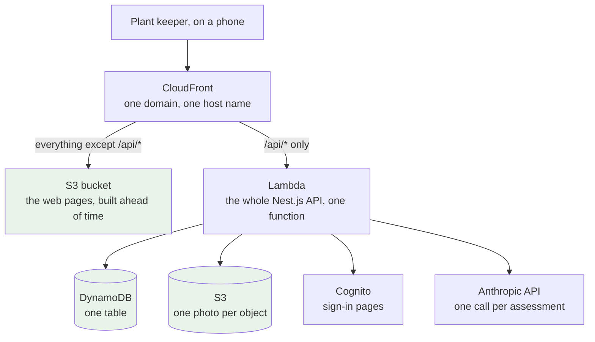
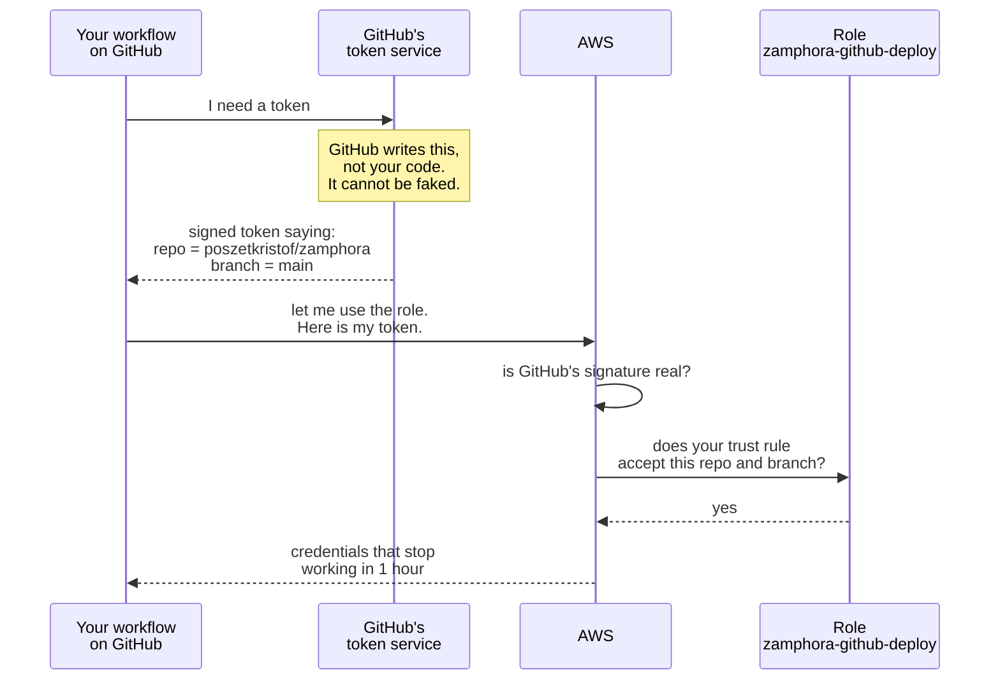
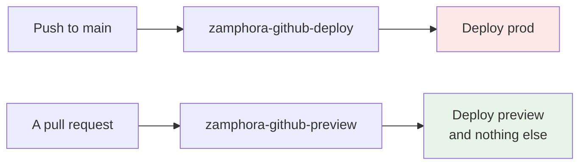
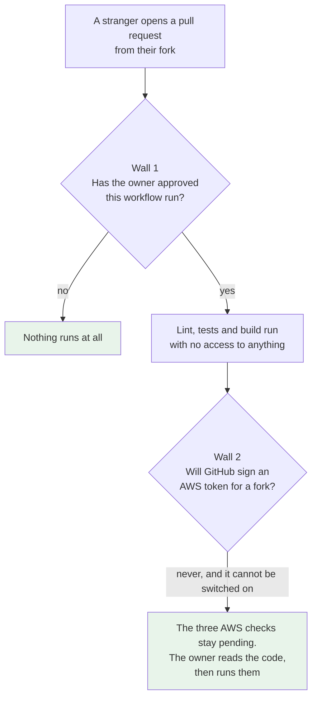
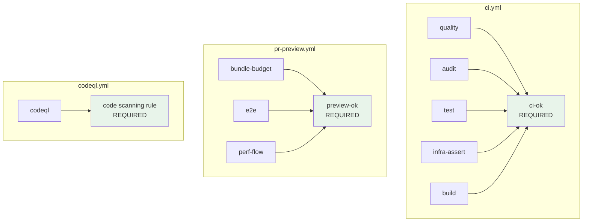
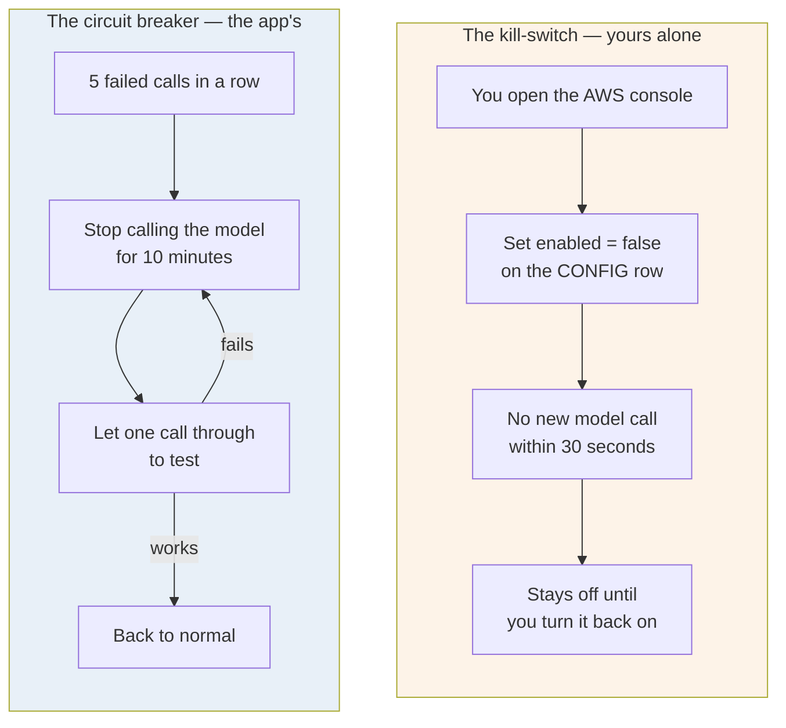

# AWS and the pipeline

**How this project runs on AWS, and how the build reaches AWS without any password existing.**

Written 2026-08-27, after 800 Infra ran and the owner closed 17 decisions.

This is the third learning note. `ai-native-delivery.md` is about the **process**.
`monorepo-architecture.md` is about the **shape of the code**. This one is about the **running
system** — what is in the cloud, who is allowed to change it, and what stops it costing money.

Read part 1 to 4 once, in order. Part 5 is lookup: come back to it when you need a number.

---

## Contents

1. [The account, and why that changes everything](#1-the-account-and-why-that-changes-everything)
2. [What actually runs on AWS](#2-what-actually-runs-on-aws)
3. [How the build signs in to AWS with no password](#3-how-the-build-signs-in-to-aws-with-no-password)
4. [A public repository, and the two walls](#4-a-public-repository-and-the-two-walls)
5. [What has to be green before a merge](#5-what-has-to-be-green-before-a-merge)
6. [Two switches that look the same and are not](#6-two-switches-that-look-the-same-and-are-not)
7. [Lookup: what was chosen, and what lost](#7-lookup-what-was-chosen-and-what-lost)

---

## 1. The account, and why that changes everything

This runs on the **AWS free account plan**. That plan does not send a bill. When you go past what is
free, it **closes the account** and takes the resources with it.

So a runaway loop is not an accounting problem. It is the product disappearing. That is why every
resource is written in CDK and kept in git: a lost account is one deploy away from coming back.

**One fact that surprises most people.** AWS has two kinds of free offer, and this plan only has
one of them switched on:

- **Always Free** — free forever. Lambda, DynamoDB, CloudFront, Cognito.
- **Twelve-month trial** — free for a year on a *paid* plan. **This account gets none of it.**

So **API Gateway, S3 and Route 53 bill from the very first request.** The amounts are tiny at one
user — under a cent a month — but "the whole stack is free" was never true, and the plan says so.

---

## 2. What actually runs on AWS

Seven CDK stacks. One Region: **eu-central-1**, Frankfurt, because a photo of the inside of a home
is personal data and it should stay under EU rules.



**Three things to notice, because each one is a decision and not an accident.**

- **The web pages hold no credentials and reach no database.** They are plain files. Every piece of
  data goes through the API. That is why the browser only ever has one cookie.
- **There is one Lambda, not one per route.** One deployable unit is easier to reason about, and the
  free allowance is a million requests a month.
- **There is no VPC.** A VPC would need a NAT Gateway to reach Anthropic, and a NAT Gateway is
  charged by the hour with no free offer. It would be the largest line item in the whole product.

**The host name is CloudFront's own**, like `d111111abcdef8.cloudfront.net`. A bought domain needs a
Route 53 hosted zone at **$0.50 every month**, which at this size would cost more than the compute,
the storage and the gateway put together. A hosted zone is the DNS record set for a domain name.

**One number in three places: Node 24.** The Lambda runtime is `nodejs24.x`, the CI image is Node 24,
and your own machine is Node 24. AWS keeps a runtime for a fixed period and then stops patching it.
Checked on the [AWS Lambda runtimes page](https://docs.aws.amazon.com/lambda/latest/dg/lambda-runtimes.html)
on 2026-08-27:

| Runtime | Stops being patched |
| --- | --- |
| `nodejs24.x` | **2028-04-30** |
| `nodejs22.x` | 2027-04-30 |

Node 22 would have meant making this decision again in early 2027. ADR-0012 originally said Node 22,
and it is corrected.

---

## 3. How the build signs in to AWS with no password

This is the part worth understanding properly. Everything else in this note is detail.

### The way it is normally done, and why it is dangerous

You create a user in AWS, get an **access key** and a **secret key**, and paste both into GitHub
secrets. Your build then signs in with them.

Those two strings are a **permanent password**. They work from anywhere, forever, until somebody
notices and changes them. If one ever appears in a log line, in a screenshot, or inside a
third-party tool your build ran, the account is gone. This is the most common way an AWS account
gets taken over.

**There is no access key anywhere in this project.**

### What happens instead



**Read step 2 again, because it is the whole idea.** The token is written and signed by **GitHub**,
not by your workflow. Your workflow cannot write its own token, and cannot change what the token
says. It only asks for one and passes it along.

**So there is nothing to steal.** Somebody can copy your entire public repository, read every file,
and still reach nothing — because they cannot make GitHub sign a statement saying they are your
repository on your branch.

### The one line that makes it safe

The role's trust rule names the **branch**, not only the repository:

```
repo:poszetkristof/zamphora:ref:refs/heads/main     <- correct
repo:poszetkristof/zamphora:*                       <- wrong, and it looks fine
```

The second one accepts **any branch** in the repository. Anyone whose pull request you approve
creates a branch. That single character is the difference between safe and not.

### Two roles, not one



If the preview role were also the deploy role, then any pull request could change production. Two
roles cost nothing and remove that entirely.

---

## 4. A public repository, and the two walls

The repository is **public**, on purpose, so anyone can read it. That means anyone can also **fork
it and open a pull request**. There is no setting to stop that, and branch protection does not do
it — branch protection stops a **merge**, never an **open**.

A pull request contains somebody else's code, and pull requests run your build. So the question is
what that code can reach.



**Wall 2 is GitHub's, not ours.** GitHub refuses to hand secrets or an AWS token to a workflow
started by a fork's pull request. It is built in and there is no switch for it.

**Wall 1 is ours.** The repository is set to *"Require approval for all external contributors"*, so
nothing runs at all until the owner presses approve — every time, not only the first time.

### The one way to break it

Someone sees three checks stuck on "pending", searches the internet, and finds
**`pull_request_target`**. That trigger runs a pull request **with your secrets**. A stranger's code
plus your AWS access, in the same run.

`04-ci-cd.md` §4 says do not use it. That is why the rule is written down.

### Why every action is pinned to an exact commit

```yaml
uses: actions/checkout@v7        # a label. Its owner can move it to different code, any time.
uses: actions/checkout@8f4b7f8…  # an exact commit. It can never change.
```

`v7` is a label, not a version of code. The person who owns the action can point that label at
something else whenever they like, and your next build runs the new code without you doing
anything.

**This is the attack that OIDC does not stop**, because by then the attacker's code is already
running inside your workflow, next to the one-hour AWS credentials. Pinning to a commit removes it.

Updates still arrive: **Dependabot** raises a pull request when a new version exists. You approve
it instead of receiving it in silence.

---

## 5. What has to be green before a merge

There are **two different kinds of rule**, and confusing them is the trap.

- A **required status check** watches one job in a workflow. It can only name a job.
- A **code scanning rule** watches what CodeQL found. It is not a job, so a required status check
  can never carry it.

That is why this repository needs both kinds. One would not cover everything.



**One aggregate job per workflow, instead of naming every job in the settings.** If branch
protection lists eleven job names, then a job you add next month is a job nobody enforces, until
you remember to go and edit the settings. An aggregate covers everything it needs. Adding a job to
its `needs:` list is a code change, reviewed like any other change.

**`if: always()` on the aggregate, and this is the sharp part.** In GitHub, a **skipped** check
counts as a **pass**. Without `always()`, a failed `build` would make `ci-ok` skip, the skip would
be read as green, and the failed build would merge. So `ci-ok` runs every time and then checks each
job's result itself.

**Two things to remember, because both cost something real:**

- **A pull request from a fork can never satisfy `preview-ok`**, because GitHub will not sign an AWS
  token for a fork. So a stranger's pull request can never merge on its own. That was accepted: the
  owner merges their own branches.
- **A required check that never reports blocks every merge, forever.** So `preview-ok` goes into
  branch protection **in the same change that adds the workflow**, never before it.

---

## 6. Two switches that look the same and are not

Both stop the AI feature. They are completely separate, and each answers a different problem.



**The breaker never writes the kill-switch row.** It has its own row. That is what lets both things
be true at once:

- The kill-switch is **yours**, and it stays off until **you** turn it on. A model never touches it.
- A run of failures at three in the morning stops itself, and starts again on its own when the
  problem goes away.

Without the separation, the app would have to write your switch, and ADR-0009 would have had to be
reversed to allow it. The separation kept the record true and still got the protection.

**One placement detail that matters to the person using the app.** The breaker is checked *before*
the daily attempt is counted. So an open breaker does not spend one of their ten tries on a call
that was never going to happen.

---

## 7. Lookup: what was chosen, and what lost

Come back to this table. Do not try to remember it.

| Question | Chosen | What lost, and why |
| --- | --- | --- |
| Preview database | **Split the 25 units**: prod 20/20, preview 5/5 | Two full tables at 25/25 — the excess price was never verified. No preview at all — three tests would have nothing to run against |
| Region | **eu-central-1**, Frankfurt | Ireland: also EU, further away. Virginia: the data would leave the EU |
| Host name | **CloudFront's free name** | A bought domain: $0.50 a month forever, the largest line item in the product |
| Backup | **None in run 1** | Point-in-time recovery is charged per gigabyte. Replaced by a calendar entry: export by hand before 2026-12-31 |
| Repository | **Public** | Private: CodeQL is not free and Actions minutes are capped |
| Deploy | **A person presses the button** | Deploy on merge: normal on a paid plan, and here a bad merge can close the account |
| Sign-up | **Closed. The owner makes accounts** | Open sign-up: the daily limit is per account, so ten accounts is ten times the spend on one $5 balance |
| Breaker | **Self-healing, its own row** | Flipping the real kill-switch: it reverses ADR-0009 for no extra safety |
| Local development | **DynamoDB Local and MinIO** | Real AWS: every local test would spend the free allowance and mix test data with real data |
| Required checks | **One aggregate check, `ci-ok`** | Eleven separate entries: a new job you forget to add becomes a check nobody enforces |
| Actions | **Pinned to exact commits** | Moving labels: easier to read, and the code can change under you |
| Node version | **24 everywhere** | Node 22: patched for a year less, and the decision would come back in 2027 |
| What blocks a merge | **`ci-ok`, `preview-ok`, and a code scanning rule** | Enforcing only CodeQL, or enforcing nothing — four written requirements would then measure and block nothing |

**Still open, on purpose:**

- **Which Cognito tier** carries the classic sign-in pages. One page to read, before the user pool
  is created — the tier is fixed at creation.
- **Which form of the model id** is right. ADR-0006 names it two ways. One live call to
  `GET /v1/models` settles it, before it is written into the table.
- **One box in GitHub's settings.** `aws-actions/configure-aws-credentials` is Amazon's action, not
  GitHub's, and the current allow-list would refuse it. It must be allowed before the first deploy.

**Where the detail lives.** Every number here comes from `docs/800-infra/`. The five files there are
the plan; this note is the reason behind it.
