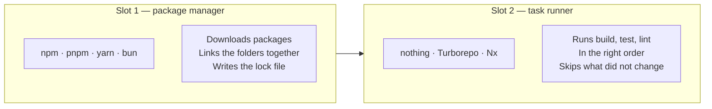
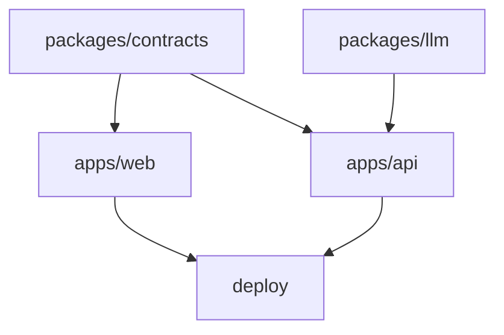
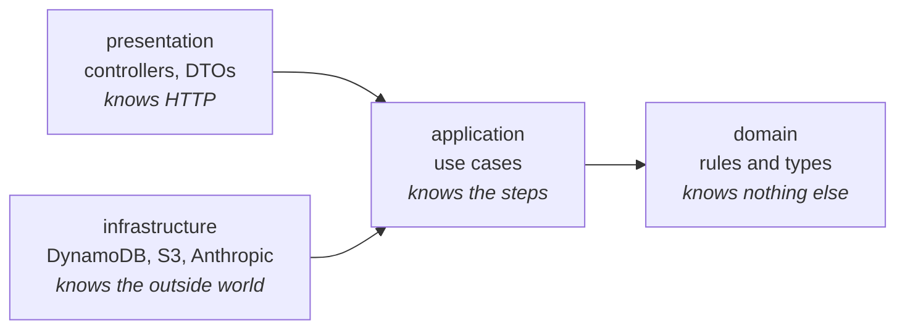
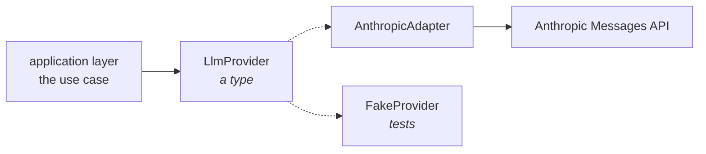

# Monorepo architecture

**What this note is.** One repository holds the web app, the API, the shared code and the
infrastructure. This note explains how that is arranged, which tools do which job, and why each
choice was made. It assumes you know React and TypeScript. It assumes nothing about workspaces.

**Written 2026-08-26**, from research with checked sources. Every version number below was read from
the npm registry on that date.

---

## Contents

1. [The problem a monorepo solves](#1-the-problem-a-monorepo-solves)
2. [Two slots, not one choice](#2-two-slots-not-one-choice)
3. [What a workspace actually is](#3-what-a-workspace-actually-is)
4. [Why pnpm and not npm](#4-why-pnpm-and-not-npm)
5. [The catalog: one place for versions](#5-the-catalog-one-place-for-versions)
6. [allowBuilds: why pnpm asks permission](#6-allowbuilds-why-pnpm-asks-permission)
7. [Turborepo and Nx: what a task runner does](#7-turborepo-and-nx-what-a-task-runner-does)
8. [Who really uses what](#8-who-really-uses-what)
9. [The layout](#9-the-layout)
10. [Inside the API: clean architecture](#10-inside-the-api-clean-architecture)
11. [Inside the web: how Next.js wants it](#11-inside-the-web-how-nextjs-wants-it)
12. [Sharing code, and the React Native question](#12-sharing-code-and-the-react-native-question)
13. [Why the model call gets its own package](#13-why-the-model-call-gets-its-own-package)
14. [The TypeScript 7 situation](#14-the-typescript-7-situation)
15. [Does deployment still work?](#15-does-deployment-still-work)
16. [Every trigger on one screen](#16-every-trigger-on-one-screen)

---

## 1. The problem a monorepo solves

zamphora has a web app and an API that talk to each other. When the assessment answer grows a new
field, three things change together: the Zod schema, the API that fills it, and the screen that shows
it.

If those live in three repositories, that one change is **three pull requests in a fixed order**, and
nothing is testable until all three are merged. Cloudflare published four pull requests per change
before they automated it down to one.

A monorepo makes it **one commit**. That is the whole idea. Everything below is machinery to make one
repository stay tidy as it grows.

The cost is real and worth naming: one repository can turn into one tangle, where every file imports
every other file. The rest of this note is about stopping that.

---

## 2. Two slots, not one choice

This is the idea that makes everything else make sense, and it is easy to miss.

**There are two separate jobs, and you pick a tool for each.**



| | Package manager | Task runner |
| --- | --- | --- |
| Answers | "Where do the files come from?" | "What do I run, and in what order?" |
| You always need one | Yes | **No.** You can start with none |
| Options | npm, **pnpm**, yarn, bun | none, **Turborepo**, Nx |

**pnpm does not compete with Turborepo.** They compete with npm and with Nx respectively. A project
using Turborepo still needs a package manager underneath it, and most of them use pnpm.

zamphora picks **pnpm** for slot 1 and **nothing** for slot 2, for now. Section 7 has the trigger to
fill slot 2.

---

## 3. What a workspace actually is

A **workspace** is one repository holding several `package.json` files, where the package manager
links them together as if they were published on npm — but they are not.

Without a workspace, `apps/web` would import shared code like this:

```ts
import { AssessmentSchema } from "../../../packages/contracts/src/assessment"
```

That path breaks the moment a file moves. With a workspace it becomes:

```ts
import { AssessmentSchema } from "@zamphora/contracts"
```

The way that works is one line in `apps/web/package.json`:

```json
{ "dependencies": { "@zamphora/contracts": "workspace:*" } }
```

`workspace:*` means **"the copy in this repository, whatever version it says"**. The package manager
makes a link from `apps/web/node_modules/@zamphora/contracts` to `packages/contracts`. Edit the
shared file and the web app sees the change immediately. There is no publish step and no build step
between them.

**The three files that make a workspace:**

| File | Job |
| --- | --- |
| `pnpm-workspace.yaml` | Lists which folders are packages. Also holds every pnpm setting |
| One `package.json` per package | Each package declares its own real dependencies |
| One `pnpm-lock.yaml` at the root | One lock file for the whole repository |

**There is no one huge `package.json`.** That is the thing being avoided. The root `package.json`
holds scripts and repo-wide dev tools only — never an application dependency.

---

## 4. Why pnpm and not npm

Both do the job. pnpm is chosen for one reason that matters more than speed.

### The flat folder problem

npm puts everything in one flat pile at the root:

```
node_modules/
├── react/          ← asked for by apps/web
├── zod/            ← asked for by packages/contracts
├── date-fns/       ← asked for by apps/api
└── … 900 more
```

Node looks for an import by walking up the folders. So **`apps/web` can import `date-fns` without
ever declaring it**, because `apps/api` declared it and it landed in the shared pile. It works. Tests
pass. CI is green.

Then somebody removes `date-fns` from `apps/api`, and the web app breaks — for a reason nothing in
its own `package.json` explains. This is called a **phantom dependency**.

### What pnpm does instead

pnpm gives each package a folder containing only what that package declared:

```
apps/web/node_modules/
├── react              → link into the shared store
└── @zamphora/contracts → link to packages/contracts
        (date-fns is NOT here, so importing it fails at once)
```

An undeclared import **fails immediately**, on the first run, with a clear error.

### Why that matters here specifically

`docs/ADR/0001` writes six split-readiness rules. Rule 3 is:

> "Each app owns its `package.json` with its real dependencies listed. **Never rely on hoisting.**"

**npm cannot enforce that rule. pnpm enforces it by default.** The rule stops being something to
remember and becomes something the tool checks. That is the argument, and speed is a bonus.

Two smaller wins: `pnpm --filter <name> build` runs a command in one package, which is what makes
path-filtered CI cheap. And pnpm stores one copy of each package version on the whole machine and
links to it, so ten projects using React store React once.

**Current version: pnpm 11.24.0.** It needs Node 22 or newer.

---

## 5. The catalog: one place for versions

This is pnpm's direct answer to "I do not want to edit ten `package.json` files to bump one version".

**The problem.** Six packages each depend on `zod`. Six places name a version. They drift. One
package ends up on `zod@3` while another is on `zod@4`, and the types stop matching across the wire —
which is exactly the bug `packages/contracts` exists to prevent.

**The catalog.** Name the version once, in `pnpm-workspace.yaml`:

```yaml
packages:
  - "apps/*"
  - "packages/*"

catalog:
  zod: ^4.1.13
  typescript: 6.0.3
  vitest: ^4.0.8
```

Then every package refers to the catalog instead of a version:

```json
{ "dependencies": { "zod": "catalog:" } }
```

**One place to change. Every package moves together, or none does.** A version mismatch across
packages becomes impossible rather than unlikely.

This replaces a tool called `syncpack`, which existed only to check that the versions in different
`package.json` files agreed. The catalog makes disagreement unrepresentable, which is better than
checking for it.

**The rule for this repo:** any dependency used by two or more packages goes in the catalog.

---

## 6. allowBuilds: why pnpm asks permission

Some npm packages run a script **on your machine at install time** — usually to compile a piece of
C++ for your operating system. `esbuild`, `sharp` and `better-sqlite3` all do this.

That is also the easiest way to attack a developer machine. A stolen npm account publishes a version
whose install script reads your `~/.aws/credentials` and posts it somewhere. You never ran the
package. Installing it was enough.

**So pnpm 11 blocks install scripts by default, and you list the ones you allow:**

```yaml
allowBuilds:
  - esbuild
  - "@swc/core"
```

If a package needs a script and is not on the list, the install stops and tells you which package
asked. You then decide.

**Two things that will confuse a search result:**

- pnpm 11 **removed** the older setting, `onlyBuiltDependencies`. Advice written before April 2026
  names a setting that no longer exists.
- **`.npmrc` is now for registry and login only.** Every other pnpm setting moved into
  `pnpm-workspace.yaml`. Older guides put them in `.npmrc`, where they are now ignored in silence.

One related default worth knowing: `minimumReleaseAge` waits 1440 minutes — one day — before
installing a newly published version. It exists so that a compromised release is usually pulled
before it reaches you. It will occasionally delay a security patch you actually want.

---

## 7. Turborepo and Nx: what a task runner does

A task runner solves a problem that only appears once the repository is big.

**Without one**, `pnpm -r build` builds every package, every time, in dependency order. Fine at four
packages. At twenty, most of that work rebuilds things that did not change.

**A task runner adds two things:**

1. **A task graph.** It knows `apps/web` needs `packages/contracts` built first, and builds them in
   the right order, in parallel where it can.
2. **Caching.** It fingerprints the inputs of a task. Same inputs as last time means it does not run
   the task — it replays the stored output. On CI, shared caching means a colleague's build can be
   reused instead of repeated.



That picture is what a task runner reads. It is also what `pnpm -r` works out on its own — the
difference is the caching, not the ordering.

### Turborepo against Nx, plainly

| | Turborepo | Nx |
| --- | --- | --- |
| What it is | A task runner. One job | A build platform. Task running, code generators, a plugin system, project graphs, its own workspace model |
| Config | One `turbo.json` | `nx.json`, project files, plugins per framework |
| Learning cost | Low. Read one page | Real. It is a system to learn, not a setting |
| Made by | Vercel — same company as Next.js | Nrwl |
| Current version | 2.10.12 | 23.1.1 |

**Nx is not being used here, and that is settled.** It brings a plugin system and a workspace model
that would be a third new thing to learn on a project already learning Nest.js and AWS. Nx also sells
a product whose job is to hide repository borders from coding agents — which is a tool to undo a
border this project is not creating.

### Why not Turborepo yet

Nothing is wrong with it. The honest reason is that it earns its keep through caching, and **there is
nothing to cache yet.** Four packages, a build measured in seconds.

**Adding it later costs almost nothing** — one `turbo.json` and a changed script line. It is
additive. Nothing has to be rearranged. So waiting has no penalty, and adding it now would be a tool
carried without a job.

**The trigger to add it:** when the same task re-runs on unchanged inputs and that is measurably the
biggest part of CI wall time. Measure first. A package count is a proxy; wasted re-runs are the
actual thing.

**One caution for that day.** Turborepo's own documentation discourages TypeScript project
references, while Nx recommends them. So "add Turborepo" and "add project references" are two
directions, not two steps.

---

## 8. Who really uses what

Read from the actual repositories on 2026-08-26, not from blog posts.

| Project | Stack | Package manager | Task runner |
| --- | --- | --- | --- |
| **cal.com** | Next.js + Nest.js | Yarn | **Turborepo** |
| **Novu** | Next.js + Nest.js | **pnpm** | Nx |
| **Twenty** | React + Nest.js | Yarn | Nx |
| **Turborepo's own `with-nestjs` example** | Next.js + Nest.js | **pnpm** | Turborepo |

**Every combination appears.** There is no single industry standard pairing. What *is* consistent is
the shape: `apps/` for things that deploy, `packages/` for things that are imported.

Two ideas worth stealing from them:

**cal.com puts configuration in its own packages.** It has `packages/tsconfig` and `packages/config`
separate from the code packages. Turborepo's own example does the same with
`@repo/typescript-config`, `@repo/eslint-config` and `@repo/jest-config` — **three of its five
packages are configuration.** That is the pattern, once there is enough duplication to justify it.

**Novu splits `libs/` from `packages/`.** The rule is one question: *can an outsider install this?*
If yes it goes in `packages/`, and pays for that with versioning, a changelog and a stable public
API. If no it goes in `libs/` and can be changed freely. zamphora has nothing published, so this
split earns nothing today. The trigger is the first package published to npm.

---

## 9. The layout

```
zamphora/
├── pnpm-workspace.yaml       which folders are packages · catalog · allowBuilds
├── package.json              root: scripts and repo-wide dev tools ONLY
├── pnpm-lock.yaml            one lock file for everything
├── tsconfig.base.json        one base config, extended by every package
├── eslint.config.mjs         one flat config, rules scoped by file path
│
├── apps/                     things that deploy. One CDK stack each
│   ├── web/                  Next.js 16.3.3
│   └── api/                  Nest.js 11.2.3, compiled into one Lambda
│
├── packages/                 things that are imported, never deployed
│   ├── contracts/            Zod schemas for everything crossing the wire
│   └── llm/                  the LlmProvider port and its one adapter
│
├── infra/                    CDK
└── docs/  factory/  TASKS.md
```

**The two-folder rule is universal across every repository in section 8.** `apps/` deploys.
`packages/` is imported. If a thing is both, it is two things.

### What is deliberately not there yet

| Package | What it would hold | Trigger to add it |
| --- | --- | --- |
| `config-typescript` | tsconfig presets | 4 or more packages copying the base |
| `config-eslint` | shared lint rules | 4 or more packages, or one needing different rules |
| `ui` | shared React components | **A second app that renders React** |
| `core` | business rules | **A second runtime that needs the same rule** |
| `testing` | shared test setup | 3 or more packages copying it |

**A `ui` package with one consumer is a folder with extra publishing steps.** Every repository in
section 8 has one, and every one of them has two or more apps rendering React. That is the trigger,
not the calendar.

### Five things to set up on day one

These are cheap now and painful later:

1. **`exports` in every `package.json`.** Node enforces it — an import of any path not listed throws
   `ERR_PACKAGE_PATH_NOT_EXPORTED`. It stops other packages reaching into your internals. The
   cheapest border there is, and hard to add after fifty deep imports exist.
2. **`workspace:*` for every internal dependency.** Never a version range, never a relative path.
3. **A `catalog:` entry for every shared dependency.**
4. **Lint rules for the borders, starting at deny-all.** Allowing what is needed is easy at zero
   files and miserable at ten thousand.
5. **The layer folders inside `apps/api`**, even with one feature.

---

## 10. Inside the API: clean architecture

Package borders keep the repository tidy. They do nothing for the inside of `apps/api`, which is
where most of the code will live. That needs its own shape.

**One folder per feature, and four layers inside each one:**

```
apps/api/src/
├── main.ts                     the Lambda handler and bootstrap
├── app.module.ts
├── shared/                     guards, filters, interceptors, config
└── modules/
    └── assessment/
        ├── domain/             pure TypeScript. No Nest, no AWS, no SDK
        ├── application/        use cases. Depends on domain and ports only
        ├── infrastructure/     DynamoDB, S3, LlmProvider adapters
        ├── presentation/       controllers and DTOs. HTTP lives here
        └── assessment.module.ts   the only file that wires the three together
```

### The one rule that makes it work

**Dependencies only point inwards.** Nothing in an inner circle knows about an outer one.



Read the arrows as "is allowed to import". The domain imports nothing. Infrastructure and
presentation both point inwards and never at each other.

### What each layer holds

| Layer | Holds | Never holds |
| --- | --- | --- |
| **domain** | The rules and the types. A verdict, a confidence band, "an `unsure` result may not write a task" | Any import at all. No Nest decorator, no AWS SDK, no HTTP |
| **application** | The use case, step by step: check the limit, store the photo, call the model, save the result | Which database. It names a **port**, not DynamoDB |
| **infrastructure** | The adapters that make those ports real. The DynamoDB repository, the S3 client, the Anthropic adapter | Business rules |
| **presentation** | Controllers, and DTOs that turn HTTP into domain types | Anything worth testing on its own |

### Why go to the trouble

**The rules become testable with no mocks.** The domain has no dependencies, so a test of "an
`unsure` result never writes a task" is a plain function call with no database and no network.

**Swapping DynamoDB touches one folder.** The use case names a port. Only `infrastructure/` knows
what is behind it.

**It cannot be retrofitted.** At one feature this costs a few folders. At thirty features it is a
rewrite. That is the only reason to do it before it hurts.

**A DTO is not a domain type**, and keeping them apart is the habit that holds the whole thing up. A
DTO is the shape on the wire — it is validated, it can be wrong, it comes from outside. A domain type
is already known to be correct. The controller turns one into the other, and that is the only place
that conversion happens.

---

## 11. Inside the web: how Next.js wants it

Next.js's own guidance: **`app/` is for routing, and almost nothing else.**

```
apps/web/src/
├── app/                        routing ONLY
│   └── [locale]/assess/
│       ├── page.tsx            a thin file that renders a feature
│       ├── layout.tsx
│       ├── loading.tsx
│       └── error.tsx
├── features/
│   └── assessment/             the real code for this feature
│       ├── components/
│       ├── hooks/
│       └── api.ts
├── components/                 UI used by two or more features
└── lib/                        fetch client, i18n, formatting
```

The trap is putting real code in `app/`. Every file there is tied to a URL. Move the URL and the code
moves with it, whether or not it belongs to that page. Keeping `app/` thin means a route change is a
route change.

**`components/` versus `features/`:** a component moves out of a feature the second time a different
feature needs it. Not the first time — the second.

---

## 12. Sharing code, and the React Native question

A React Native app is a real possibility, so the question of what would be shared is worth answering
now — even though nothing is being built for it.

**What would survive a move to React Native:**

| Shareable | Not shareable |
| --- | --- |
| `packages/contracts` — Zod schemas. Already right | React DOM components. `<div>` does not exist there |
| `packages/llm` — the port. Already right | CSS and Tailwind classes |
| Business rules, if they move to `packages/core` | Anything reading `window` or `document` |
| Translation strings | Next.js routing |
| The design tokens, as plain values | |

**The rule for moving code into a package**, and it is worth following strictly:

> Move a business rule out of `apps/api` when a **second runtime** needs it. Not when it feels
> shared.

Both cal.com and Novu have a package like this. **Both arrived at it by pulling code out later, not
by planning it up front.** That is the evidence for waiting: the people who did it at scale did not
predict it either.

**What to do now instead of guessing:** keep the layers in section 10 clean. A domain layer with no
imports is already portable — moving it into a package later is a folder move plus a
`package.json`. A domain layer with a Nest decorator in it is not, and no package border will fix
that afterwards.

So the preparation for React Native is not a package. It is the discipline of keeping the domain
free of framework imports.

---

## 13. Why the model call gets its own package

`packages/llm` holds two things:

- **The port** — a plain TypeScript type, `LlmProvider`, that says what the rest of the code may ask
  for. Not what Anthropic offers. What zamphora needs.
- **The adapter** — the one file in the entire repository allowed to `import` the Anthropic SDK.



The dotted arrows mean "is one of these". The use case never learns which.

**Four reasons this is a package and not a folder:**

**The rule can be enforced.** `CLAUDE.md` says every model call goes through `LlmProvider` and no SDK
import exists outside its adapter. As a package, a lint rule checks that. As a folder, it is a note.

**Tests cost nothing.** Every test that is not about the model swaps in a fake provider. No network,
no key, no spend. On a project where a test run can empty the credit balance, this is a money
decision.

**The model can be replaced.** `docs/ADR/0006` says the model is chosen by measuring it. That
measurement only stays cheap if changing the model touches one file.

**Failures get names inside it.** The adapter turns a timeout, a 429, a refusal and a truncation into
named values the rest of the code can branch on. Only this package knows what an Anthropic error
looks like.

### About RAG and what comes later

Retrieval-augmented generation means looking something up first — a plant care database, past
assessments — and putting what you found into the prompt.

**When that arrives, it goes here**, and the port may not change at all: `assess(photo, plantName,
locale)` is still the question being asked. What changes is what the adapter does before it calls the
model. If the port does change, it changes in one file, and every caller is a compile error rather
than a silent behaviour change.

**Today it is one call and nothing more.** `docs/400-architecture/00-options.md` §8 has the ladder:
plain code, then one model call, then a fixed chain, then a free-roaming agent. Stop at the first
rung that does the job. Photo assessment is one call. Reaching for an agent by default is the most
common mistake in this area right now, and an agent is the hardest thing to test, to debug and to
predict the cost of.

---

## 14. The TypeScript 7 situation

**The short version: install `typescript@6.0.3`, not 7. It is one line, and it is normal.**

### What happened

TypeScript 7.0 was released on 8 July 2026. It is **a rewrite of the compiler in Go** — a different
language from the TypeScript the old compiler was written in. It type-checks roughly 8 to 12 times
faster. Type-checking the VS Code codebase went from 125.7 seconds to 10.6 seconds.

That is a genuinely large improvement and it is worth having, later.

### Why not yet

The rewrite does not yet ship a stable **programmatic API** — the way other tools ask the compiler
questions about your code. That is expected in 7.1.

Everything that inspects types needs that API. So on TypeScript 7 today, these do not run:

- **typescript-eslint** — every lint rule that reads types
- **ts-jest**, **ts-morph**
- the type-checkers behind **Vue**, **Svelte** and **Astro**

I checked this directly rather than trusting a summary:

```
npm view typescript version           → 7.0.2
npm view typescript-eslint version    → 8.68.0
npm view typescript-eslint peerDeps   → typescript: '>=4.8.4 <6.1.0'
```

The supported range stops below 7. And typescript-eslint's issue for supporting 7 is closed as not
planned, so the fix is version 7.1 of the compiler, not a patch to the linter.

### Why this is not a workaround

Three things worth keeping in proportion:

**Pinning a version is not a workaround. It is what a lock file is for.** Every serious project pins
its toolchain. The catalog makes it one line that every package follows.

**TypeScript 6 is not old.** It shipped this year and is fully supported.

**This is what a compiler rewrite looks like from the outside.** The plugin API is the last part to
stabilise, because it is the widest surface. The alternative was for the team to hold the whole
rewrite back for another year.

**What it would actually cost to install 7 anyway:** every type-aware lint rule stops working. Those
rules are most of the border enforcement in section 9. So the ten-times-faster compiler would be paid
for with the checks that keep the architecture honest.

**The watch condition**, better than a date: revisit when typescript-eslint's peer range accepts
TypeScript 7.

---

## 15. Does deployment still work?

Yes, but two things need care, and both are known before any code is written.

### The Lambda side

`apps/api` imports `packages/contracts` and `packages/llm`. Those are **links** in a pnpm workspace,
not real folders full of files. Copying `node_modules` into a zip therefore copies links that point
nowhere.

**The answer is to bundle, not to copy.** esbuild follows every import and writes one JavaScript file
with everything inlined. Links stop existing at that point, so the problem disappears.

This is also what you want for another reason already written down: `03-flow.md` budgets 800 ms for a
cold start, and a bundled function starts faster than one that unpacks a large `node_modules`.

**One specific thing to avoid.** AWS CDK's `NodejsFunction` has an option called
`bundling.nodeModules`, which asks CDK to install some packages instead of bundling them. **It is
broken with pnpm 11 today** — aws-cdk issue 37898, open since 16 May 2026. CDK writes an empty
`pnpm-workspace.yaml` into its build folder, which erases the `allowBuilds` list that pnpm 11
requires, and the escape hatch runs too early to fix it.

So: bundle everything, and do not use that option. This is a real trap, it is documented here so
nobody rediscovers it, and it should be re-checked before the first deploy.

### The web side

Next.js has a mode called `standalone` that traces which files the server needs. Tracing and pnpm
links have a known open issue.

**But `docs/ADR/0010` may have removed the problem already.** It says the web app holds no
credentials, never reads the session, fetches every value from `/api/*` in the browser, and always
paints a skeleton first. That describes a static site.

If a static export is workable, there is no server to trace, the build output is a folder of files in
S3 behind the CloudFront distribution that ADR-0010 already requires, and this whole class of problem
does not exist.

It is not free. A static export gives up Next.js image optimisation with the default loader, and
needs an answer for choosing between Hungarian and English. **This is an open decision and it is the
owner's.**

### The good sign

In every deployment path — static export, standalone, bundled Lambda — **the `apps/` and `packages/`
layout is unchanged.** Deployment pressure changes how things are built, never where they live. A
layout that survives every option is a layout that was not chosen by accident.

---

## 16. Every trigger on one screen

Nothing here is decided by feeling. Each row is a condition that can be checked.

| Add this | When |
| --- | --- |
| Turborepo | The same task re-runs on unchanged inputs and that is the biggest part of CI time. Measure first |
| `packages/config-typescript`, `config-eslint` | 4 or more packages copying the same base |
| `packages/ui` | A second app renders React |
| `packages/core` | A second runtime needs the same business rule |
| `packages/testing` | 3 or more packages copying the same test setup |
| `libs/` separate from `packages/` | The first package published to npm |
| dependency-cruiser | The first import cycle, or more than 8 packages |
| TypeScript 7 | typescript-eslint's peer range accepts it |
| Split into several repositories | A second person owns one side · a service is written in another language · CI on a pull request passes 15 minutes |

**And the rule under all of them:** adding one of these later is cheap, and each was checked to be
so. Adding all of them now would be carrying nine tools to build four packages.

---

## Where the evidence is

Version numbers were read from the npm registry on 2026-08-26: pnpm 11.24.0 · Turborepo 2.10.12 ·
Nx 23.1.1 · Next.js 16.3.3 · Nest.js 11.2.3 · TypeScript 7.0.2 and 6.0.3 · typescript-eslint 8.68.0.

The repository layouts in section 8 were read from the repositories themselves, not from articles.
The full research, with every source and the date each was checked, is the note this file was written
from.
